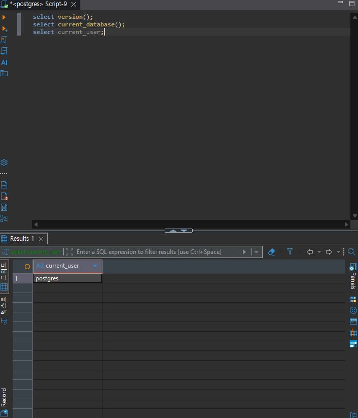
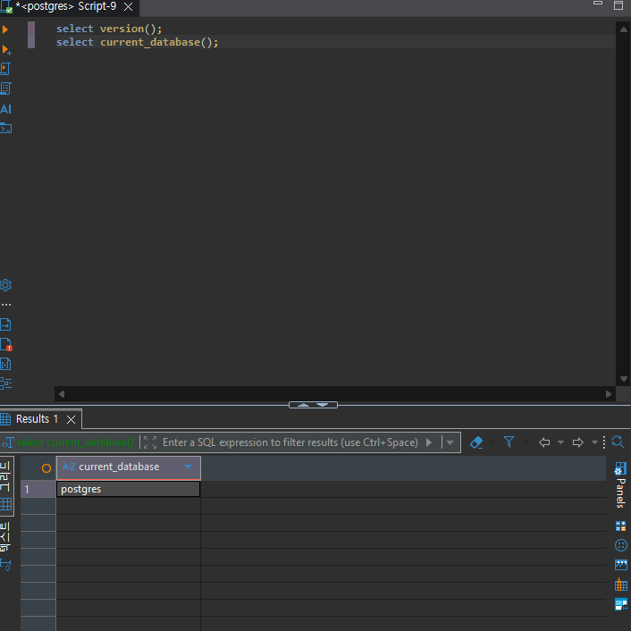
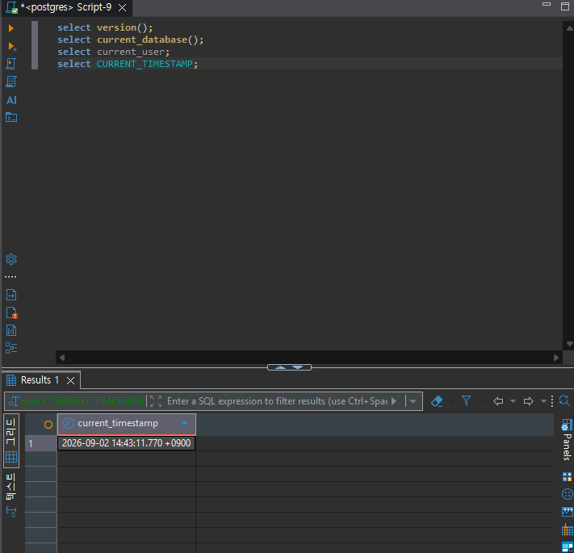
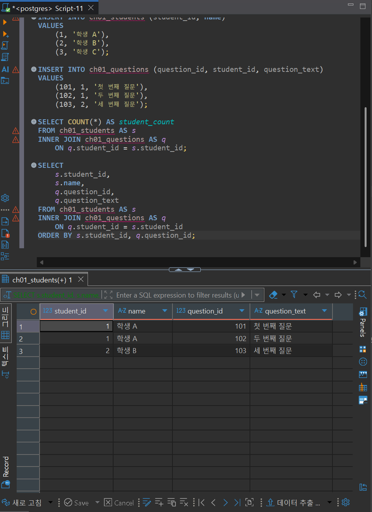
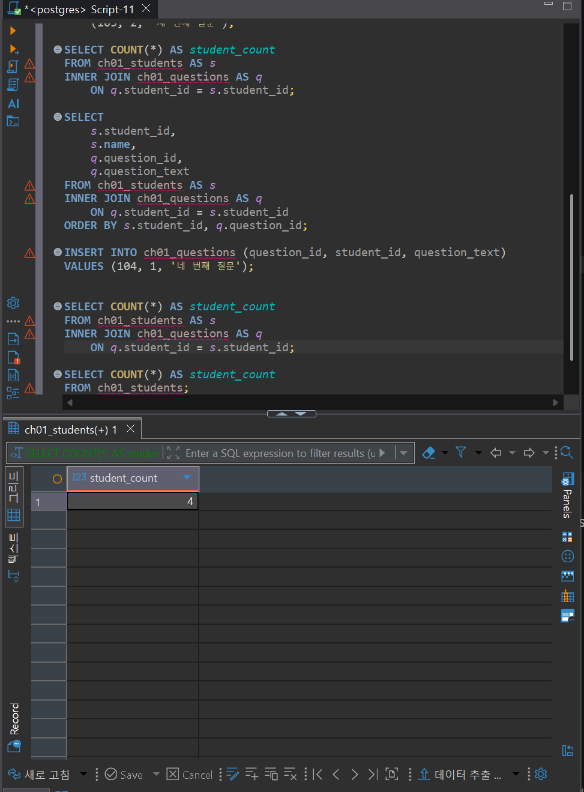
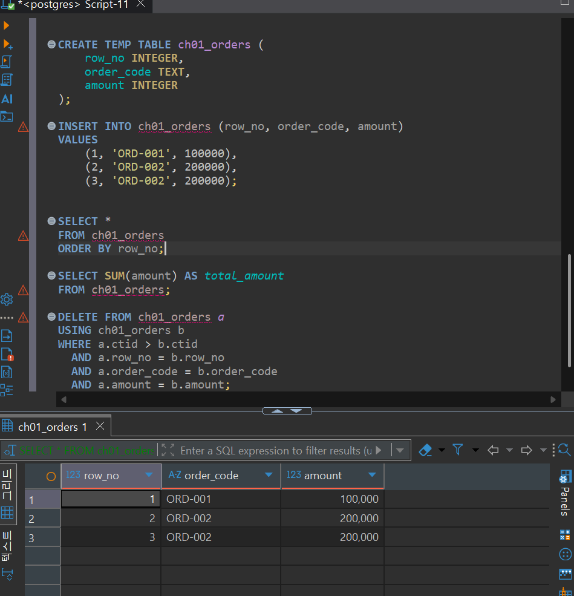
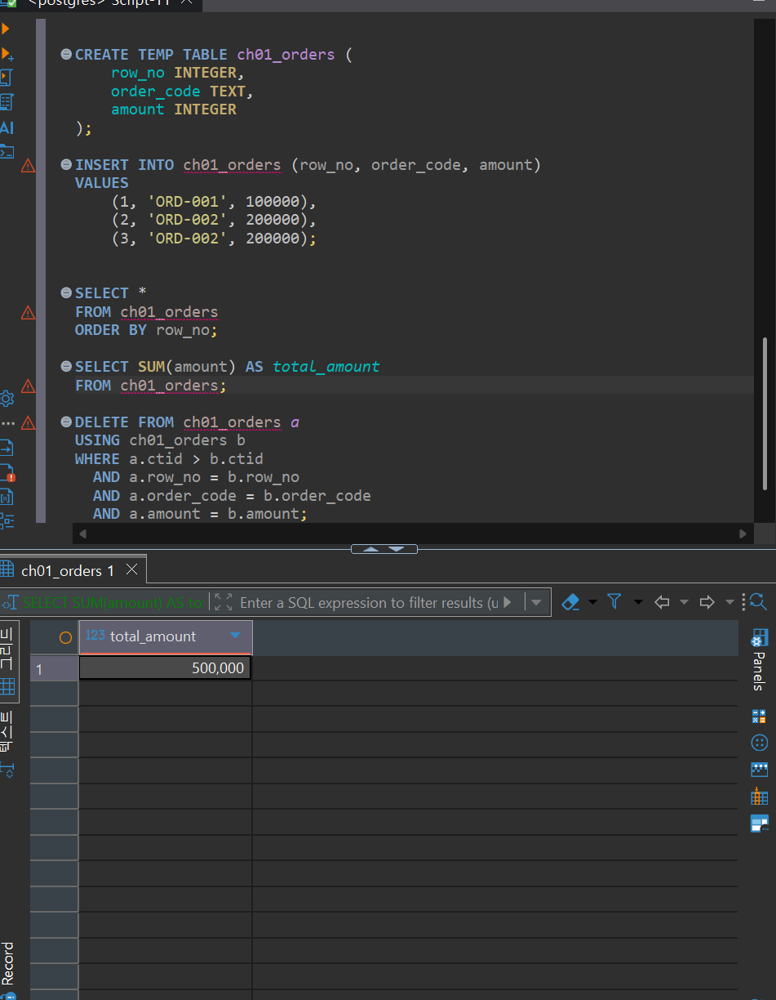
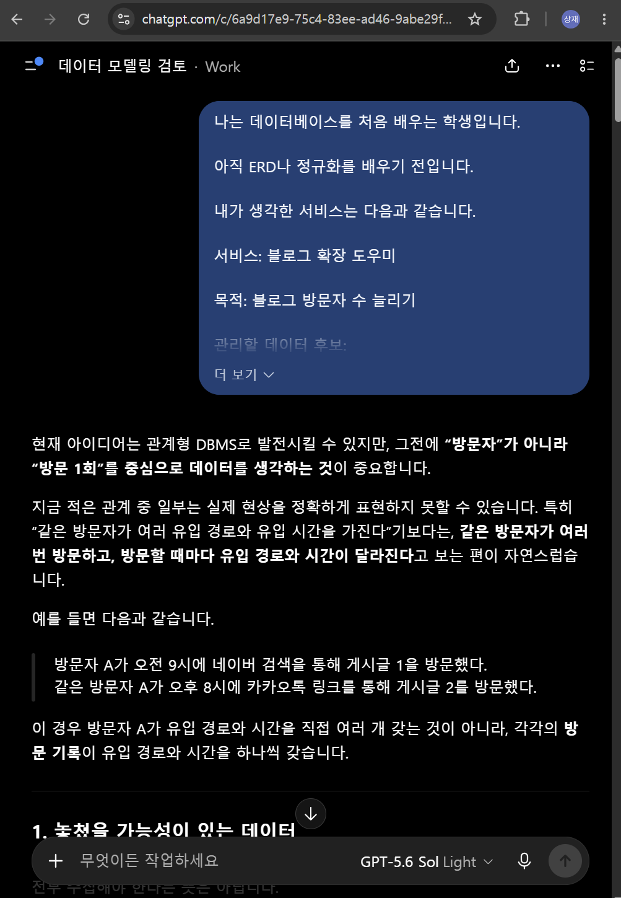

# Chapter 01 확장 실습 답안 템플릿

> **과제:** AI 시대에 데이터베이스를 왜 배워야 하는가  
> **사용 방법:** 이 파일을 내려받아 **본인의 GitHub 저장소**에 `chapter01_answer.md`라는 이름으로 저장한 뒤 답안을 작성합니다.  
> **제출 방법:** LMS에는 파일을 업로드하지 않고, **본인 GitHub 저장소의 `chapter01_answer.md` 파일 URL**을 제출합니다.

---

## 0. 학생 정보

| 항목 | 작성 내용 |
| --- | --- |
| 학번 |  |
| 이름 | 이상재 |
| GitHub 계정 |  |
| 과제 작성일 |  |
| 사용한 AI 도구 |  |

> 실제 비밀번호, API Key, 전체 DB 접속 URL, 개인정보는 이 파일이나 캡처 화면에 기록하지 않습니다.

---

# 1. PostgreSQL 실행 환경 확인

## 1-1. 실행한 SQL

```sql
SELECT version();
SELECT current_database();
SELECT current_user;
SELECT CURRENT_TIMESTAMP;
```

## 1-2. 실행 결과 기록

```text
PostgreSQL 버전: PostgreSQL 18.4 on x86_64-windows, compiled by msvc-19.44.35227, 64-bit
현재 데이터베이스: postgres
현재 사용자: postgres
현재 시각: 2026-09-02 14:45:40.840 +0900
```


## 1-3. 내가 확인한 내용

1. SQL을 작성하는 프로그램과 PostgreSQL은 같은 프로그램인가요?

```text
나의 답: 네
```

2. `current_database()` 결과는 무엇을 의미하나요?

```text
나의 답: 현재 사용 중인 database 위치
```

3. SQL이 실행되었다는 사실만으로 데이터 내용도 올바르다고 할 수 있나요?

```text
나의 답: 아니요
```

## 1-4. 증거 화면

아래 경로에 캡처 이미지를 저장하는 것을 권장합니다.

```text
assignments/chapter01/images/step01_environment.png
```

이미지를 저장했다면 아래 링크의 파일명을 실제 파일명에 맞게 수정합니다.

```markdown

```

**이미지 삽입 위치:**

<!-- 아래 줄의 주석을 지우고 실제 이미지 Markdown을 넣어도 됩니다. -->






---

# 2. Chapter 01 핵심 내용 복습

교재 문장을 그대로 복사하지 말고 자신의 말로 작성합니다.

| 본문의 핵심 | 나의 설명 |
| --- | --- |
| AI가 SQL을 만들어도 DB를 배워야 한다 | AI가 SQL을 만들어도 우리의 의도와는 다르게 만들었을수도 있으므로 DB를 배워야 한다 |
| 데이터 구조가 중요하다 | 같은 결과를 내더라도 데이터 구조는 다를 수 있기에 중요하다 |
| SQL 결과를 검증해야 한다 | 위와 같이 같은 구조가 아니더라도 같은 결과가 나올 수 있으므로 검증해야 한다 |
| 데이터 품질이 AI 답변 품질에 영향을 준다 | 데이터 품질에 따라 AI가 더 정확한 결과를 낼 수도 안좋은 결과를 낼 수도 있다 |
| 저장 방식은 데이터 양만 보고 선택하지 않는다 | 저장 방식은 데이터 양과 사용할 방식을 보고 같이 결정한다 |

## 가장 중요하다고 생각한 한 문장

```text
AI가 SQL을 만들어도 우리의 의도와는 다르게 만들었을수도 있으므로 DB를 배워야 한다
```

---

# 3. 실행 성공과 결과 정확성의 차이

## 3-1. SQL 실행 전 예상

학생 A는 질문 2개, 학생 B는 질문 1개, 학생 C는 질문이 없습니다.

```text
전체 학생 수: __3____ 명
전체 질문 수: ____3__ 개
질문이 있는 학생 수: ___2___ 명
질문이 없는 학생 수: ___1___ 명
```

## 3-2. 임시 테이블 생성 및 데이터 입력 완료 확인

- [x] `ch01_students` 생성
- [x] `ch01_questions` 생성
- [x] 학생 3명 입력
- [x] 질문 3건 입력
- [x] 두 테이블의 데이터를 직접 조회

## 3-3. 잘못된 학생 수 SQL 실행 결과

실행한 SQL:

```sql
SELECT COUNT(*) AS student_count
FROM ch01_students AS s
INNER JOIN ch01_questions AS q
    ON q.student_id = s.student_id;
```

실행 결과:

```text
3
```

## 3-4. JOIN 상세 결과 관찰

```text
학생 A가 나타난 행 수: 2
학생 B가 나타난 행 수: 1
학생 C가 나타난 행 수: 0
```

다음 질문에 답합니다.

### Q1. 학생 C가 왜 결과에서 사라졌나요?

```text
질문 테이블에서 학생 C의 student_id로 질문한 행이 없어서
```

### Q2. 학생 A가 왜 여러 행으로 나타났나요?

```text
질문 테이블에서 학생 A의 student_id로 질문한 행이 2개 여서
```

### Q3. 위 `COUNT(*)`가 실제로 세고 있었던 것은 무엇인가요?

```text
학생 name이 아닌 stduent_id
```

### Q4. 결과 숫자가 우연히 실제 학생 수와 같아도 바로 믿으면 안 되는 이유는 무엇인가요?

```text
우리가 원하는 결과가 아닌 다른 값을 세워서 원하던 결과가 나왔을 가능성이 있으므로
```

## 3-5. 질문 한 건을 추가한 뒤 다시 실행

추가한 데이터:

```text
INSERT INTO ch01_questions (question_id, student_id, question_text)
VALUES (104, 1, '네 번째 질문');
```

다시 실행한 결과:

```text
AI SQL 결과:4
실제 학생 수:3
```

### 결과 해석

```text
데이터가 바뀐 뒤 무엇이 달라졌는지: student_count

실제 학생 수는 왜 그대로인지: 학생 id의 갯수를 세는게 아니라 학생 테이블에 포함된 학생의 id와 질문한 학생의 id 일치 여부 갯수를 세기 때문

이 실험을 통해 알게 된 점: 원하던 결과를 믿는게 아닌 과정을 믿어야 겠다.
```

## 3-6. 학생 테이블을 직접 센 결과

```sql
SELECT COUNT(*) AS student_count
FROM ch01_students;
```

결과:

```text
3
```

### 두 SQL의 차이를 내 말로 설명

```text
첫 번째 SQL은 질문한 학생의 수를 세고 있었다.

두 번째 SQL은 학생 테이블의 학생 수를 세고 있었다.

따라서 SQL을 검토할 때는 문법보다 먼저
질문의 의도가 정확한지를 확인해야 한다.
```

## 3-7. 증거 화면

권장 경로:

```text
assignments/chapter01/images/step03_join_result.png
```

`여기에 STEP 3 핵심 증거 화면을 삽입하세요.`


---

# 4. 잘못된 데이터가 결과를 바꾸는 과정

## 4-1. 주문 데이터 확인

다음 데이터를 입력한 뒤 실제 결과를 확인합니다.

```text
1	ORD-001	100000
2	ORD-002	200000
3	ORD-002	200000
```

## 4-2. 실행 전 예상

업무적으로 주문이 `ORD-001`, `ORD-002` 두 건이고 `order_code`가 주문을 고유하게 구분한다고 **가정할 경우** 예상 합계:

```text
300000 원
```

> 위 가정 자체가 실제 업무 규칙인지 확인해야 한다는 점도 기억합니다.

## 4-3. SQL 합계

```sql
SELECT SUM(amount) AS total_amount
FROM ch01_orders;
```

실제 결과:

```text
500000 원
```

## 4-4. 결과 해석

### `SUM` 문법 자체가 잘못된 것인가요?

```text
아니요
```

### 결과 차이의 원인은 무엇인가요?

```text
테이블 생성시 order_code에 unique 안넣음
```

### SQL이 정확하게 실행되어도 업무 숫자가 잘못될 수 있는 이유를 설명하세요.

```text
테이블 생성이 잘못 되거나 데이터가 잘 못 될수 있어서
```

## 4-5. AI에게 같은 데이터를 분석시킨 결과

AI가 계산한 합계:

```text
500000
```

AI가 중복 가능성을 언급했나요?

```text
네
```

AI가 `ORD-002` 두 행이 실제 두 주문인지 중복 입력인지 스스로 확정할 수 있나요? 이유도 적으세요.

```text
없음. 그래서 두 가지 경우를 다 말해줌
```

추가로 확인해야 할 업무 규칙:

```text
1. 데이터가 중복되었는지 확인하기
2.
3.
```


```text
내가 최종적으로 내린 판단: 데이터 오류로 인한 문제는 ai가 무엇을 기준으로 삼을지 못정한다
```

## 4-6. 증거 화면

권장 경로:

```text
assignments/chapter01/images/step04_duplicate_result.png
```

`여기에 STEP 4 핵심 증거 화면을 삽입하세요.`


---

# 5. 파일·스프레드시트·DBMS 선택 연습

각 사례에 대해 **AI에게 묻기 전에 먼저 본인의 판단을 작성**합니다.

## 사례 A. 개인 독서 기록

```text
나의 선택: 파일
선택 이유: 한 사람이 사용해서
어떤 조건이 추가되면 다른 방식으로 바꿀 것인지: 다른 사용자가 생긴다면 스프레드시트 or DBMS 선택
```

## 사례 B. 동아리 행사 신청 명단

```text
나의 선택: 스프레드시트
선택 이유: 다양한 주체가 사용하지만 모두 관리자 이며 복잡한 계산 및 관리 필요 없고 단기간 사용
어떤 조건이 추가되면 다른 방식으로 바꿀 것인지: 복잡한 계산이 필요하거나 장기간 사용시 DBMS 선택
```

## 사례 C. 온라인 강의 서비스

```text
나의 선택: DBMS
선택 이유: 다양한 주체가 사용하며 주체의 종류에 따라 확인할 수 있는 데이터 종류가 다르며 복잡한 계산이 필요하고 권한과 복구가 중요하기 때문
어떤 조건이 추가되면 다른 방식으로 바꿀 것인지:
```

## 판단 기준 체크

- [x] 데이터 증가
- [x] 여러 사용자의 동시 수정
- [x] 데이터 사이의 관계
- [x] 반복 조회와 집계
- [x] 정확성·일관성
- [x] 변경 이력
- [x] 권한 구분
- [x] 백업·복구
- [x] 웹·앱에서 지속 사용

### 데이터가 적으면 무조건 스프레드시트를 사용해야 하나요?

```text
나의 답: 아니요. 변경 이력 및 권한 구분, 백업 * 복구 중요하다면 DBMS 사용
```

---

# 6. 나만의 서비스 데이터 구조 초안

> 이 내용은 이후 Chapter에서 계속 확장할 수 있으므로 신중하게 작성합니다.

## 6-1. 서비스 정의

```text
서비스 이름: 블로그 확장 도우미

이 서비스는
개인 블로그 방문자를 분석하고 방문자 수를 증가시키기 위한 서비스이다.
```

## 6-2. 관리할 데이터 후보

```text
1. 블로그 post 주제 종류
2. 방문자 성별
3. 방문자 유입 경로
4. 방문자 유입 시간
5. post별 방문자 수
```

## 6-3. 한 행의 의미

| 데이터 후보 | 한 행의 의미 |
| --- | --- |
| 블로그 post 주제 한행 | 주제 종류 한 개 |
| 방문자 성별 | 남 or 여 |
| 방문자 유입 경로 | 유입 경로 한 개 |
| 방문자 유입 시간 | 시간대별 유입 시간 |
| post별 방문자 수 | post 1개의 방문자 수 |

## 6-4. 관계를 자연어로 설명

```text
1. post의 방문자는 여러 정보를 가질 수 있다.
2. 같은 방문자라도 여러 유입 경로를 가질 수 있다.
3. 같은 방문자라도 여러 유입 시간을 가질 수 있다.
```

## 6-5. 아직 결정하지 않은 정책

```text
Q1. 같은 주제라도 세부 주제로 여러개로 나뉜다면 어떻게 해야 하는가
Q2. 유의미한 방문자 수가 아직 없다면 어떻게 해야 하는가
Q3. 유입 경로는 어떻게 판단 해야 하는가
```

> 확정되지 않은 정책을 AI가 임의로 결정한 경우 그대로 받아들이지 않습니다.

---

# 7. AI를 검토자로 활용하기

## 7-1. 내가 AI에게 전달한 핵심 프롬프트

개인정보나 비밀번호 등 민감한 내용은 제거한 뒤 기록합니다.

```text
# 블로그 확장 도우미 데이터 구조 검토

현재 아이디어는 관계형 DBMS로 발전시킬 수 있지만, 그전에 **“방문자”가 아니라 “방문 1회”를 중심으로 데이터를 생각하는 것**이 중요합니다.

지금 적은 관계 중 일부는 실제 현상을 정확하게 표현하지 못할 수 있습니다. 특히 “같은 방문자가 여러 유입 경로와 유입 시간을 가진다”기보다는, **같은 방문자가 여러 번 방문하고, 방문할 때마다 유입 경로와 시간이 달라진다**고 보는 편이 자연스럽습니다.

예를 들면 다음과 같습니다.

> 방문자 A가 오전 9시에 네이버 검색을 통해 게시글 1을 방문했다.  
> 같은 방문자 A가 오후 8시에 카카오톡 링크를 통해 게시글 2를 방문했다.

이 경우 방문자 A가 유입 경로와 시간을 직접 여러 개 갖는 것이 아니라, 각각의 **방문 기록**이 유입 경로와 시간을 하나씩 갖습니다.

---

## 1. 놓쳤을 가능성이 있는 데이터

목적이 “블로그 방문자 수 늘리기”라면 다음 데이터도 검토할 가치가 있습니다. 다만 전부 수집해야 한다는 뜻은 아닙니다.

| 데이터 후보 | 필요한 이유 | 주의할 점 |
| --- | --- | --- |
| 게시글 식별값 | 제목이 바뀌어도 같은 게시글을 구분하기 위해 | URL 또는 별도의 번호를 사용할 수 있음 |
| 게시글 제목 | 어떤 게시글인지 사람이 확인하기 위해 | 제목 자체를 식별값으로 사용하면 변경 시 불편함 |
| 게시일 | 게시 후 방문자 증가 추이를 분석하기 위해 | 수정일과 구분할지 결정 필요 |
| 방문일시 | 날짜와 시간대별 방문 패턴을 분석하기 위해 | 단순히 “오전”만 저장하면 상세 분석이 어려움 |
| 방문한 게시글 | 어떤 방문이 어떤 게시글에서 발생했는지 알기 위해 | 방문 기록과 게시글의 연결이 필요함 |
| 방문자 식별 정보 | 신규 방문자와 재방문자를 구분하기 위해 | 개인정보 및 플랫폼에서 제공하는 데이터 범위 확인 필요 |
| 기기 종류 | 모바일과 PC의 차이를 분석하기 위해 | 실제로 활용할 목적이 있을 때만 수집 |
| 검색어 | 어떤 검색어로 들어왔는지 분석하기 위해 | 플랫폼이 제공하지 않을 수 있음 |
| 체류 시간 | 방문자가 글을 실제로 읽었는지 추정하기 위해 | 단순 방문자 수보다 해석이 복잡함 |
| 이탈 또는 다음 행동 | 다른 글도 읽었는지 분석하기 위해 | 수집 가능 여부부터 확인 필요 |
| 조회수 | 동일인이 여러 번 읽은 경우까지 포함하기 위해 | 방문자 수와 의미가 다름 |
| 좋아요·댓글·구독 | 방문 이후 반응을 분석하기 위해 | 서비스의 핵심 목표에 따라 선택 |

가장 먼저 확인할 것은 **실제로 블로그 플랫폼에서 어떤 데이터를 받을 수 있는가**입니다. 필요한 데이터라도 네이버 블로그 등의 플랫폼이 제공하지 않는다면 직접 저장하기 어렵습니다.

---

## 2. 서로 다른 의미가 섞인 항목

### 2.1. `post별 방문자 수`

이 항목에는 서로 다른 두 정보가 들어 있습니다.

- 게시글
- 방문자 수

그리고 방문자 수는 게시글 자체의 고정된 특징이 아닙니다. 시간이 지나면 계속 변합니다.

예를 들면 다음과 같습니다.

| 게시글 | 집계 날짜 | 방문자 수 |
| --- | --- | ---: |
| PostgreSQL 입문 | 9월 5일 | 30 |
| PostgreSQL 입문 | 9월 6일 | 45 |

따라서 다음 중 무엇을 관리하려는 것인지 먼저 결정해야 합니다.

- 게시글의 현재 누적 방문자 수
- 게시글의 날짜별 방문자 수
- 게시글의 시간대별 방문자 수

### 2.2. `방문자 유입 시간`

“방문자의 정보”와 “방문 당시의 정보”가 섞여 있습니다.

- 성별: 비교적 방문자에게 속하는 정보
- 유입 시간: 방문할 때마다 달라지는 정보
- 유입 경로: 방문할 때마다 달라지는 정보

따라서 개념적으로는 다음처럼 구분하는 편이 좋습니다.

| 대상 | 한 행이 의미하는 것 | 포함될 수 있는 데이터 |
| --- | --- | --- |
| 게시글 | 게시글 1개 | 제목, 게시일, 주제 |
| 방문자 | 식별 가능한 방문자 1명 | 성별 등 |
| 방문 기록 | 특정 방문자가 특정 시점에 방문한 사건 1회 | 방문일시, 유입 경로, 방문 게시글 |
| 방문자 수 집계 | 특정 기간의 방문자 통계 1개 | 날짜, 게시글, 방문자 수 |

다만 블로그 플랫폼에서 개별 방문자를 식별하지 못하고 통계만 제공한다면, `방문자`와 `방문 기록`을 관리하는 방식은 사용할 수 없습니다.

그 경우에는 다음과 같은 **집계 데이터**를 저장해야 합니다.

- 성별별 방문자 수
- 시간대별 방문자 수
- 유입 경로별 방문자 수
- 게시글별 방문자 수

### 2.3. `블로그 post 주제 한 행`

주제 자체와 게시글이 섞이지 않도록 주의해야 합니다.

- `데이터베이스`는 주제입니다.
- `초보자를 위한 PostgreSQL 설치 방법`은 게시글입니다.

“게시글 주제 한 행”이라고 하면 다음 중 어떤 의미인지 불분명합니다.

- 주제 한 개
- 게시글 한 개
- 게시글과 주제의 연결 한 개

따라서 게시글과 주제를 서로 다른 데이터로 생각하는 것이 좋습니다.

---

## 3. 추가로 확인해야 할 업무 질문

### 3.1. 수집 단위에 관한 질문

1. 개별 방문 1건을 저장할 수 있습니까, 아니면 일별 통계만 받을 수 있습니까?
2. 방문자 수를 일별, 시간별, 주별 중 어떤 단위로 분석할 것입니까?
3. 조회수와 순방문자 수 중 무엇을 관리할 것입니까?
4. 같은 사람이 같은 글을 여러 번 보면 1명으로 계산합니까, 여러 조회로 계산합니까?
5. 방문자를 실제로 식별할 수 있습니까?

이 질문들이 중요한 이유는 다음 두 데이터가 전혀 다른 의미이기 때문입니다.

- 방문자 10명이 한 번씩 방문
- 방문자 1명이 열 번 방문

둘 다 조회수는 10이지만 방문자 수는 다릅니다.

### 3.2. 게시글과 주제에 관한 질문

1. 게시글 하나가 여러 주제에 속할 수 있습니까?
2. 주제는 대분류와 세부 주제처럼 계층을 가집니까?
3. 게시글의 주제를 나중에 변경할 수 있습니까?
4. 제목이 변경되더라도 같은 게시글로 추적해야 합니까?
5. 삭제되거나 비공개로 전환된 게시글도 분석에 남겨야 합니까?

Q1의 “세부 주제”는 아직 결정하지 않아도 됩니다. 다만 다음 선택지가 있다는 것만 구분해 두면 좋습니다.

- 게시글마다 주제 하나만 선택
- 게시글마다 여러 주제 선택
- 대주제와 세부 주제를 계층적으로 관리

어떤 방식이 맞는지는 실제 분석 목적과 주제 분류 방식이 정해진 후 결정해야 합니다.

### 3.3. 유입 경로에 관한 질문

Q3은 먼저 **“유입 경로를 직접 판단하는가, 플랫폼이 제공한 값을 사용하는가”**를 확인해야 합니다.

가능한 원본 정보는 다음과 같습니다.

- 네이버 검색
- 구글 검색
- 카카오톡 링크
- 다른 블로그
- 직접 접속
- 알 수 없음

여기에서 `검색`, `SNS`, `외부 사이트`처럼 묶는 것은 원본 데이터 수집이 아니라 **분류 정책**입니다.

따라서 가능하다면 원본 경로와 분류 결과를 구분해서 생각하는 것이 좋습니다.

추가로 확인할 질문은 다음과 같습니다.

1. 유입 경로는 플랫폼에서 어떤 형태로 제공됩니까?
2. 주소 전체를 저장할 것입니까, 서비스 이름만 저장할 것입니까?
3. 네이버 검색과 구글 검색을 따로 볼 필요가 있습니까?
4. 경로를 확인할 수 없는 방문은 어떻게 표시합니까?
5. 기존 분류에 없는 새로운 경로가 등장하면 어떻게 처리합니까?

### 3.4. 데이터가 적을 때의 질문

Q2의 경우 “유의미하다”의 기준이 아직 정의되지 않았습니다.

먼저 다음을 정해야 합니다.

1. 게시글별 최소 방문자 수 기준이 필요합니까?
2. 며칠 동안 데이터를 모은 뒤 비교할 것입니까?
3. 방문자 수가 적은 글을 분석에서 제외할 것입니까, 참고 표시만 할 것입니까?
4. 방문자가 0명인 것과 데이터가 수집되지 않은 것을 구분해야 합니까?
5. 전체 방문자가 적을 때는 게시글별 분석 대신 주제별로 합쳐 볼 것입니까?

특히 다음 둘은 반드시 구분해야 합니다.

- `0`: 정상적으로 집계했는데 방문자가 없었음
- `데이터 없음`: 집계하지 못했거나 아직 수집하지 않았음

방문자가 적다고 데이터를 삭제할 필요는 없습니다. 나중에 데이터가 쌓였을 때 함께 분석할 수 있기 때문입니다.

### 3.5. 서비스 목표에 관한 질문

“방문자 수 늘리기”는 방향은 분명하지만 측정 기준이 아직 넓습니다.

다음 중 무엇을 핵심 목표로 삼을지 확인해야 합니다.

- 전체 방문자 수를 늘릴 것인가?
- 새로운 방문자를 늘릴 것인가?
- 재방문자를 늘릴 것인가?
- 특정 게시글이나 주제의 방문자를 늘릴 것인가?
- 검색 유입을 늘릴 것인가?
- 방문 후 댓글이나 구독 같은 행동을 늘릴 것인가?

목표가 달라지면 필요한 데이터도 달라집니다.

---

## 4. 어떤 저장 방식이 적합한가

| 방식 | 현재 적합도 | 장점 | 한계 |
| --- | ---: | --- | --- |
| 일반 파일 | 낮음 | 시작이 간단함 | 데이터를 연결하거나 수정·검색하기 어려움 |
| 스프레드시트 | 높음 | 초보자가 데이터를 직접 확인하고 구조를 실험하기 쉬움 | 데이터가 많아지거나 관계가 복잡해지면 관리하기 어려움 |
| 관계형 DBMS | 향후 높음 | 게시글·주제·방문 기록을 연결하고 다양한 분석을 하기 좋음 | 현재는 업무 정책이 확정되지 않아 성급하게 만들면 구조를 계속 수정하게 됨 |

현재 단계에서는 **스프레드시트로 작은 표본을 만들어보는 것**이 가장 적합해 보입니다.

예를 들어 실제 또는 가상 데이터 20~30건으로 다음을 확인할 수 있습니다.

- 방문 1건을 한 행으로 만들 수 있는가?
- 플랫폼에서는 개별 방문 데이터가 제공되는가?
- 게시글 하나에 여러 주제가 필요한가?
- 유입 경로의 실제 값에는 무엇이 있는가?
- 방문자 성별을 게시글·시간·유입 경로와 함께 분석할 수 있는가?

하지만 최종 서비스에서는 관계형 DBMS가 더 적합할 가능성이 높습니다. 게시글, 주제, 방문 기록처럼 서로 다른 대상이 연결되고 데이터가 계속 누적되기 때문입니다.

---

## 결론

현재 단계에서 가장 먼저 확정해야 할 것은 **어떤 형태의 원본 데이터를 얻을 수 있는가**입니다.

가능한 형태는 크게 두 가지입니다.

1. 방문 한 건마다 기록되는 상세 데이터
2. 날짜·성별·시간대·유입 경로별로 이미 합산된 통계 데이터

이 둘은 필요한 데이터 구조가 크게 다릅니다.

따라서 지금 당장 테이블이나 SQL을 확정하기보다 다음 순서로 진행하는 것이 적절합니다.

1. 블로그 플랫폼에서 제공하는 실제 데이터 확인
2. 서비스의 핵심 목표 구체화
3. 한 행이 무엇을 의미하는지 결정
4. 스프레드시트로 소량의 예시 데이터 작성
5. 업무 정책을 결정한 뒤 관계형 DBMS 구조 검토

확정되지 않은 세부 주제 분류, 유의미한 방문자 수의 기준, 유입 경로 분류 방식은 현재 단계에서 임의로 결정하지 않고 업무 정책으로 남겨 두는 것이 좋습니다.
```

## 7-2. AI의 주요 제안과 나의 판단

최소 5개를 작성합니다.

| AI의 제안 | 수용 / 수정 / 거절 | 나의 판단 근거 |
| --- | --- | --- |
| “게시글의 현재 누적 방문자 수”를 관리할 것인지, “날짜별 방문자 수”를 관리할 것인지 먼저 결정해야 합니다. | 수용 | 실제로 방문자 수는 매일 증가하므로 결정 필요 |
| 방문자와 방문 기록 분리 | 거절 | 플랫폼애서 개별 방문자 식별기록은 안 제공하므로|
| 주제 자체와 게시글이 섞이지 않도록 주의해야 합니다. | 수용 | “게시글 주제 한 행”이라고 하면 주제 한 개를 의미하는지, 게시글과 주제의 연결 한 개를 의미하는지 불분명하므로 |
|  |  |  |
|  |  |  |

## 7-3. AI에게 자기 답변을 다시 비판하도록 요청한 결과

첫 번째 답변과 달라진 점:

```text
사용자는 다섯 가지 데이터 후보를 제시했다. 그러나 이전 답변은 새로운 후보를 많이 추가하면서도 기존 후보 각각에 대해 무엇이 문제인지 한눈에 정리하지 않았다.

이전 답변은 게시글, 방문자, 방문 기록, 방문자 수 집계를 제시했지만, 왜 서로 다른 종류인지 충분히 간단하게 설명하지 않았다.

방문자 수를 늘리려면 단순히 현재 방문자의 성별과 유입 시간을 아는 것만으로는 부족할 수 있다. 방문자 증가에 영향을 줄 가능성이 있는 다음 정보도 검토해야 한다.

예를 들어 저녁 시간대 방문자가 많다고 해서 저녁에 글을 올리면 방문자가 늘어난다고 바로 결론 내릴 수는 없다. 특정 성별의 방문자가 많다는 사실도 그 성별을 대상으로 글을 쓰면 반드시 성장한다는 뜻은 아니다.

이 데이터는 우선 현상을 설명하는 데 사용할 수 있지만, 방문자 증가의 원인을 확인하려면 게시 시간이나 제목 등을 바꿔 보고 결과를 비교하는 과정이 필요할 수 있다.

이전 답변은 데이터 저장 구조만 다루고 이러한 분석상의 한계를 언급하지 않았다.

```

AI가 처음에 임의로 가정했던 내용:

```text
특히 실제 블로그 플랫폼에서 얻을 수 있는 데이터가 무엇인지 모르는 상태인데도 방문 1회를 중심으로 생각해야 한다고 강하게 제안
```

추가로 업무 담당자에게 확인해야 한다고 판단한 내용:

```text
현재 가장 먼저 해야 할 일은 데이터베이스 구조를 결정하는 것이 아니라 다음을 확인하는 것이다.

1. 블로그 플랫폼에서 실제로 제공하는 데이터 항목

2. 각 데이터의 한 행이 의미하는 것

3. 원본 데이터와 계산된 방문자 수의 구분

4. 서비스가 늘리려는 방문자 수의 정확한 의미

이 내용이 확인되지 않은 상태에서는 개별 방문 기록 방식과 집계 통계 방식 중 어느 쪽이 맞는지 결정할 수 없다.
```

## 7-4. AI 활용에 대한 나의 평가

```text
가장 유용했던 부분: post별 방문자 수에서 날짜별로 관리할 것인지, 게시글의 현재 누적 방문자 수를 관리 할 것인지

수정하거나 거절한 부분: 방문자와 방문자 기록을 구분

그렇게 판단한 근거:하여 플랫폼에서 제공하지 않기에 구분할 수 없음

AI가 없었다면 놓쳤을 가능성이 있는 질문: 방문자 수 늘리기는 방향은 분명하지만 전체 방문자 수를 늘릴것 인지, 새로운 방문자를 늘릴 것인지, 재 방문자를 늘릴 것인지 등 여러 측정 기준이 있고 아직 안정했다는 것
```

## 7-5. AI 활용 증거 화면

권장 경로:

```text
assignments/chapter01/images/step07_ai_review.png
```

AI 대화 전체를 캡처할 필요는 없습니다. 핵심 요청과 검토 과정이 보이는 화면 1장 정도면 충분합니다.

`여기에 AI 활용 증거 화면을 삽입하세요.`


---

# 8. 기준 데이터·파생 데이터·AI 생성 결과 구분

내 서비스에 맞게 작성합니다.

| 구분 | 내 서비스의 예 | 판단 이유 |
| --- | --- | --- |
| 기준 데이터 | 게시글 별 방문자 수 | 방문자를 식별할 수 있는 기록이 제공되지 않는 시점에서 방문자 수는 제일 직관적|
| 파생 데이터 | 주제별 방문자 수 | 게시글 별 방문자 수를 집계해 만든 파생 데이터 |
| AI 생성 결과 | AI가 작성한 이번달 주제별 게시글 방문자 수 | 데이터와 지시에 따라 만들어진 AI 결과

### 기준 데이터가 변경되면 파생 데이터는 어떻게 해야 하나요?

```text
변해야함
```

### AI 결과만 있고 원본 데이터가 없다면 결과를 충분히 검증할 수 있나요?

```text
할 수 없음
```

---

# 9. 최종 성찰

아래 세 문장은 반드시 **본인의 말**로 작성합니다.

```text
1. SQL이 실행되어도 결과를 바로 믿으면 안 되는 이유는
   데이터가 잘못 되었을 수 있기 때문이다.

2. AI를 데이터베이스 학습에 활용할 때 가장 중요한 것은
   원본 데이터를 검증하는 것이다.

3. 이번 실습 이후 내가 더 확인하고 싶은 것은
   데이터를 검증 하는 방법이다.
```

## 이번 Chapter에서 새롭게 알게 된 점 3가지

```text
1. AI 또한 데이터가 잘못되면 잘못된 결론을 내릴 수 있다.
2. AI는 자기가 내놓은 결론 또한 자기가 비판할 점이 있다.
3. AI를 무조건 믿어서는 안된다.
```

## 아직 이해가 명확하지 않은 부분

```text
1. 데이터 검증을 어떻게 해야할까?
2. AI가 처음부터 비판할 점 없이 좋은 분석을 내리게 하려면 어떻게 해야할까?
```

---

# 10. 제출 전 자기 점검

- [x] PostgreSQL 실행 화면을 확인했다.
- [x] SQL 실행 전에 예상 결과를 먼저 작성했다.
- [x] `INNER JOIN` 예제에서 누락과 반복을 설명할 수 있다.
- [x] 숫자가 우연히 같아도 의미가 다를 수 있음을 설명했다.
- [x] 중복 데이터가 집계 결과에 미치는 영향을 확인했다.
- [x] 저장 방식을 데이터 양만으로 판단하지 않았다.
- [x] 개인 서비스 주제를 하나 정했다.
- [x] 데이터 후보와 한 행의 의미를 작성했다.
- [x] 미확정 정책을 최소 3개 작성했다.
- [x] AI 제안을 수용·수정·거절로 구분했다.
- [x] AI 제안에 대한 판단 근거를 작성했다.
- [x] 기준 데이터·파생 데이터·AI 결과를 구분했다.
- [x] 핵심 증거 이미지가 Markdown에서 정상적으로 보인다.
- [x] 비밀번호·API Key·개인정보가 노출되지 않았다.

---

# 11. LMS 제출 정보

## 내 GitHub 답안 파일 URL

아래에는 **교수자 템플릿 URL이 아니라 본인이 작성한 답안 파일의 GitHub URL**을 기록합니다.

```text
https://github.com/<본인-GitHub-ID>/<본인-저장소>/blob/main/assignments/chapter01/chapter01_answer.md
```

내 실제 제출 URL:

```text
https://github.com/sangjae-lee97/kant-axagent-study/blob/main/ai-database-study/assignments/chapter01/chapter01_answer.md
```

> LMS에는 위 **본인 저장소의 `chapter01_answer.md` 파일 URL 하나**를 제출합니다.

---

## 권장 학생 저장소 구조

```text
<본인-저장소>/
└── assignments/
    └── chapter01/
        ├── chapter01_answer.md
        └── images/
            ├── step01_environment.png
            ├── step03_join_result.png
            ├── step04_duplicate_result.png
            └── step07_ai_review.png
```

이 구조를 사용하면 이후 Chapter 02, Chapter 03도 같은 방식으로 계속 추가할 수 있습니다.