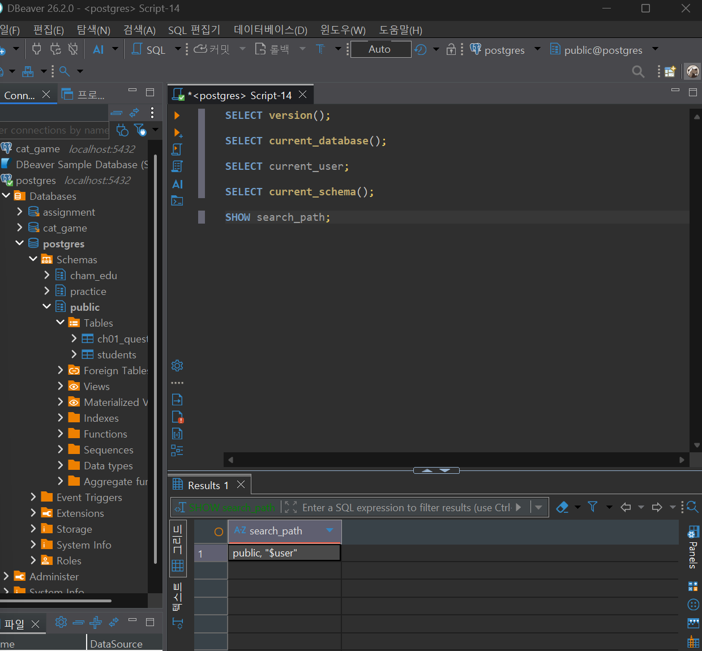
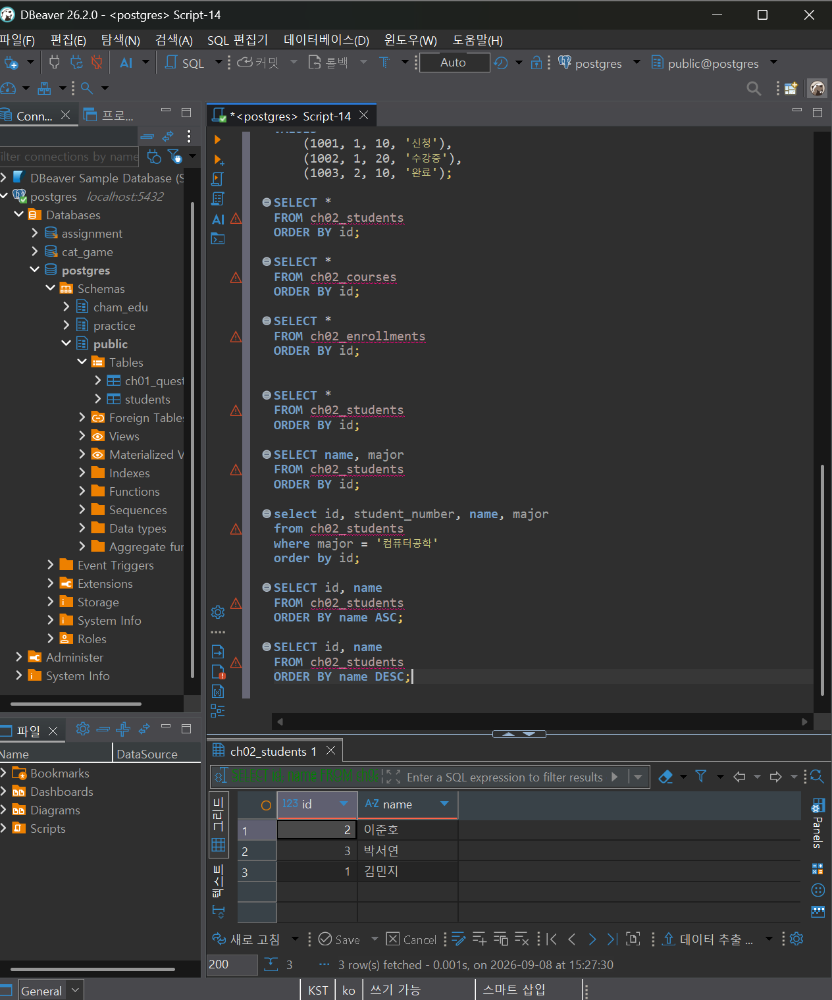
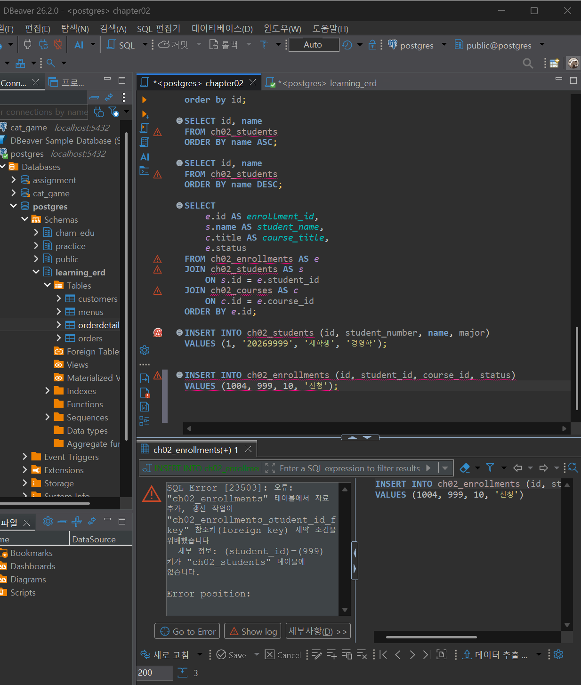
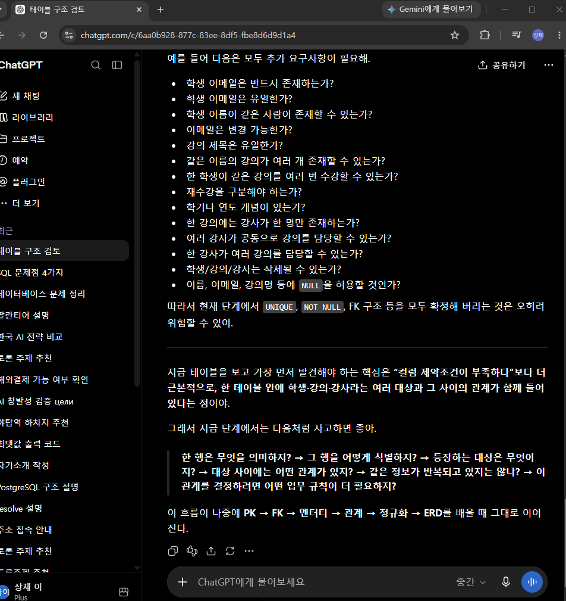

# Chapter 02 확장 실습 답안 템플릿

> **과제:** 데이터와 DBMS의 기본 개념  
> **사용 방법:** 이 파일을 내려받아 본인의 GitHub 저장소에 `chapter02_answer.md`라는 이름으로 저장한 뒤 실습하면서 바로 작성합니다.  
> **제출 방법:** LMS에는 파일을 직접 업로드하지 않고, **본인 GitHub 저장소의 `chapter02_answer.md` 파일 URL**을 제출합니다.

---

## 제출 전 개인정보 주의

LMS에서 제출자를 확인할 수 있으므로 이 공개 Markdown 파일에 학번이나 실명을 반드시 적을 필요는 없습니다.

```text
GitHub 계정 또는 별칭: 
과제 작성일: 2026-09-08
사용한 AI 도구: Chat gpt
```

> 실제 비밀번호, API Key, 전체 DB 접속 URL, 개인정보가 포함된 화면은 올리지 않습니다.

---

# 1. PostgreSQL에서 현재 위치 확인

## 1-1. 실행한 SQL

```sql
SELECT version();
SELECT current_database();
SELECT current_user;
SELECT current_schema();
SHOW search_path;
```

## 1-2. 실행 결과 기록

```text
PostgreSQL 버전: PostgreSQL 18.4 on x86_64-windows, compiled by msvc-19.44.35227, 64-bit
현재 데이터베이스: postgres
현재 사용자: postgres
현재 스키마: public
search_path: public, "$user"
```

## 1-3. 구조를 내 말로 설명

```text
PostgreSQL은:

현재 접속한 데이터베이스는: postrgres

스키마는: public

DBeaver 또는 psql 같은 도구는: DBeaver
```

## 1-4. 계층 구조 완성

```text
사용자
→ DBeaver
→ PostgreSQL DBMS
→ Database
→ schema
→ table
→ 행 / 열
```

## 1-5. 증거 화면

권장 경로:

```text
assignments/chapter02/images/step01_environment.png
```

```markdown

```

`여기에 STEP 1 핵심 증거 화면을 삽입하세요.`

---

# 2. 데이터베이스 안의 스키마와 테이블 관찰

## 2-1. 스키마 조회 결과

실행한 SQL:

```sql
SELECT schema_name
FROM information_schema.schemata
ORDER BY schema_name;
```

관찰한 스키마 이름 중 3개 이내를 적습니다.

```text
1. cham_edu
2. practice
3. public
```

### `public`은 무엇인가요?

```text
특별한 목적이 없는 낙서장 같은 스키마
```

### 데이터베이스와 스키마는 같은 것인가요?

```text
나의 설명: 스키마들이 모여 데이터베이스가 된다.
```

## 2-2. 현재 보이는 테이블 조회

```sql
SELECT table_schema, table_name
FROM information_schema.tables
WHERE table_type = 'BASE TABLE'
  AND table_schema NOT IN ('pg_catalog', 'information_schema')
ORDER BY table_schema, table_name;
```

```text
조회된 사용자 테이블 수 또는 눈에 띈 테이블: cham_edu

아직 테이블이 거의 없어도 괜찮은 이유: 아직 table 실행 코드를 입력하지 않았기에 괜찮음
```

## 2-3. 관찰 정리

```text
PostgreSQL 서버 안에는 여러 데이터 베이스가 있을 수 있다.
한 데이터베이스 안에는 여러 스키마가 있을 수 있다.
스키마 안에는 테이블과 같은 표가 존재한다.
```

---

# 3. TEMP TABLE로 테이블·행·열·키 직접 확인

## 3-1. 임시 테이블 생성 완료 확인

- [x] `ch02_students` 생성
- [x] `ch02_courses` 생성
- [x] `ch02_enrollments` 생성

각 테이블의 **한 행 의미**를 적습니다.

| 테이블 | 한 행의 의미 |
| --- | --- |
| `ch02_students` | 학생 정보 한 행 |
| `ch02_courses` | 특정 강의 한 개 |
| `ch02_enrollments` | 특정 학생이 특정 강의를 신청한 사건 한 건|

## 3-2. 열의 의미 확인

### `ch02_students`

| 열 | 값의 의미 | 내부 식별자 / 업무 식별자 / 일반 속성 |
| --- | --- | --- |
| `id` | 학생 id 1개 | 내부 식별자 |
| `student_number` | 학번 1개 | 업무 식별자 |
| `name` | 이름 1개 | 일반 속성 |
| `major` | 전공 1개 | 일반 속성 |

### `ch02_enrollments`

| 열 | 값의 의미 | PK / FK / 일반 속성 |
| --- | --- | --- |
| `id` | 특정 학생이 특정 강의를 신청한 한 건 | PK |
| `student_id` | 학번 1개 | FK |
| `course_id` | 강의명 1개 | FK |
| `status` | 지원 상태 | 일반 속성 |

## 3-3. 입력된 행 수

```text
students 행 수: 3개
courses 행 수: 2개
enrollments 행 수: 3개
```

## 3-4. 내부 식별자와 업무 식별자

```text
students.id가 필요한 이유: 내부 식별자

student_number가 필요한 이유: 학생을 구분하는 고유 넘버. 이름은 동명이인이 있을 수 있음 -> 업무 식별자

둘을 항상 같은 값으로 사용하지 않아도 되는 이유: 학번은 업무 규칙에 따라 바뀔 가능성 있어서 학번 바뀌면 다른 모든 테이블을 바꿔야함
```

## 3-5. 숫자처럼 보이는 학번을 문자열로 저장한 이유

```text
나의 설명: 학번의 제일 앞이 0으로 시작할 수 도 있기에 이때는 숫자 타입으로 하면 부적절함
```

---

# 4. 테이블과 조회 결과는 다르다

## 4-1. 원본 테이블 행 수

```text
ch02_students 전체 행 수: 3개
```

## 4-2. 일부 열만 조회

실행 SQL: 

```sql
SELECT name, major
FROM ch02_students
ORDER BY id;
```

```text
원본 테이블의 열 수와 조회 결과의 열 수가 다른 이유: 원본은 4개의 컬럼이 있지만 지금은 이름과 전공 컬럼만 선택해서
```

## 4-3. 조건을 적용한 조회

실행 SQL:

```sql
SELECT id, student_number, name, major
FROM ch02_students
WHERE major = '컴퓨터공학'
ORDER BY id;
```

```text
원본 테이블 행 수: 3개
조회 결과 행 수: 2개
원본 테이블의 데이터가 삭제된 것인가?: 아니요
그렇게 판단한 이유: where 조건으로 전공이 컴퓨터공학인 사람만 골랐기 때문에
```

## 4-4. 정렬 결과 비교

```sql
SELECT id, name
FROM ch02_students
ORDER BY name ASC;

SELECT id, name
FROM ch02_students
ORDER BY name DESC;
```

```text
ASC 결과의 첫 학생: 김민지
DESC 결과의 첫 학생: 이준호

이 실험을 통해 ORDER BY에 대해 알게 된 점: 순서대로 정렬, ASC는 오름차순, DESC는 내림차순
```

## 4-5. 증거 화면

권장 경로:

```text
assignments/chapter02/images/step04_result_set.png
```

`여기에 STEP 4 핵심 증거 화면을 삽입하세요.`

---

# 5. PK와 FK를 실제로 관찰

## 5-1. 정상 데이터의 관계 읽기

다음 SQL 결과를 보고 작성합니다.

```sql
SELECT
    e.id AS enrollment_id,
    s.name AS student_name,
    c.title AS course_title,
    e.status
FROM ch02_enrollments AS e
JOIN ch02_students AS s
    ON s.id = e.student_id
JOIN ch02_courses AS c
    ON c.id = e.course_id
ORDER BY e.id;
```

```text
한 행이 의미하는 것: 한 학생의 등록_id, 이름, 신청한 강의, 신청 상태

같은 student_id가 여러 enrollment 행에서 반복될 수 있는 이유: 여러 수업을 신청 할 수도 있기 때문에

같은 course_id가 여러 enrollment 행에서 반복될 수 있는 이유:
여러명이 한 강의를 등록 하기 때문에 반복 가능
```

## 5-2. 기본키 중복 오류 관찰

중복 PK 입력을 시도한 결과:

```text
실행 성공 / 실패: 실패
오류 메시지에서 확인한 핵심 단어: 고유 제약 조건을 위반함
왜 실패했다고 생각하는가: unique 조건 위반
```

## 5-3. 존재하지 않는 학생을 참조하는 FK 오류 관찰

존재하지 않는 `student_id`를 사용한 수강신청 입력 결과:

```text
실행 성공 / 실패: 실패
오류 메시지에서 확인한 핵심 단어: (student_id)=(999) 키가 "ch02_students" 테이블에 없습니다.
왜 실패했다고 생각하는가: student_id = 999인 학생이 없어서 
```

## 5-4. PK와 FK의 차이 정리

```text
PK는 각 테이블의 기준이 되기 위한 키이다.

FK는 다른 테이블에 같은 정보가 있어 참조하기 위한 키이다.

FK 값이 여러 행에서 반복될 수 있는 이유는
다른 테이블에서 가져오는 값이기 때문이다.
```

## 5-5. 증거 화면

권장 경로:

```text
assignments/chapter02/images/step05_pk_fk.png
```

> 오류 메시지는 전체 화면이 아니라 테이블명·constraint·참조 오류가 보이는 정도만 캡처합니다.

`여기에 STEP 5 핵심 증거 화면을 삽입하세요.`


---

# 6. 관계와 카디널리티를 자연어로 설명

현재 임시 데이터 기준으로 작성합니다.

```text
학생 한 명은 여러 수강신청을 가질 수 있는가?: 예

강의 한 개는 여러 수강신청을 가질 수 있는가?: 예

수강신청 한 건은 학생 몇 명을 참조하는가?: 1명

수강신청 한 건은 강의 몇 개를 참조하는가?: 1개
```

아래 구조를 완성합니다.

```text
students 1 ── N enrollments N ── 1 courses
```

### 학생과 강의가 N:M 관계라고 볼 수 있는 이유

```text
나의 설명: 한 강의에 여러 명의 학생이 신청할 수 있고, 한명의 학생은 여러 강의를 신청할 수 있어서.
```

> 아직 0개 허용 여부, 필수 관계, 삭제 정책까지 확정하지 않습니다. 그런 규칙은 Chapter 05~06에서 다룹니다.

---

# 7. AI가 만든 테이블 구조 직접 검토

## 7-1. AI에게 묻기 전에 내가 먼저 찾은 문제1. 

다음 구조를 보고 최소 4개를 적습니다.

```sql
CREATE TABLE student_courses (
    student_name VARCHAR(50),
    student_email VARCHAR(100),
    course_title VARCHAR(100),
    instructor_name VARCHAR(50)
);
```

```text
문제 1. 각 행을 안정적으로 구분하는 PK가 없음
문제 2. null, not null 안넣음
문제 3. 학생 정보와 강의 정보가 같은 테이블에 섞여 있음
문제 4. 중복을 방지하는 unique 제약이 없음
```

## 7-2. AI 검토 요청 프롬프트

사용한 핵심 프롬프트를 기록합니다.

```text
나는 PostgreSQL과 데이터베이스를 처음 배우는 학생입니다.

아직 정규화와 ERD를 정식으로 배우기 전입니다.

다음 테이블 구조를 검토해 주세요.

CREATE TABLE student_courses (

    student_name VARCHAR(50),

    student_email VARCHAR(100),

    course_title VARCHAR(100),

    instructor_name VARCHAR(50)

);

완성된 정답 설계를 바로 만들어 주지 말고 다음 질문 중심으로 설명해 주세요.

1. 한 행의 의미가 명확한가?

2. PK 후보가 필요한가?

3. 내부 식별자와 업무 식별자를 구분할 필요가 있는가?

4. FK로 표현해야 할 관계 후보는 무엇인가?

5. 중복 저장 위험이 있는가?

6. 현재 요구사항만으로 결정할 수 없는 정책은 무엇인가?

확정되지 않은 업무 규칙은 임의로 결정하지 마세요.

```

## 7-3. AI 제안과 나의 판단

| AI의 지적 또는 제안 | 동의 / 수정 / 보류 | 나의 근거 |
| --- | --- | --- |
| 한행의 의미가 명확한가 | 동의 | 한명이 특정 강의를 수강하고 있는 한건을 나타내는데 이건 기초 테이블이라기 보다는 자식 테이블에 가까워 먼저 만들게 아님  |
| PK 후보가 필요한가? | 동의 | 중복입력된건지 맞게 입력된건지 확인할 수 없기에 PK는 필요하지만 아직 무엇을 PK로 해야할지는 모름 |
| 내부식별자와 업무 식별자를 구분할 필요가 있는가 | 동의 | 현재 모든 값은 중복가능하고 변경해야 할수 있기 때문 |
| FK로 표현해야 할 관계 후보는 무엇인가? 학생 강의 강사 | 보류 | 아직 전체적인 구조 정해지지 않음 |
| 중복 저장 위험이 있는가? | 동의 | 강의 하나를 학생 100명이 듣는다면 같은 데이터가 100번 저장될 수 있고 이러면 나중에 수정시 문제 생길 수 있음 |

## 7-4. 본문과 대조한 항목

AI 설명 중 최소 하나를 `chapter02.md`와 비교합니다.

```text
AI가 설명한 내용: 중복입력된건지 맞게 입력된건지 확인할 수 없기에 PK는 필요하지만 아직 무엇을 PK로 해야할지는 모름

본문에서 확인한 내용: PK 후보가 필요한가?

일치 / 부분 일치 / 수정 필요: 일치

내가 최종적으로 이해한 내용: 내부적으로 수정될 수 없는 PK가 있어야 기준이 제대로 잡힘
```

## 7-5. 증거 화면

권장 경로:

```text
assignments/chapter02/images/step07_ai_review.png
```

`여기에 AI 검토 과정의 핵심 화면을 삽입하세요.`

---

# 8. Chapter 01의 개인 서비스 아이디어를 DB 용어로 다시 표현

Chapter 01에서 정한 개인 서비스 주제를 그대로 사용하거나 새 주제를 정해도 됩니다.

## 8-1. 서비스 기본 정보

```text
서비스 이름: 블로그 키우기 도우미
서비스 목적: 블로그 조회수 증가
```

## 8-2. PostgreSQL 구조 후보

```text
데이터베이스 이름 후보: view_booster
스키마 이름 후보: posts, topics, traffic_source
```

> 아직 실제 데이터베이스나 스키마를 생성하지 않아도 됩니다.

## 8-3. 테이블 후보와 한 행 의미

최소 3개를 작성합니다.

| 테이블 후보 | 한 행의 의미 | 내부 ID 후보 | 업무 식별자 후보 |
| --- | --- | --- | --- |
| posts | 블로그 글 1개 | post_id | 블로그 플랫폼의 글 번호, 글 url |
| topics | 게시글 주제 1개 | topic_id | 주제명 |
| traffic_sources | 유입 경로 종류 1개 | source_id | 유입 경로명/코드 |

## 8-4. FK 후보

```text
1. posts.topic_id-> topics.id 참조 후보
   이유: 게시글 하나는 주제를 가지고 있고 이건 topic_id에 포함되어 있기 때문
```

## 8-5. 자연어 관계 문장

```text
1. 주제 1개는 여러개의 게시글을 포함 할 수 있음
2. 게시글 1개는 여러 종류의 유입 경로를 가질 수 있음
3. 
```

## 8-6. 아직 확정하지 않을 정책

```text
Q1. 유입 경로를 어떻게 나눌 것인가?
Q2. 주제를 어떤 방식으로 나눌 것인가?
Q3. 게시글 한 개에 여러 주제가 포함 되면 어떻게 할 것인가?
```

---

# 9. AI를 개인 구조의 검토자로 사용

## 9-1. 사용한 프롬프트

```text
나는 데이터베이스 초보자입니다.

Chapter 02까지 학습했고 아직 ERD와 정규화는 정식으로 배우지 않았습니다.

내 서비스 구조 초안은 다음과 같습니다.

서비스 이름: 블로그 조회수 키우기

테이블 후보와 한 행 의미:


내부 식별자 후보:

\- [작성]

업무 식별자 후보:

\- [작성]

FK 후보:

\- [작성]

미확정 정책:

\- [작성]

정답 설계를 대신 작성하지 말고 다음을 질문 형태로 검토해 주세요.

1\. DBMS / database / schema / table을 혼동한 곳

2\. 한 행 의미가 모호한 곳

3\. 내부 식별자와 업무 식별자를 혼동한 곳

4\. PK와 FK 역할을 잘못 이해한 곳

5\. FK가 필요한데 빠진 관계 후보

6\. 아직 업무 담당자에게 확인해야 할 정책

근거 없이 정책을 확정하지 마세요.

**[출처]** [Chapter 02 확장 실습 — 데이터와 DBMS의 기본 개념](https://blog.naver.com/dev-dog/224399504053)|**작성자** [아토믹데브](https://blog.naver.com/dev-dog)

근데 visitors는 정보 제공 안해서 테이블 못만들거같아

맞아. 방문자 개인 식별 정보가 제공되지 않는다면 `visitors` 테이블을 억지로 만들면 안 돼.

그 경우에는 **“방문자”를 개별 사람으로 저장하는 모델이 아니라, 블로그 플랫폼이 제공하는 집계 통계 데이터를 저장하는 모델**로 바꾸는 게 자연스러워.

예를 들면 이렇게 볼 수 있어.

| 테이블 후보한 행의 의미내부 ID 후보업무 식별자 후보 |                               |                   |                    |
| ------------------------------ | ----------------------------- | ----------------- | ------------------ |
| `posts`                        | 블로그 게시글 1개                    | `post_id`         | 게시글 번호, URL        |
| `topics`                       | 게시글 주제 1개                     | `topic_id`        | 주제명                |
| `traffic_sources`              | 유입 경로 종류 1개                   | `source_id`       | 유입 경로명/코드          |
| `post_view_stats`              | 특정 게시글의 특정 날짜 조회수 통계 1건       | `stat_id`         | `post + 날짜` 조합     |
| `traffic_stats`                | 특정 날짜 또는 시간대의 유입 경로별 방문 통계 1건 | `traffic_stat_id` | `날짜 + 유입 경로` 등의 조합 |
| `gender_stats`                 | 특정 날짜 또는 기간의 성별 방문 통계 1건      | `gender_stat_id`  | `기간 + 성별` 조합       |
| `time_stats`                   | 특정 날짜의 특정 시간대 방문 통계 1건        | `time_stat_id`    | `날짜 + 시간대` 조합      |

여기서 중요한 차이가 있어.

예전 구조는 이런 느낌이었어.

```
```

```
방문자 A
 ├─ 성별: 남성
 ├─ 방문 시간: 13:20
 └─ 유입 경로: 네이버 검색
```

그런데 실제로 플랫폼이 개인 정보를 안 주면 이런 연결은 못 해.

대신 우리가 받을 수 있는 데이터가 예를 들어

```
```

```
남성 방문자: 60%
여성 방문자: 40%

네이버 검색: 100명
구글 검색: 20명

13시 방문자: 15명
14시 방문자: 22명
```

정도라면 DB 역시 **개별 방문자가 아니라 통계 단위**로 설계해야 해.

그래서 네가 처음 생각했던

> 같은 방문자라도 여러 유입 경로를 가질 수 있다.
>
> 같은 방문자라도 여러 유입 시간을 가질 수 있다.

이 관계도 현재 데이터로는 표현할 수 없어. **“같은 방문자”라는 사실 자체를 알 수 없기 때문이야.**

오히려 지금 프로젝트라면 핵심 구조를 이렇게 생각하는 편이 좋아.

```
```

```
게시글
  ↓
게시글별 조회수 통계

블로그 전체
  ├─ 성별 통계
  ├─ 시간대 통계
  └─ 유입 경로 통계
```

다만 여기서도 아직 확정하면 안 되는 게 하나 있어. **성별·유입 경로·시간대 통계가 게시글별로 제공되는지, 블로그 전체 통계로만 제공되는지**에 따라 테이블 관계가 크게 달라져.

실제 네이버 블로그 같은 특정 플랫폼을 대상으로 한다면, 다음 단계에서는 **실제로 어떤 통계 데이터를 제공하는지부터 확인하고 그 데이터만 가지고 테이블 후보를 다시 잡는 게 가장 좋아.**

posts, topics, traffic\_sources 의 fk 후보와 이유 추천해줘

지금 구조 기준으로 보면 이렇게 생각할 수 있어.

| 테이블FK 후보참조 대상이유   |            |                    |                            |
| ----------------- | ---------- | ------------------ | -------------------------- |
| `posts`           | `topic_id` | `topics(topic_id)` | 각 게시글이 어떤 주제에 속하는지 연결하기 위해 |
| `topics`          | 현재는 없음     | -                  | 주제 자체는 독립적인 기준 정보로 볼 수 있어서 |
| `traffic_sources` | 현재는 없음     | -                  | 유입 경로 종류 자체도 독립적인 기준 정보라서  |

조금 더 풀어서 보면, `posts.topic_id`가 가장 자연스러운 FK 후보야.

```
```

```
posts
- post_id
- title
- topic_id  -- FK 후보
```

예를 들어:

```
```

```
topics
1 | AI
2 | 여행
3 | 음식
```

```
```

```
posts
101 | ChatGPT 활용법 | 1
102 | 제주도 여행기   | 2
```

여기서 `posts.topic_id = 1`은 `topics.topic_id = 1`, 즉 **AI 주제**를 의미해.

이렇게 하면 `posts`에 매번 `"AI"`라는 문자열을 직접 저장하지 않고, 주제 테이블을 참조할 수 있어.

다만 이건 **“게시글 하나는 주제 하나만 가진다”는 정책일 때만** 자연스러워. 만약 게시글 하나가 `AI`, `개발`, `생산성`처럼 여러 주제를 가질 수 있다면 `posts`에 `topic_id` 하나만 두는 구조는 맞지 않아. 그 경우에는 나중에 별도의 연결 테이블을 고민해야 해.

`topics`는 현재 다른 테이블을 꼭 참조해야 할 이유가 없어.

```
```

```
topic_id
topic_name
```

정도로 독립적으로 존재할 수 있어.

`traffic_sources`도 마찬가지야.

```
```

```
source_id
source_name
```

예를 들어:

```
```

```
1 | 네이버 검색
2 | 구글 검색
3 | 직접 유입
4 | SNS
```

자체가 하나의 **기준 테이블**이기 때문에 FK가 꼭 필요한 건 아니야.

대신 `traffic_sources`의 PK는 나중에 **유입 통계 테이블에서 FK로 사용될 가능성**이 높아.

예를 들어:

```
```

```
traffic_stats
- traffic_stat_id
- source_id       ← FK
- stat_date
- visitor_count
```

즉, 지금 세 테이블만 놓고 보면 관계를 이렇게 보는 게 좋아.

```
```

```
topics
   ↑
   │ topic_id
   │
posts


traffic_sources
   ↑
   │ source_id
   │
[향후 traffic_stats 같은 통계 테이블]
```

핵심은 **FK를 모든 테이블에 억지로 넣는 게 아니라, 다른 테이블의 행을 참조해야 할 필요가 있을 때 넣는 것**이야.

그리고 현재 요구사항만 보면 `posts.topic_id`조차도 아직 완전히 확정은 아니야. **게시글 하나당 주제가 하나인지 여러 개인지** 먼저 결정해야 해.

나는 데이터베이스 초보자입니다.

Chapter 02까지 학습했고 아직 ERD와 정규화는 정식으로 배우지 않았습니다.

내 서비스 구조 초안은 다음과 같습니다.

서비스 이름: 블로그 조회수 키우기

테이블 후보와 한 행 의미, 내부 식별자 후보, 업무 식별자 후보

| 테이블 후보 | 한 행의 의미 | 내부 ID 후보 | 업무 식별자 후보 |
| --- | --- | --- | --- |
| posts | 블로그 글 1개 | post_id | 블로그 플랫폼의 글 번호, 글 url |
| topics | 게시글 주제 1개 | topic_id | 주제명 |
| traffic_sources | 유입 경로 종류 1개 | source_id | 유입 경로명/코드 |

FK 후보:

1. posts.topic_id-> topics.id 참조 후보
   이유: 게시글 하나는 주제를 가지고 있고 이건 topic_id에 포함되어 있기 때문

미확정 정책:

Q1. 유입 경로를 어떻게 나눌 것인가?

Q2. 주제를 어떤 방식으로 나눌 것인가?

Q3. 게시글 한 개에 여러 주제가 포함 되면 어떻게 할 것인가?

정답 설계를 대신 작성하지 말고 다음을 질문 형태로 검토해 주세요.

1\. DBMS / database / schema / table을 혼동한 곳

2\. 한 행 의미가 모호한 곳

3\. 내부 식별자와 업무 식별자를 혼동한 곳

4\. PK와 FK 역할을 잘못 이해한 곳

5\. FK가 필요한데 빠진 관계 후보

6\. 아직 업무 담당자에게 확인해야 할 정책

근거 없이 정책을 확정하지 마세요.
```

## 9-2. AI가 질문한 내용 중 유용했던 것

```text
1. 주제 1개는 미리 분류한 키워드인가 or 게시글에서 자동으로 추출한 키워드 인가
2. ai, 인공지능, 생성형 ai를 서로 다른 주제로 볼 것인가
3. 유입 경로의 수준은 네이버, 구글, sns 수준인가 or 네이버 검색, 카페, 블로그 처럼 세분화 하는가 or 특정 url 하나하나를 별도의 유입 경로로 보는가
```

## 9-3. AI가 너무 빨리 결정한 내용 또는 내가 보류한 내용

```text
1. AI가 posts.topic_id를 FK 후보로 제안했지만, 게시글 하나에 여러 주제가 포함될 수 있는지 정책이 확정되지 않았기 때문에 최종 결정은 보류했다.
2. 방문자 정보를 저장하는 visitors 테이블은 처음에는 후보로 고려했지만, 실제 블로그 플랫폼에서 방문자 개인 식별 정보를 제공하지 않을 가능성이 높아 제외하기로 했다.
```

## 9-4. 검토 후 수정한 구조

| 수정 전                                     | 수정 후                          | 수정 이유                                               |
| ---------------------------------------- | ----------------------------- | --------------------------------------------------- |
| `visitors` 테이블 후보 포함                     | `visitors` 테이블 후보 제외          | 블로그 플랫폼에서 방문자 개인 식별 정보를 제공하지 않아 개별 방문자를 저장하기 어렵기 때문 |
| 방문자별 성별, 유입 경로, 유입 시간 저장                 | 성별, 유입 경로, 시간대는 집계 통계 데이터로 검토 | 같은 방문자를 식별할 수 없기 때문에 방문자 단위 관계를 표현할 수 없기 때문         |
| `posts.topic_id`를 바로 FK로 결정              | `posts.topic_id`는 FK 후보로만 보류  | 게시글 하나에 여러 주제가 포함될 수 있는지 정책이 확정되지 않았기 때문            |
| `topics`의 업무 식별자를 주제명으로 확정               | 주제명은 업무 식별자 후보로만 유지           | 주제명이 변경되거나 중복될 가능성을 아직 확인하지 못했기 때문                  |
| `traffic_sources`의 업무 식별자를 유입 경로명/코드로 확정 | 유입 경로명/코드는 업무 식별자 후보로만 유지     | 유입 경로를 어떤 기준과 단위로 나눌지 아직 결정되지 않았기 때문                |
| 조회수·성별·유입 경로·시간대 통계 테이블을 바로 추가           | 통계 테이블 추가는 보류                 | 실제 블로그 플랫폼이 어떤 통계 데이터를 어떤 단위로 제공하는지 먼저 확인해야 하기 때문   |


---

# 10. 최종 개념 정리

아래 문장을 본인의 말로 완성합니다.

```text
PostgreSQL은 데이터 관리 저장소이다.

DBeaver 또는 psql은 데이터 관리 플랫폼이다.

데이터베이스와 스키마의 차이는 "전체를 포함하는가" 이다.

테이블 한 행은 여러 종류의 정보 집합이다.

조회 결과가 원본 테이블과 다른 이유는 몇몇 컬럼만 뽑아서이다.

내부 식별자와 업무 식별자의 차이는 "추후에 수정이 필요한가"의 차이 이다.

PK는 기본키 이다.

FK는 외래키 이다.
```

---

# 11. 이번 Chapter에서 새롭게 알게 된 점

최소 3개를 작성합니다.

```text
1. 업무 식별자를 기본키로 쓰지 않는 이유
2. 테이블을 정할 때 얻을 수 있는 데이터인지 먼저 확인해야한다.
3. 조회수를 누적으로 할 것인지, 날짜별로 할 것인지
```

## 아직 헷갈리는 내용

```text
1. FK 이름 정하기(순서)
2. 어느 정도의 테이블이 필요한가
```

## AI에게 다시 질문하고 싶은 내용

```text
테이블이 얻을 수 있는 정보를 바탕으로 만들어 진것인가? or 상상인가
```

---

# 12. 제출 전 자기 점검

- [x] PostgreSQL에서 현재 database / schema / search_path를 확인했다.
- [x] DBMS, database, schema, table을 구분해서 설명할 수 있다.
- [x] TEMP TABLE 3개를 생성하고 직접 데이터를 조회했다.
- [x] 각 테이블의 한 행 의미를 작성했다.
- [x] 테이블과 조회 결과가 다르다는 것을 실제 SQL로 확인했다.
- [x] `ORDER BY`를 사용하지 않으면 업무 순서를 가정하면 안 된다는 점을 이해했다.
- [x] 내부 식별자와 업무 식별자의 차이를 설명할 수 있다.
- [x] PK 중복 입력 실패를 직접 확인했다.
- [x] 존재하지 않는 FK 참조 실패를 직접 확인했다.
- [x] FK 값이 반복될 수 있는 이유를 설명할 수 있다.
- [x] AI가 만든 테이블을 내가 먼저 검토했다.
- [x] AI 설명 중 최소 하나를 본문과 대조했다.
- [x] 개인 서비스의 테이블 후보를 3개 이상 작성했다.
- [x] 개인 서비스의 FK 후보와 미확정 정책을 기록했다.
- [x] 실제 비밀번호·API Key·민감한 접속 정보가 포함되지 않았는지 확인했다.
- [x] 이미지 링크가 GitHub에서 정상적으로 보이는지 확인했다.

---

# 13. GitHub 제출 정보

답안 파일 권장 위치:

```text
assignments/chapter02/chapter02_answer.md
```

이미지 권장 위치:

```text
assignments/chapter02/images/
```

LMS 제출 URL 형식:

```text
https://github.com/<본인-GitHub-ID>/<본인-저장소>/blob/main/assignments/chapter02/chapter02_answer.md
```

## 최종 확인

- [x] 위 URL을 로그아웃 상태 또는 다른 브라우저에서 열어도 확인 가능하다.
- [x] Markdown이 정상 렌더링된다.
- [x] 이미지가 깨지지 않는다.
- [x] LMS에 교수자 템플릿 URL이 아니라 **내 답안 파일 URL**을 제출했다.