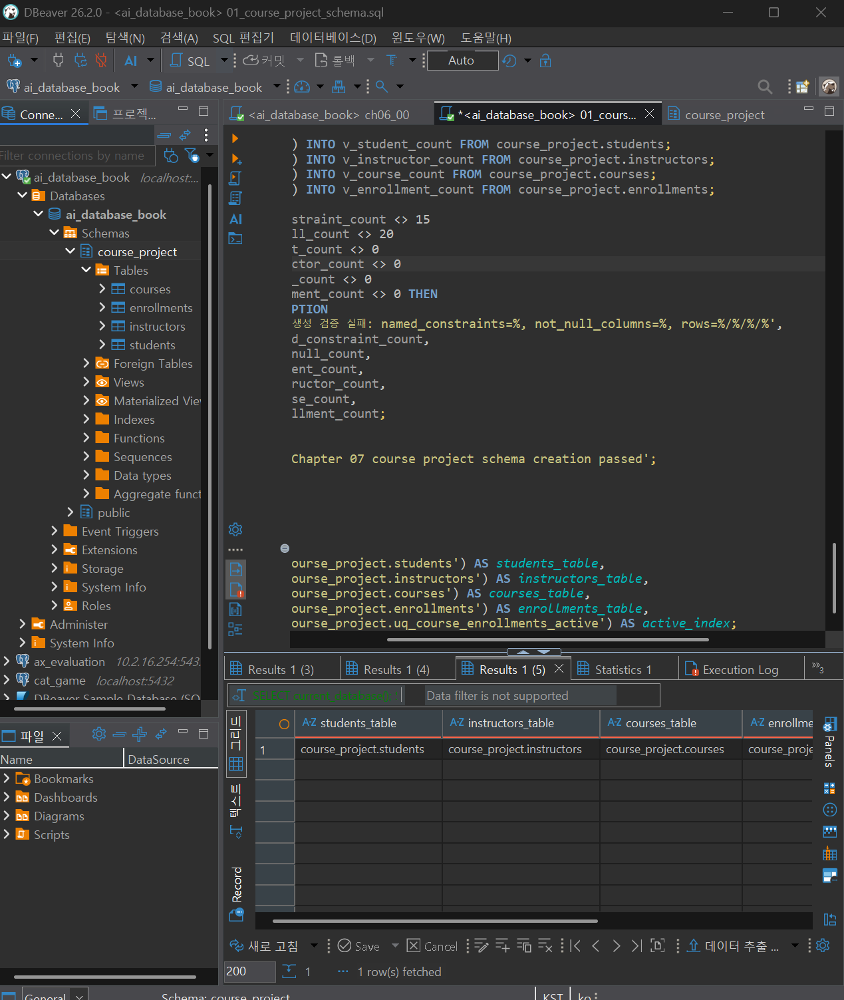
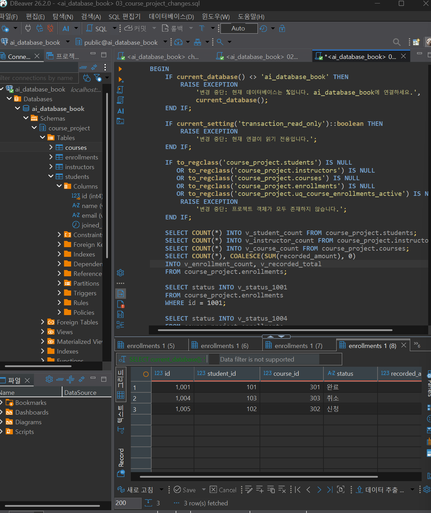
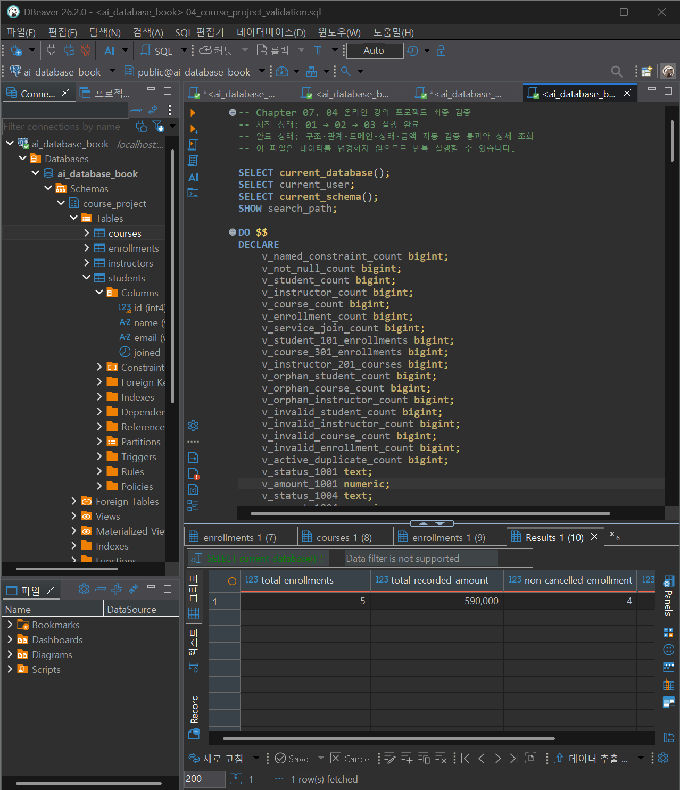
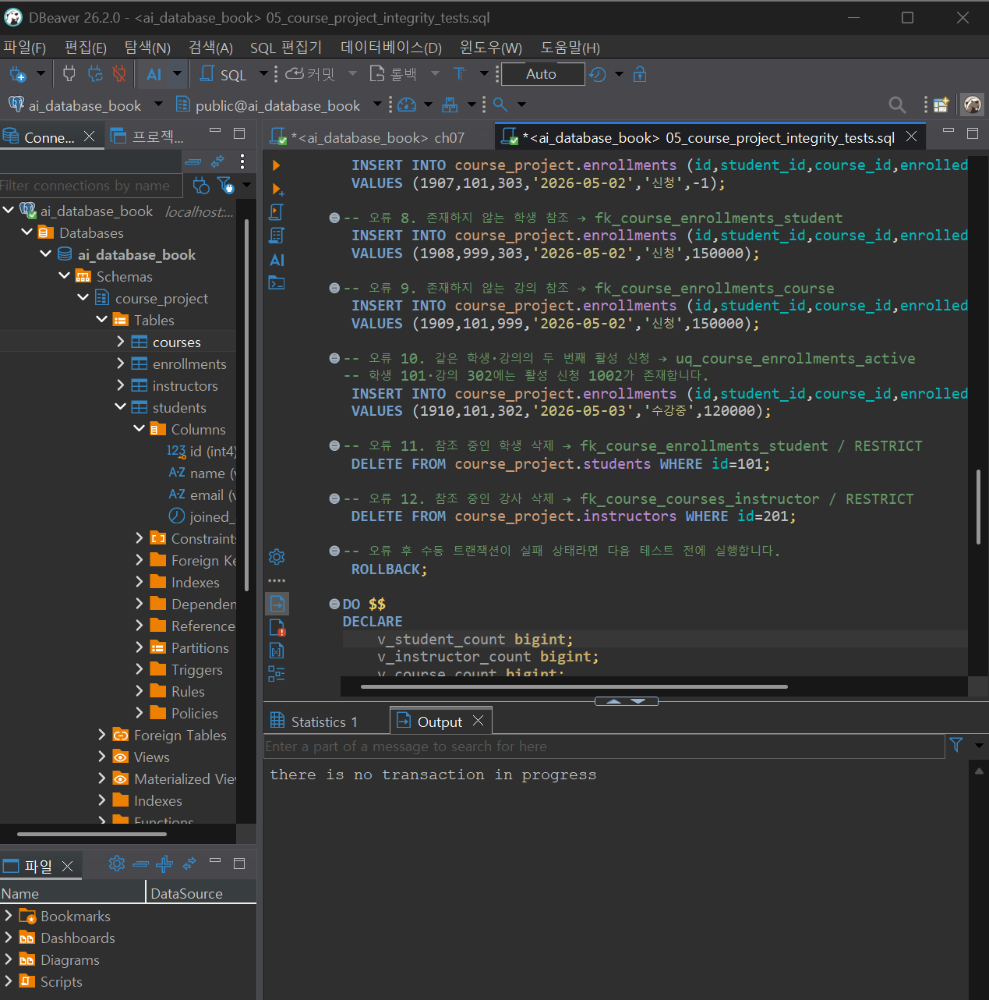
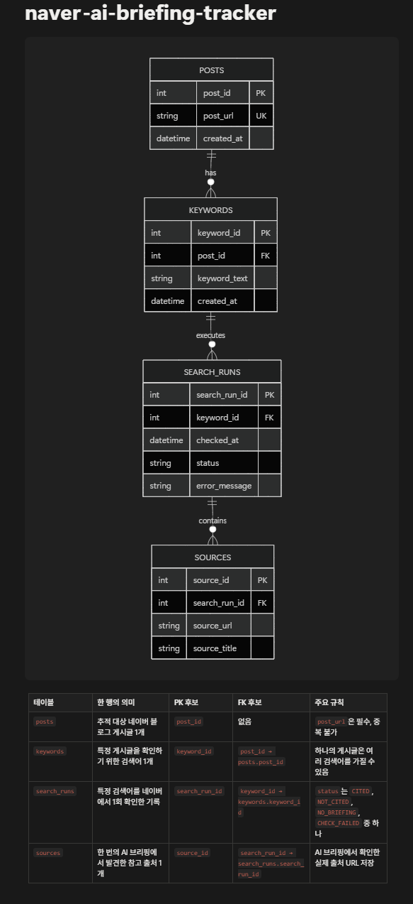

# Chapter 07 확장 실습 답안 템플릿

> **과제:** 실전 프로젝트 1 — 온라인 강의 수강신청 DB 완성하기  
> **사용 방법:** 이 파일을 내려받아 본인의 GitHub 저장소에 `chapter07_answer.md`라는 이름으로 저장한 뒤 실습하면서 바로 작성합니다.  
> **제출 방법:** LMS에는 파일을 직접 업로드하지 않고, **본인 GitHub 저장소의 `chapter07_answer.md` 파일 URL**을 제출합니다.

---

## 제출 전 주의

이 파일과 캡처 화면에는 실제 비밀번호, 전체 DB 접속 URL, API Key, 개인정보를 기록하지 않습니다.

```text
GitHub 계정 또는 별칭: sangjae-lee97    
과제 작성일: 2026.09.16
사용한 AI 도구: chat gpt
```

---

# 1. 시작 환경 확인

다음을 실행합니다.

```sql
SELECT current_database();
SELECT current_user;
SELECT current_schema();
SHOW search_path;
SHOW transaction_read_only;
```

| 확인 항목 | 실제 결과 | 의미 |
| --- | --- | --- |
| `current_database()` | ai_database_book | 현재 db가 'ai_database_book'이다. |
| `current_user` | postgres | 유저이름은 postgres이다. |
| `current_schema()` | course_project | 현재 스키마는 course_project이다. |
| `search_path` | course_project, "$user", public | 테이블 이름만 썼을 때, course_project 스키마 부터 검색한다. |
| `transaction_read_only` | off | 현재 트랜잭션은 읽기/쓰기 가능하다.(auto-commit 상태) |

- [x] 현재 DB가 `ai_database_book`이다.
- [x] 쓰기 가능한 연결인지 확인했다.
- [x] 실행할 SQL 범위를 확인했다.
- [x] Auto-commit 상태를 확인했다.

### 프로젝트 SQL을 실행하기 전에 시작 상태를 확인해야 하는 이유

```text
현재 어디서 작업할지 모르기 때문
```

---

# 2. 프로젝트 범위와 요구사항 읽기

## 2-1. 포함 범위

본문을 그대로 복사하지 말고 자신의 말로 정리합니다.

```text
1. 학생
2. 강사
3. 강의, 강의 기준 가격, 신청 시 기록 금액
4. 수강신청, 신청 상태, 
```

## 2-2. 제외 범위

```text
1. 실제 결제 시도, 승인, 실패, 환불 이력
2. 강의 전원과 대기열
3. 상태 변경 전체 이력
4. 진도, 수료, 강의 콘텐츠
5. 수강평, 쿠폰, 할인 적용 이력
```

### 범위를 명확하게 정해야 하는 이유

```text
범위를 정해야만 기능의 구현 범위도 정할 수 있기 때문에
```

## 2-3. 요구사항 / 프로젝트 결정 / 미확정 질문 구분

아래 항목 중 대표 항목을 정리합니다.

| ID | 종류 | 내용 요약 | DB 구조/규칙에 미치는 영향 |
| --- | --- | --- | --- |
| P07-R01 | 요구사항 | 학생은 이름, 이메일과 가입일을 가진다. | 학생 테이블에 아래 3개 컬럼은 무조건 들어가야 함 |
| P07-R05 | 요구사항 | 수강신청은 학생, 강의, 신청일, 상태와 신청 시 기록 금액을 가진다. | 수강신청 컬럼에 아래 컬럼은 무조건 들어가야함 |
| P07-R07 | 요구사항 | 학생·강사 이메일은 각 테이블 안에서 공백·동일 문자열 중복이 허용되지 않는다. | 이메일은 기입시 공백과 unique 제약을 걸어야 한다. |
| P07-D02 | 프로젝트 결정 |할인 기능이 없는 현재 범위에서는 신청 생성 시 **courses.price**를 **recorded_amount**에 복사해 보존  | 추후 강의 가격이 바뀔 수 있으므로 현재 강의 가격을 따로 기록해 보존 |
| P07-D03 | 프로젝트 결정 | 진행 중 중복 신청 금지 | 한 사람이 같은 강의 신청 금지 제약 |
| P07-Q01 | 미확정 질문 | 학생과 강사 사이에서도 이메일을 전역 고유하게 제한해야 하는가? | 학생과 강사 테이블의 이메일을 묶어서 제약을 걸어야 하는지 구분 |

### 미확정 질문을 바로 제약조건으로 만들면 안 되는 이유

```text
이 요구사항 제시자의 의도를 모르기 때문
```

---

# 3. 네 테이블의 한 행 의미와 관계

## 3-1. 한 행 의미

```text
course_project.students 한 행 = students 한 행은 학생 한 명이다.

course_project.instructors 한 행 = instructors 한 행은 강사 한 명이다.

course_project.courses 한 행 = courses 한 행 은 개설된 강의 한 행이다.

course_project.enrollments 한 행 = enrollments 한 행은 특정 학생이 즉정 강의에 신청한 사건 한 건이다.
```

## 3-2. 키와 중요 규칙

| 테이블 | PK | FK | 중요 규칙 |
| --- | --- | --- | --- |
| students | id |  | email UNIQUE |
| instructors | id |  | email UNIQUE |
| courses | id | instructor_id | price NUMERIC |
| enrollments | id | student_id, course-id | recorded_amount는 course_price 참조|

## 3-3. 관계를 양방향 문장으로 작성

```text
instructors ↔ courses: 1 : N

students ↔ enrollments: 1 : N

courses ↔ enrollments: 1 : N
```

### 학생과 강의의 N:M 관계가 `enrollments`를 통해 어떻게 바뀌는지 설명

```text
1 : N : 1
```

### `enrollments`가 단순 연결 테이블이 아니라 사건 테이블이라고 볼 수 있는 이유

```text
status 같은 정보는 다른 곳에 넣기 애매하기 때문
```

---

# 4. `recorded_amount`의 의미 이해

```text
courses.price = 현재 강의의 기준 가격

enrollments.recorded_amount = 해당 신청이 만들어질 때 신청 행에 기록한 금액
```

### 두 값이 처음에는 같아도 같은 의미가 아닌 이유

```text
현재는 할인이 없기 때문
```

### `recorded_amount`를 실제 결제 성공액이나 회계 매출로 해석하면 안 되는 이유

```text
recorded_amount는 실제 결제 승인 금액을 뜻하지 않기에, 결제 및 환불을 관리하려면 별도 구조 필요
```

---

# 5. STEP 01 — 스키마와 테이블 생성

실행 파일:

```text
code/chapter07/01_course_project_schema.sql
```

## 5-1. 실행 전 예상

```text
course_project 스키마 존재 여부: X
예상 테이블 수: 4개
예상 데이터 행 수: 0개
예상되는 명명 제약조건 수: 15개
예상되는 NOT NULL 열 수: 20열
부분 고유 인덱스 존재 여부: 존재
```

## 5-2. 실행 결과

```text
실제 테이블 수: 4개
실제 명명 제약조건 수: 15개
실제 NOT NULL 열 수: 20열
부분 고유 인덱스: 2개의 이메일
네 테이블의 실제 행 수: 0개
통과 메시지: Chapter 07 course project schema creation passed
```

### 예상과 실제 비교

```text
일치
```

### 증거 화면

권장 경로:

```text
assignments/chapter07/images/step05_schema.png
```

`여기에 스키마/테이블 생성 검증 화면을 삽입하세요.`

---

# 6. STEP 02 — Seed 데이터 입력

실행 파일:

```text
code/chapter07/02_course_project_seed.sql
```

## 6-1. 실행 전 예상

```text
students: 3
instructors: 2
courses: 3
enrollments: 4
recorded_amount 합계: 470000
학생 101 신청 건수: 2
강의 301 신청 건수: 2
강사 201 담당 강의 수: 2
활성 중복 신청: 0
```

## 6-2. 실제 결과

```text
students: 3
instructors: 2
courses: 3
enrollments: 4
recorded_amount 합계: 47000
학생 101 신청 건수: 2
강의 301 신청 건수: 2
강사 201 담당 강의 수: 2
활성 중복 신청: 0
1001 상태: 수강중
1004 상태: 신청
1005 존재 여부: 없음
통과 메시지: Chapter 07 course project seed passed
```

### Seed 데이터를 단순 예제가 아니라 검증 데이터라고 볼 수 있는 이유

```text
설계한 제약조건과 관계가 실제로 정상 동작하는지 확인하기 위한 값들로 구성되어 있기 때문
```

---

# 7. STEP 03 — 변경 시나리오 실행

실행 파일:

```text
code/chapter07/03_course_project_changes.sql
```

## 7-1. 실행 전에 상태 변화를 예상

| 신청 ID | 변경 전 예상 상태 | 변경 후 예상 상태 | 예상 recorded_amount |
| ---: | --- | --- | ---: |
| 1001 | 수강중 | 완료 | 100000 |
| 1004 | 신청 | 취소 | 150000 |
| 1005 | 없음 | 신청 | 120000 |

```text
변경 후 예상 enrollments 행 수: 5
변경 후 예상 전체 recorded_amount 합계: 590000
변경 후 예상 취소 제외 건수: 4
변경 후 예상 취소 제외 recorded_amount 합계: 440000
```

## 7-2. 실제 결과

```text
1001 상태 / recorded_amount: 완료 / 100000
1004 상태 / recorded_amount: 취소 / 150000
1005 상태 / recorded_amount: 신청 / 120000
최종 enrollments 행 수: 5
전체 recorded_amount 합계: 590000
취소 제외 건수: 4
취소 제외 recorded_amount 합계: 440000
활성 중복 신청: 0
통과 메시지: Chapter 07 course project changes passed
```

### 조건부 UPDATE에서 예상 이전 상태를 확인해야 하는 이유

```text
잘못된 상태의 데이터를 의도치 않게 변경하지 않기 위해서
```

### 증거 화면

권장 경로:

```text
assignments/chapter07/images/step07_changes.png
```

`여기에 주요 변경 전/후 결과를 삽입하세요.`

---

# 8. STEP 04 — 최종 완료 게이트 실행

실행 파일:

```text
code/chapter07/04_course_project_validation.sql
```

## 8-1. 최종 검증 결과

```text
최종 행 수 students/instructors/courses/enrollments: 3 / 2 / 3 / 5
서비스 JOIN 결과 행 수: 5
학생 101 신청 수: 2
강의 301 신청 수: 2
강사 201 강의 수: 2
고아 관계 수: 0
활성 중복 신청 수: 0
전체 recorded_amount: 590000
취소 제외 recorded_amount: 440000
통과 메시지: Chapter 07 course project validation passed
```

### SQL 파일 4개가 모두 실행되었다는 사실과 프로젝트 검증 PASS가 다른 이유

```text
4개 모두 실행은 단지 실행되었다는 의미, 하지만 검증 pass는 단순 실행 여부 만이 아닌 여러가지 구조, 제약 등을 확인했다는 의미
```

### 증거 화면

권장 경로:

```text
assignments/chapter07/images/step08_validation.png
```

`여기에 최종 validation PASS 화면을 삽입하세요.`

---

# 9. 무결성 테스트

실행 파일:

```text
code/chapter07/05_course_project_integrity_tests.sql
```

> 오류 테스트는 파일 전체를 무작정 실행하지 않고 **한 테스트 구간씩** 실행합니다.

## 9-1. 허용되어야 하는 경계값 1개

```text
테스트 내용: price=0, description=NULL, recorded_amount=0인 무료 강의와 신청 데이터 입력

기대 결과: 정상 입력 후 정상 삭제

실제 결과: 오류 없이 INSERT 및 DELETE 성공

왜 허용되어야 하는가: description은 NULL을 허용하고, price와 recorded_amount는 0 이상을 허용하도록 제약조건이 설정되어 있기 때문이다.
```

## 9-2. 실패해야 하는 테스트 1 — 잘못된 참조 또는 값

```text
테스트 내용: 존재하지 않는 강사 ID 999를 참조하는 강의 입력
기대 결과: INSERT 실패
실제 오류 핵심: ERROR: null value in column "name" of relation "students" violates not-null constraint
  세부 정보: Failing row contains
동작한 제약조건/규칙: fk_course_courses_instructor
왜 실패해야 하는가: courses.instructor_id는 instructors.id를 참조해야 하는데 ID 999인 강사가 존재하지 않기 때문이다.
```

## 9-3. 실패해야 하는 테스트 2 — 활성 중복 신청

```text
테스트 내용: 학생 101이 강의 302에 두 번째 활성 신청을 추가
기대 결과: INSERT 실패
실제 오류 핵심: duplicate key value violates unique constraint "uq_course_students_email"
동작한 인덱스/규칙: Key (email)=(minji@example.com) already exists.
왜 실패해야 하는가: 같은 학생과 강의 조합에 대해 신청 또는 수강중 상태의 활성 신청은 하나만 허용하기 때문이다.
```

## 9-4. 실패 후 기준 상태 재검증

```text
04 validation 재실행 결과: Chapter 07 course project validation passed
기준 데이터가 유지되었는가: 예
```

### 실패 테스트가 프로젝트 품질 검증에 필요한 이유

```text

```

### 증거 화면

권장 경로:

```text
assignments/chapter07/images/step09_integrity.png
```

`여기에 대표 실패 테스트와 기준 상태 유지 결과를 삽입하세요.`

---

# 10. 재현성 실험

> 이 단계는 본인의 실습 환경이며 보존할 데이터가 없을 때만 수행합니다.

실행 순서:

```text
reset_course_project.sql
→ 01_course_project_schema.sql
→ 02_course_project_seed.sql
→ 03_course_project_changes.sql
→ 04_course_project_validation.sql
```

```text
처음 실행의 최종 결과: Chapter 07 course project validation passed
재실행의 최종 결과: Chapter 07 course project validation passed
두 결과가 일치했는가: 예
중간에 수동 수정이 필요했는가: 아니오
```

### 다른 사람이 같은 순서로 실행해 같은 결과를 얻는 것이 중요한 이유

```text
같은 SQL 파일을 같은 순서로 실행했을 때 동일한 결과가 나와야
프로젝트가 개인의 수동 수정이나 우연한 상태에 의존하지 않고
재현 가능한 상태라고 볼 수 있기 때문
```

---

# 11. Chapter 01~06 개인 프로젝트를 중간 프로젝트 초안으로 확장

온라인 강의 예제를 이름만 바꾸지 않고 본인의 아이디어를 사용합니다.

## 11-1. 프로젝트 기본 정보

```text
프로젝트 이름: naver-ai-briefing-tracker

해결하려는 문제: 네이버 블로그의 전체 글에 대한 ai 인용수만 나오고 특정 글에는 얼마나 인용되었는지 정보 제공 안해줘서 확인 불가

주요 사용자: 내가 확인해서 어느 글이 ai에게 인용 많이 되었는지 확인하고 블로그 발전 시키기 위한 필요 정보이기 때문

목적 정의: 네이버 검색에서 특정 검색어를 조회했을 때, AI 브리핑에 내 네이버 블로그 글이 출처로 인용되었는지를 추적하고 기록
```

## 11-2. 포함 범위 / 제외 범위

```text
[포함]
1. 추적할 네이버 블로그 글 URL 등록
2. 확인할 검색어 등록
3. 네이버 검색 결과에서 AI 브리핑 존재 여부 확인
4. AI 브리핑 출처에 해당 블로그 글이 포함됐는지 판별
5. 검색어, 확인 시각, 인용 여부를 저장
[제외]
1. 네이버 공식 인용수 전체 내역 복원은 제외
2. 검색어 자동 생성은 제외
3. 네이버 외 다른 검색 서비스 추적은 제외
```

## 11-3. 요구사항

최소 8개를 작성합니다.


| ID       | 요구사항                                                   | 관련 테이블/관계                               | 검증 방법 후보                                |
| -------- | ------------------------------------------------------ | --------------------------------------- | --------------------------------------- |
| P07-MR01 | 사용자는 추적할 네이버 블로그 게시글 URL을 등록할 수 있어야 한다.                | `posts`                                 | 유효한 네이버 블로그 URL 등록 후 저장 여부 확인           |
| P07-MR02 | 사용자는 게시글과 함께 확인할 검색어를 등록할 수 있어야 한다.                    | `keywords`, `posts` ↔ `keywords`        | 하나의 게시글에 여러 검색어 등록 후 관계 확인              |
| P07-MR03 | 시스템은 등록된 검색어로 네이버 검색을 실행할 수 있어야 한다.                    | `keywords`, `search_runs`               | 등록 검색어로 실제 검색 실행 여부 확인                  |
| P07-MR04 | 시스템은 검색 결과에서 AI 브리핑 노출 여부를 확인할 수 있어야 한다.               | `search_runs`                           | AI 브리핑이 있는 검색어와 없는 검색어를 각각 테스트          |
| P07-MR05 | 시스템은 AI 브리핑이 노출된 경우 브리핑에 표시된 출처 정보를 수집할 수 있어야 한다.      | `search_runs`, `sources`                | AI 브리핑 출처 링크 또는 출처 정보 저장 여부 확인          |
| P07-MR06 | 시스템은 수집한 출처와 등록된 블로그 게시글을 비교하여 인용 여부를 판별할 수 있어야 한다.    | `posts`, `sources`, `citation_results`  | 동일 URL일 때 인용, 다른 URL일 때 미인용으로 판별되는지 확인  |
| P07-MR07 | 시스템은 검색어, 게시글, 확인 시각, AI 브리핑 여부, 인용 여부를 저장해야 한다.       | `search_runs`, `citation_results`       | 검색 1회 실행 후 필수 데이터가 모두 저장되는지 확인          |
| P07-MR08 | 사용자는 저장된 결과를 조회하여 어떤 검색어에서 어떤 게시글이 인용됐는지 확인할 수 있어야 한다. | `posts`, `keywords`, `citation_results` | 저장 결과 조회 시 검색어와 게시글별 인용 상태가 정상 출력되는지 확인 |


## 11-4. 프로젝트 결정

최소 3개를 작성합니다.

| ID       | 이번 프로젝트에서 내린 결정                                                    | 이유                                                        | 구현 후보                               |
| -------- | ------------------------------------------------------------------ | --------------------------------------------------------- | ----------------------------------- |
| P07-MD01 | 네이버가 제공하는 월별 공식 인용수를 복원하지 않고, 검색 결과에서 개별 인용 사례를 직접 관찰하는 방식으로 구현한다. | 네이버는 월별 인용수는 제공하지만 개별 게시글·검색어 단위의 상세 인용 내역은 제공하지 않기 때문이다. | 네이버 검색 결과를 자동 조회하고 AI 브리핑 영역을 분석    |
| P07-MD02 | 사용자가 직접 지정한 블로그 글과 검색어만 추적한다.                                      | 1차 MVP에서 검색어 자동 생성까지 포함하면 범위가 커지고, 핵심 기능 검증이 어려워지기 때문이다.  | `posts`, `keywords` 테이블에 사용자가 직접 등록 |
| P07-MD03 | 개별 게시글의 인용 여부는 월별 인용수 변화가 아니라, 특정 검색 시점의 AI 브리핑 출처에서 해당 게시글이 직접 확인된 경우에만 ‘인용 사례 발견’으로 기록한다. | 월별 인용수만으로는 어떤 게시글이나 검색어에서 발생한 인용인지 구분할 수 없기 때문이다. | AI 브리핑 출처 URL과 등록 게시글 URL 비교 |


## 11-5. 미확정 질문

최소 3개를 작성합니다.

```text
P07-MQ01. 실행 환경을 고정할 것인가?
P07-MQ02. 인용 판별 기준을 URL 일치로 할 것인가?
P07-MQ03. 실패/미확인 상태를 별도로 둘 것인가?
```

---

# 12. 개인 프로젝트 ERD와 한 행 의미

## 12-1. 테이블 후보

최소 4개를 권장합니다.

| 테이블           | 한 행의 의미                        | PK 후보           | FK 후보                                       | 주요 규칙                                                              |
| ------------- | ------------------------------ | --------------- | ------------------------------------------- | ------------------------------------------------------------------ |
| `posts`       | 추적 대상인 네이버 블로그 게시글 1개          | `post_id`       | 없음                                          | `post_url`은 필수이며 중복 등록하지 않음                                        |
| `keywords`    | 특정 게시글의 인용 여부를 확인하기 위한 검색어 1개  | `keyword_id`    | `post_id → posts.post_id`                   | 하나의 게시글은 여러 검색어를 가질 수 있음                                           |
| `search_runs` | 특정 검색어를 네이버에서 한 번 확인한 기록       | `search_run_id` | `keyword_id → keywords.keyword_id`          | 확인 시각과 상태(`CITED`, `NOT_CITED`, `NO_BRIEFING`, `CHECK_FAILED`)를 저장 |
| `sources`     | 한 번의 AI 브리핑 확인에서 발견한 참고 사이트 1개 | `source_id`     | `search_run_id → search_runs.search_run_id` | AI 브리핑이 있을 때 발견된 출처 URL을 저장하며, 추적 게시글 URL과 비교 가능                   |


## 12-2. 관계 문장

```text
1. posts : keywords = 1: N
2. keywords : search_runs = 1 : N
3. search_runs : sources = 1 : N
```

## 12-3. ERD

권장 이미지 경로:

```text
assignments/chapter07/images/personal_project_erd.png
```

`여기에 본인의 ERD 이미지를 삽입하세요.`



### Chapter 05~06 ERD에서 이번에 바꾼 점

```text

```

---

# 13. 개인 프로젝트 완료 기준 만들기

“잘 동작한다”처럼 모호하게 쓰지 말고 검증 가능한 기준을 최소 6개 작성합니다.

| 번호 | 완료 기준                                                                                                | 자동 SQL 검증 가능? | 검증 방법                                                              |
| -: | ---------------------------------------------------------------------------------------------------- | ------------- | ------------------------------------------------------------------ |
|  1 | `posts` 테이블에 추적 대상 블로그 게시글 URL이 1개 이상 저장되어 있다.                                                       | O             | `SELECT COUNT(*) FROM posts;` 결과가 1 이상인지 확인                        |
|  2 | 각 `keywords` 행은 존재하는 `posts.post_id`를 참조한다.                                                          | O             | FK 제약 확인 및 orphan `keyword` 행이 0건인지 조회                             |
|  3 | 검색 실행 시 `search_runs`에 검색어, 확인 시각, 상태값이 저장된다.                                                        | O             | 실행 전후 `search_runs` 행 수 비교 및 필수 컬럼 NULL 여부 확인                      |
|  4 | `search_runs.status`에는 `CITED`, `NOT_CITED`, `NO_BRIEFING`, `CHECK_FAILED` 이외의 값이 존재하지 않는다.          | O             | 허용값 이외 상태를 조회했을 때 0건인지 확인                                          |
|  5 | `CITED`로 저장된 실행은 해당 `search_run_id`와 연결된 `sources`에 추적 대상 게시글 URL과 일치하는 출처가 1개 이상 존재한다.              | O             | `search_runs`, `sources`, `keywords`, `posts`를 JOIN하여 URL 일치 여부 확인 |
|  6 | 실제 네이버 검색 1회 이상을 수행하고, 검색 결과에 따라 `CITED`, `NOT_CITED`, `NO_BRIEFING`, `CHECK_FAILED` 중 하나가 DB에 저장된다. | 부분 가능         | 검색 실행 후 DB 저장 결과 확인. 검색 자체는 브라우저 실행 로그 또는 화면으로 확인                  |


예시 형식:

```text
Seed 실행 후 A/B/C/D 테이블의 행 수가 각각 5/3/8/12다.
존재하지 않는 부모를 참조하는 행은 0건이다.
허용되지 않은 상태 입력은 DB가 거부한다.
검증 SQL이 예상 결과를 반환한다.
```

---

# 14. AI를 프로젝트 리뷰어로 사용

AI에게 프로젝트를 대신 완성시키지 않고 누락과 위험을 찾게 합니다.

## 14-1. AI에게 전달한 핵심 자료

```text
요구사항: 
1. 사용자는 추적할 네이버 블로그 게시글 URL을 등록할 수 있어야 한다.
2. 사용자는 게시글과 함께 확인할 검색어를 등록할 수 있어야 한다.
3. 시스템은 등록된 검색어로 네이버 검색을 실행할 수 있어야 한다.
4. 시스템은 네이버 검색 결과에 AI 브리핑이 표시되는지 확인할 수 있어야 한다.
5. AI 브리핑이 표시된 경우 시스템은 브리핑에 표시된 참고 사이트 출처 정보를 확인할 수 있어야 한다.
6. 시스템은 참고 사이트 URL과 등록한 블로그 게시글 URL을 비교하여 인용 여부를 판별할 수 있어야 한다.
7. 시스템은 검색어, 게시글, 확인 시각, AI 브리핑 여부, 인용 상태를 저장해야 한다.
8. 사용자는 저장된 결과를 조회하여 어떤 검색어에서 어떤 게시글이 인용 사례로 발견됐는지 확인할 수 있어야 한다.

테이블/ERD 설명:
- posts: 추적 대상 네이버 블로그 게시글 1개를 저장한다.
  - PK: post_id
  - 주요 컬럼: post_url, created_at
- keywords: 특정 게시글을 확인하기 위한 검색어 1개를 저장한다.
  - PK: keyword_id
  - FK: post_id -> posts.post_id
  - 주요 컬럼: keyword_text, created_at
- search_runs: 특정 검색어로 네이버 검색을 1회 수행한 결과를 저장한다.
  - PK: search_run_id
  - FK: keyword_id -> keywords.keyword_id
  - 주요 컬럼: checked_at, status, error_message
- sources: 한 번의 AI 브리핑 검색에서 확인된 참고 사이트 1개를 저장한다.
  - PK: source_id
  - FK: search_run_id -> search_runs.search_run_id
  - 주요 컬럼: source_url, source_title

관계:
posts 1:N keywords
keywords 1:N search_runs
search_runs 1:N sources

status 허용값:
CITED
NOT_CITED
NO_BRIEFING
CHECK_FAILED

프로젝트 결정:
1. 네이버가 제공하는 월별 공식 인용수를 이용해 개별 글을 추론하지 않고, 실제 네이버 검색 결과의 AI 브리핑을 직접 관찰해 인용 사례를 찾는다.
2. 실행 환경은 사용자의 개인 컴퓨터 1대로 한정한다.
3. 사용자가 직접 지정한 블로그 게시글과 검색어만 추적하며, 검색어 자동 생성은 1차 MVP에서 제외한다.
4. AI 브리핑의 참고 사이트 링크에 등록한 블로그 게시글 URL이 실제로 확인될 때만 CITED로 판정한다.
5. 월별 인용수 변화만으로 특정 게시글이 인용됐다고 판단하지 않는다.
6. CAPTCHA 우회, 차단 회피, 대량 병렬 크롤링은 하지 않는다.

미확정 질문:
1. 네이버 AI 브리핑의 참고 사이트 링크를 프로그램이 안정적으로 추출할 수 있는가?
2. 네이버 페이지 구조가 변경될 경우 출처 탐지 로직을 어떻게 유지할 것인가?
3. 동일한 검색어를 여러 번 실행했을 때 모든 실행 기록을 저장할 것인가?
4. 리다이렉트 URL, 모바일 URL, 쿼리 파라미터가 붙은 URL을 동일 게시글로 판단할지 URL 정규화 기준을 어떻게 정할 것인가?
5. AI 브리핑은 표시되지만 출처 정보를 읽지 못한 경우 CHECK_FAILED로 처리할 것인가?
6. 검색 실행 간격과 하루 최대 조회 횟수를 어느 정도로 제한할 것인가?

완료 기준:
1. posts 테이블에 추적 대상 블로그 게시글 URL이 1개 이상 저장되어 있다.
2. 모든 keywords 행은 실제로 존재하는 posts.post_id를 참조하며 고아 데이터가 0건이다.
3. 검색 실행 후 search_runs에 검색어와 연결된 실행 기록, 확인 시각, 상태값이 저장된다.
4. search_runs.status에는 CITED, NOT_CITED, NO_BRIEFING, CHECK_FAILED 이외의 값이 존재하지 않는다.
5. CITED 상태인 검색 실행은 연결된 sources에 추적 대상 게시글 URL과 일치하는 출처가 1개 이상 존재한다.
6. 실제 네이버 검색을 최소 1회 수행하고, 결과에 따라 CITED, NOT_CITED, NO_BRIEFING, CHECK_FAILED 중 하나가 DB에 저장된다.
```

## 14-2. 내가 사용한 프롬프트

```text
위 정보를 바탕으로 내가 erd 작성하고 프로젝트 시작해 보려고해. 한번 너의 기준으로 판단해줘
```

## 14-3. AI 제안 검토

## 설계 리뷰 결정 로그

| AI 제안 | 수용/수정/보류/거절 | 실제 근거 | 반영 내용 |
| --- | --- | --- | --- |
| keywords를 독립 엔티티로 분리해 N:M 구조(post_keywords 조인테이블)로 변경 | 보류 | 결정사항 3번("사용자가 직접 지정한 게시글과 검색어만 추적")은 이미 1:1 쌍을 전제로 함. N:M으로 바꾸면 status를 search_runs가 아닌 별도 citations 테이블로 옮겨야 해서 완료기준 3~5번을 다시 써야 하는데, "같은 키워드로 여러 글을 동시에 확인"하는 실사용 케이스가 아직 확인되지 않음 | 스키마 변경 없음. 1:N 구조 유지. ERD에 "키워드 재사용 필요 시 post_keywords + citations로 확장 가능"이라는 주석만 남김 |
| search_runs에 raw_html_path / raw_briefing_text 컬럼 추가 | 수정 | 미확정 질문 1·2(추출 안정성, 구조 변경 대응)가 풀리기 전까지 판정 근거를 재검증할 방법이 없으면 완료기준 6번을 신뢰하기 어려움. 단, 전체 HTML을 DB 컬럼에 그대로 넣으면 테이블이 비대해지고 개인 PC 환경(결정 2)과 안 맞음 | search_runs.raw_snapshot_path(파일 경로만 저장, 실제 HTML/스크린샷은 로컬 디스크) 추가. CHECK_FAILED일 때 필수, 그 외 선택 |
| sources.source_url을 raw_source_url / resolved_source_url로 분리 | 수용 | 네이버 AI 브리핑 출처 링크는 리다이렉트/트래킹 파라미터가 붙을 가능성이 높고, 결정 4번(CITED 판정=실제 URL 일치)을 지키려면 최종 도착 URL로 비교해야 함 | sources 테이블에 raw_source_url, resolved_source_url 두 컬럼 분리. CITED 비교는 resolved_source_url 기준 |
| posts/sources에 normalized_url 컬럼 추가 | 수용 | 미확정 질문 4(정규화 기준)를 코드에서 그때그때 처리하면 규칙이 여러 곳에 흩어져 완료기준 5번(CITED 판정 정확성)이 흔들림 | posts.normalized_url, sources.normalized_source_url 컬럼 추가(저장 시점 계산). 비교 로직은 이 두 컬럼만 사용 |
| keywords.keyword_text UNIQUE(post_id 기준) + search_runs(keyword_id, checked_at) 인덱스 | 수용 | 완료기준 2번(고아 데이터 0건)과 별개로, 중복 키워드 등록 방지 제약이 없으면 같은 키워드가 중복 실행되어 결정 6번(대량 크롤링 금지 취지)에 위배될 소지 | UNIQUE(post_id, keyword_text) 제약, search_runs(keyword_id, checked_at) 복합 인덱스 추가 |
| 모든 검색 실행 이력을 삭제 없이 보존 (Q3 답변) | 수용 | 요구사항 8번("어떤 검색어에서 어떤 게시글이 인용됐는지 확인")은 시점별 추이 확인을 내포. 최신 상태만 남기면 "언제부터 인용됐는지" 답할 수 없음 | search_runs는 append-only로 유지(UPDATE/DELETE 없음). 위 인덱스로 최신 상태 조회 성능 보완 |
| 브리핑 O + 출처 파싱 실패 케이스를 CHECK_FAILED로 통합 (Q5 답변) | 수용 | status 허용값이 이미 4개로 고정(완료기준 4)되어 있고, error_message 컬럼이 이미 있어 별도 열거값 없이도 사유 구분 가능 | status enum 4개 값 그대로 유지. CHECK_FAILED 시 error_message에 사유 코드(예: briefing_present_but_source_unreadable) 기록 |
| 실행 간격/일일 한도를 DB가 아닌 앱 설정값으로 관리 (Q6 답변) | 보류 | 스키마와 무관해 이번 ERD 확정 범위에 넣을 필요 없음. 다만 완전히 하드코딩하면 나중에 값 조정 시 재배포가 필요해 개인 사용자 입장에서 번거로움 | 이번 ERD에는 미반영(테이블 추가 없음). 구현 단계에서 config 파일로 최소 간격/일일 한도 관리하기로 메모만 남김 |

### AI가 미확정 정책을 임의로 확정하려 한 부분이 있었나요?

```text
아니요
```

### AI가 제안한 규칙 중 아직 배우지 않은 기능이라 보류한 것이 있나요?

```text
아니요
```

### AI 활용 후 실제로 좋아진 부분

```text
sources에 raw/resolved URL 분리
AI 브리핑의 출처 링크가 네이버 리다이렉트/트래킹 URL로 감싸져 있을 가능성이 높습니다(미확정 질문 1과 직결). source_url 하나만 두지 말고 raw_source_url(브리핑에 표시된 그대로) + resolved_source_url(리다이렉트 추적 후 최종 URL)을 분리 저장하면 비교 로직과 디버깅이 명확해집니다.
```

---

# 15. 최종 성찰

아래 문장은 반드시 본인의 말로 작성합니다.

```text
1. 데이터베이스 프로젝트가 완료되었다고 판단하려면
   SQL 파일의 존재보다 자신의 의도대로 되었는지 검증하는게 중요하다.

2. Seed 데이터의 목적은 단순히 화면을 채우는 것이 아니라
   실제로 정한 규칙과 제약이 작동하는지 확인 하는 것이다.

3. 실패 테스트가 필요한 이유는
   자신의 제약이 제대로 되었는지 확인 하기 위해서이다.

4. 요구사항과 프로젝트 결정을 구분해야 하는 이유는
   요구 사항은 들어갈 기능이고 프로젝트 결정은 그 기능을 구현할 구제적 방법이기 때문이다.

5. 내가 만든 개인 프로젝트에서 가장 먼저 추가 확인해야 할 정책은
   네이버의 자동화 접근·수집 정책이다.
```

---

# 16. 제출 체크리스트

- [x] `chapter07_answer.md`를 본인 저장소에 만들었다.
- [x] 시작 환경과 현재 DB를 확인했다.
- [x] 프로젝트 포함/제외 범위를 설명했다.
- [x] 요구사항/결정/미확정 질문을 구분했다.
- [x] 네 테이블의 한 행 의미와 관계를 설명했다.
- [x] `01_course_project_schema.sql`을 실행하고 결과를 확인했다.
- [x] `02_course_project_seed.sql`의 기준 상태를 확인했다.
- [x] `03_course_project_changes.sql` 전후 상태를 비교했다.
- [x] `04_course_project_validation.sql` PASS를 확인했다.
- [x] 허용 경계값 1개 이상을 확인했다.
- [x] 실패 테스트 2개 이상을 한 구간씩 실행했다.
- [x] 실패 후 validation을 다시 실행했다.
- [x] 개인 프로젝트 요구사항 8개 이상을 작성했다.
- [x] 프로젝트 결정 3개 이상과 미확정 질문 3개 이상을 작성했다.
- [x] 개인 프로젝트 ERD를 작성했다.
- [x] 검증 가능한 완료 기준 6개 이상을 작성했다.
- [x] AI 제안을 수용/수정/보류/거절로 구분했다.
- [x] 핵심 캡처는 3~4장 정도로 정리했다.
- [x] 캡처에 비밀번호나 개인정보가 없다.
- [x] GitHub 웹에서 Markdown과 이미지가 정상적으로 보인다.
- [x] 최종 파일을 commit/push했다.

---

# 17. LMS 제출 URL

아래 형식의 **본인 GitHub 파일 URL**을 LMS에 제출합니다.

```text
https://github.com/<본인-GitHub-ID>/<본인-저장소>/blob/main/assignments/chapter07/chapter07_answer.md
```

내 제출 URL:

```text

```

> 저장소 메인 URL, 교수자 템플릿 URL, Raw URL이 아니라 **작성 완료된 본인 `chapter07_answer.md` 파일 화면 URL**을 제출합니다.