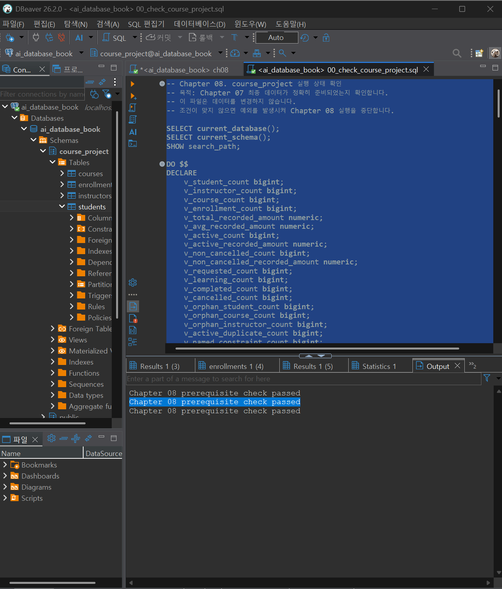
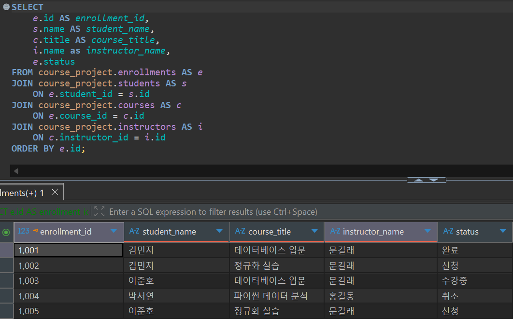

# Chapter 08 확장 실습 답안 템플릿

> **과제:** JOIN과 집계로 서비스 질문에 답하기  
> **사용 방법:** 이 파일을 내려받아 본인의 GitHub 저장소에 `chapter08_answer.md`라는 이름으로 저장한 뒤 실습하면서 바로 작성합니다.  
> **제출 방법:** LMS에는 파일을 직접 업로드하지 않고, **본인 GitHub 저장소의 `chapter08_answer.md` 파일 URL**을 제출합니다.

---

## 제출 전 주의

이 파일과 캡처 화면에는 실제 비밀번호, 전체 DB 접속 URL, API Key, 개인정보를 기록하지 않습니다.

```text
GitHub 계정 또는 별칭: sangjae-lee97 
과제 작성일: 2026.09.18
사용한 AI 도구: gpt
```

---

# 1. Chapter 07 기준 상태 확인

다음을 실행합니다.

```text
code/chapter08/00_check_course_project.sql
```

## 1-1. 사전 검사 결과

```text
검증 메시지: Chapter 08 prerequisite check passed

students 행 수: 3
instructors 행 수: 2
courses 행 수: 3
enrollments 행 수: 5

전체 신청 건수: 5
전체 recorded_amount: 590000
활성 신청 건수: 3
활성 recorded_amount: 340000
취소 제외 신청 건수: 4
취소 제외 recorded_amount: 440000
```

기준값:

```text
students = 3
instructors = 2
courses = 3
enrollments = 5

전체 = 5 / 590000
활성 = 3 / 340000
취소 제외 = 4 / 440000
```

### 기준값이 다르면 그대로 진행하면 안 되는 이유

```text
같은 결과가 안나오면 제대로된 분석 재현성이 떨어져 신뢰도에 영향을 미치기 때문
```

### 증거 화면

권장 경로:

```text
assignments/chapter08/images/step01_prerequisite.png
```

`여기에 사전 검사 통과 화면을 삽입하세요.`

---

# 2. 업무 질문을 SQL보다 먼저 정의하기

다음 세 질문을 각각 SQL 작성 전에 먼저 정의합니다.

## 질문 A

```text
| 항목                        | 내용                                                |
| ------------------------- | ------------------------------------------------- |
| 업무 질문                     | 취소되지 않은 신청 수를 강의별로 보여 주세요.                        |
| 결과 한 행의 의미                | 강의 한 개                                            |
| 포함 상태                     | 신청, 수강중, 완료                                       |
| 제외 상태                     | 취소                                                |
| JOIN할 테이블                 | courses, enrollments                              |
| JOIN 경로                   | courses.id = enrollments.course_id                |
| INNER JOIN / LEFT JOIN 선택 | LEFT JOIN                                         |
| 집계 대상                     | 강의별 취소되지 않은 수강신청 건수                               |
| 예상 결과                     | 모든 강의가 표시되고, 취소되지 않은 신청이 없는 강의는 0건으로 표시           |
| 검산 방법                     | enrollments에서 취소 상태를 제외한 전체 건수와 강의별 집계 건수의 합계를 비교 |

```

## 질문 B

```text
| 항목                        | 내용                                     |
| ------------------------- | -------------------------------------- |
| 업무 질문                     | 강사별로 담당 강의 수를 보여 주세요.                  |
| 결과 한 행의 의미                | 강사 한 명                                 |
| 포함 상태                     | 모든 강의                                  |
| 제외 상태                     | 없음                                     |
| JOIN할 테이블                 | instructors, courses                   |
| JOIN 경로                   | instructors.id = courses.instructor_id |
| INNER JOIN / LEFT JOIN 선택 | LEFT JOIN                              |
| 집계 대상                     | 강사별 담당 강의 수                            |
| 예상 결과                     | 모든 강사가 표시되고, 담당 강의가 없는 강사는 0개로 표시      |
| 검산 방법                     | courses 전체 행 수와 강사별 강의 수 합계를 비교        |

```

## 질문 C

```text
| 항목                        | 내용                                                           |
| ------------------------- | ------------------------------------------------------------ |
| 업무 질문                     | 학생별로 취소되지 않은 수강신청의 기록 금액 합계를 보여 주세요.                         |
| 결과 한 행의 의미                | 학생 한 명                                                       |
| 포함 상태                     | 신청, 수강중, 완료                                                  |
| 제외 상태                     | 취소                                                           |
| JOIN할 테이블                 | students, enrollments                                        |
| JOIN 경로                   | students.id = enrollments.student_id                         |
| INNER JOIN / LEFT JOIN 선택 | LEFT JOIN                                                    |
| 집계 대상                     | 학생별 `recorded_amount` 합계                                     |
| 예상 결과                     | 모든 학생이 표시되고, 취소되지 않은 신청이 없는 학생은 금액 합계가 0으로 표시                |
| 검산 방법                     | enrollments에서 취소를 제외한 `recorded_amount` 총합과 학생별 합계의 전체 합을 비교 |

```

---

# 3. INNER JOIN과 다중 JOIN

## 3-1. 신청 한 건마다 학생 이름과 강의 제목 조회

실행 전 예상:

```text
결과 한 행 = 수강신청 한 건
예상 행 수 = 5행
JOIN 경로 = enrollments.student_id-> students.id
JOIN 경로 = enrollments.course_id-> courses.id
```

내가 실행한 SQL:

```sql
SELECT
    e.id AS enrollment_id,
    s.name AS student_name,
    c.title AS course_title,
    e.status
FROM course_project.enrollments AS e
JOIN course_project.students AS s
    ON e.student_id = s.id
JOIN course_project.courses AS c
    ON e.course_id = c.id
ORDER BY e.id;
```

실제 결과:

```text
실제 행 수: 5행
예상과 일치 여부: 일치
```

### 학생 이름이 여러 번 보이는 것이 중복 오류가 아닐 수 있는 이유

```text
학생 한 명이 여러 강의를 신청했을 수도 있기 때문
```

## 3-2. 학생·강의·강사까지 연결

```text
결과 한 행 = 수강신청 한건과 신청한 학생 그 강의 강사
강사까지 가는 JOIN 경로 = enrollments.course_id -> courses.id -> courses.instructor_id -> instructors.id
```

```sql
SELECT
    e.id AS enrollment_id,
    s.name AS student_name,
    c.title AS course_title,
    i.name as instructor_name,
    e.status
FROM course_project.enrollments AS e
JOIN course_project.students AS s
    ON e.student_id = s.id
JOIN course_project.courses AS c
    ON e.course_id = c.id
JOIN course_project.instructors AS i
    ON c.instructor_id = i.id
ORDER BY e.id;
```

실제 행 수:5

```text

```

### 증거 화면

권장 경로:

```text
assignments/chapter08/images/step03_inner_join.png
```

`여기에 다중 JOIN 결과 화면을 삽입하세요.`

---

# 4. LEFT JOIN과 0건 표현

## 4-1. 강의별 취소 제외 신청 수

신청이 없는 강의도 결과에 남도록 작성합니다.

실행 전:

```text
결과 한 행 = 강의 한 개
강의 303의 예상 실제 신청 수 = 0
강의 303의 예상 고유 학생 수 = 0
강의 303의 예상 recorded_amount = 0 
```

내 SQL:

```sql
SELECT
    c.id AS course_id,
    c.title AS course_title,
    COUNT(
        CASE
            WHEN e.status <> '취소'
            THEN e.id
        END
    ) AS enrollment_count,
    COUNT(
        DISTINCT CASE
            WHEN e.status <> '취소'
            THEN e.student_id
        END
    ) AS unique_student_count,
    COALESCE(
        SUM(
            CASE
                WHEN e.status <> '취소'
                THEN e.recorded_amount
                ELSE 0
            END
        ),
        0
    ) AS total_recorded_amount
FROM course_project.courses AS c
LEFT JOIN course_project.enrollments AS e
    ON c.id = e.course_id
GROUP BY
    c.id,
    c.title
ORDER BY
    c.id;
```

실제 결과:

```text
| course_id | course_title | enrollment_count | unique_student_count | total_recorded_amount |
| --------: | ------------ | ---------------: | -------------------: | --------------------: |
|       301 | 데이터베이스 입문    |                2 |                    2 |                200000 |
|       302 | 정규화 실습       |                2 |                    2 |                240000 |
|       303 | 파이썬 데이터 분석   |                0 |                    0 |                     0 |

```

## 4-2. `COUNT(*)`와 `COUNT(e.id)` 비교

강의 303을 기준으로 작성합니다.

```text
COUNT(*) 결과: 1
COUNT(e.id) 결과: 0
COUNT(DISTINCT e.student_id) 결과: 0
```

### 왜 `COUNT(*) = 1`인데 실제 신청 수는 0일 수 있나요?

```text
join 결과의 행 수를 세기 때문
```

### 자식 사건 수를 셀 때 `COUNT(child.id)`가 더 적절한 이유

```text
null이 아닌 실제 신청 id만 세기 때문
```

---

# 5. `LEFT JOIN`에서 `ON`과 `WHERE` 조건 비교

취소 제외 신청만 연결한다고 가정합니다.

## 5-1. 조건을 `ON`에 둔 경우

```sql
SELECT
    s.id,
    s.name,
    COUNT(e.id) AS non_cancelled_count
FROM course_project.students AS s
LEFT JOIN course_project.enrollments AS e
    ON s.id = e.student_id
   AND e.status <> '취소'
GROUP BY s.id, s.name
ORDER BY s.id;
```

```text
결과 학생 수: 3
박서연 포함 여부: 포함
```

## 5-2. 조건을 `WHERE`에 둔 경우

```sql
SELECT
    s.id,
    s.name,
    COUNT(e.id) AS non_cancelled_count
FROM course_project.students AS s
LEFT JOIN course_project.enrollments AS e
    ON s.id = e.student_id
WHERE e.status <> '취소'
GROUP BY s.id, s.name
ORDER BY s.id;
```

```text
결과 학생 수: 2
박서연 포함 여부: 미포함
```

## 5-3. 차이 설명

```text
ON 조건이 LEFT JOIN의 오른쪽 연결 대상을 제한하는 방식: 왼쪽 행을 유지하면서 join 대상만 제한

WHERE 조건이 JOIN 이후 결과 행을 제거하는 방식: join 결과가 만들어진 뒤 행을 제거

이번 사례에서 ON = 3명, WHERE = 2명이 되는 이유: on은 null 행을 세지만 where은 후에 조건에 맞는 행을 제거해버리기 때문
```

---

# 6. 신청이 없는 학생 찾기 — 두 방법 비교

## 방법 1. `LEFT JOIN ... IS NULL`

```sql
SELECT
    s.id,
    s.name,
    s.email
FROM course_project.students AS s
LEFT JOIN course_project.enrollments AS e
    ON s.id = e.student_id
   AND e.status <> '취소'
WHERE e.id IS NULL;
```

## 방법 2. `NOT EXISTS`

```sql
SELECT
    s.id,
    s.name,
    s.email
FROM course_project.students AS s
WHERE NOT EXISTS (
    SELECT 1
    FROM course_project.enrollments AS e
    WHERE e.student_id = s.id
      AND e.status <> '취소'
);
```

```text
방법 1 결과:
103	박서연	seoyeon@example.com
방법 2 결과:
103	박서연	seoyeon@example.com
두 결과가 같은가: 같음
찾아진 학생: 박서연
```

### 두 방식의 공통 의미를 자신의 말로 설명

```text
left join ... is null은 대응하는 오른쪽 행이 없는 결과를 찾는다
not exists는 조건을 만족하는 자식 행이 존재하지 않는 부모를 찾는다.
공통 의미는 연결 대상이 존재하지 않는 부모를 찾는다.
```

---

# 7. 기본 집계 검산

다음 결과를 직접 확인합니다.

| 분석 범위 | 예상 건수 | 실제 건수 | 예상 금액 | 실제 금액 | 일치? |
| --- | ---: | ---: | ---: | ---: | --- |
| 전체 신청 | 5 | 5 | 590000 | 590000 | 일치 |
| 활성 신청 | 3 | 3 | 340000 | 340000 | 일치 |
| 취소 제외 | 4 | 4 | 440000 | 440000 | 일치 |
| 취소 | 1 | 1 | 150000 | 150000 | 일치 |

## 7-1. 전체 평균 `recorded_amount`

```text
예상 평균: 590000
실제 평균: 590000
```

## 7-2. 취소 제외 평균

```text
예상 평균: 340000
실제 평균: 340000
```

### `recorded_amount`를 실제 회계 매출이라고 부르면 안 되는 이유

```text
수강 상태에 관계 없이 합계되기 때문
```

---

# 8. `GROUP BY`, `HAVING`, `FILTER`

## 8-1. 상태별 신청 건수

```sql

```

결과:

```text
신청:
수강중:
완료:
취소:
상태별 합계:
```

### 상태별 건수 합이 전체 신청 5건과 맞는지 검산

```text

```

## 8-2. 강의별 취소 제외 신청 수와 금액

```sql

```

```text
강의 301:
강의 302:
강의 303:
강의별 합계를 다시 더한 값:
전체 취소 제외 기준 440000과 일치 여부:
```

## 8-3. `HAVING` 사용

취소 제외 신청이 2건 이상인 강의를 조회합니다.

```sql

```

```text
예상 강의 수:
실제 강의 수:
```

---

# 9. 과대 집계 오류 직접 관찰

강사 201의 강의 가격 합계를 구한다고 가정합니다.

## 9-1. 신청까지 JOIN해서 잘못 집계한 결과

```sql

```

```text
강사 201 잘못된 가격 합계:
```

본문 기준:

```text
440000
```

## 9-2. 강의 수준에서 올바르게 집계

```sql

```

```text
강사 201 올바른 가격 합계:
```

본문 기준:

```text
220000
```

## 9-3. 왜 두 결과가 달라졌나요?

```text
JOIN 전 강의 행 수:
JOIN 후 강의가 반복된 이유:
SUM이 무엇을 반복해서 더했는가:
```

### `SUM(DISTINCT c.price)`를 일반적인 해결책으로 사용하면 안 되는 이유

```text

```

### 증거 화면

권장 경로:

```text
assignments/chapter08/images/step09_over_aggregation.png
```

`여기에 잘못된 합계와 올바른 합계를 비교한 화면을 삽입하세요.`

---

# 10. 상세 결과 ↔ 집계 결과 교차 검산

강의 하나를 선택합니다.

```text
선택한 course_id:
강의 제목:
```

## 10-1. 상세 신청 행 조회

```sql

```

```text
상세 행 수:
상세 recorded_amount를 직접 더한 값:
```

## 10-2. 집계 SQL

```sql

```

```text
집계 건수:
집계 금액:
```

## 10-3. 비교

```text
상세 행 수와 COUNT 결과 일치 여부:
상세 금액 합과 SUM 결과 일치 여부:
다르다면 원인:
```

---

# 11. 자동 완료 게이트

다음을 실행합니다.

```text
code/chapter08/03_join_aggregation_validation.sql
```

```text
최종 검증 메시지:
```

기대 메시지:

```text
Chapter 08 join and aggregation validation passed
```

### 자동 검증이 통과했어도 사람이 SQL 의미를 설명해야 하는 이유

```text

```

---

# 12. 개인 프로젝트 업무 질문 3개 만들기

Chapter 07에서 작성한 개인 프로젝트를 사용합니다.

| 질문 ID | 업무 질문 | 결과 한 행 | 포함/제외 범위 | JOIN 경로 | 집계 대상 | 검산 방법 |
| --- | --- | --- | --- | --- | --- | --- |
| P08-Q01 |  |  |  |  |  |  |
| P08-Q02 |  |  |  |  |  |  |
| P08-Q03 |  |  |  |  |  |  |

## 12-1. 질문 1 SQL

```sql

```

```text
예상 결과:
실제 결과:
검산 결과:
```

## 12-2. 질문 2 SQL

```sql

```

```text
예상 결과:
실제 결과:
검산 결과:
```

## 12-3. 질문 3 SQL

```sql

```

```text
예상 결과:
실제 결과:
검산 결과:
```

> 아직 개인 프로젝트 테이블을 PostgreSQL로 완성하지 않았다면 SQL 초안과 예상 검산 방법까지만 작성하고 `미실행`이라고 명시합니다.

---

# 13. AI를 JOIN·집계 리뷰어로 활용

## 13-1. 내가 AI에게 전달한 질문

```text

```

## 13-2. 내 SQL과 AI SQL 비교

| 검토 항목 | 내 판단/SQL | AI 제안 | 최종 선택 | 이유 |
| --- | --- | --- | --- | --- |
| 결과 한 행 |  |  |  |  |
| 상태 범위 |  |  |  |  |
| JOIN 경로 |  |  |  |  |
| INNER/LEFT 선택 |  |  |  |  |
| COUNT 대상 |  |  |  |  |
| 과대 집계 위험 |  |  |  |  |
| 상세 검산 방법 |  |  |  |  |

### AI가 만든 SQL에서 발견한 위험 또는 확인한 점

```text

```

### AI SQL이 실행 성공했다고 바로 정답이라고 할 수 없는 이유

```text

```

---

# 14. 최종 성찰

아래 문장은 본인의 말로 작성합니다.

```text
1. JOIN SQL을 작성하기 전에 가장 먼저 정해야 하는 것은
   ____________________________________________________________ 이다.

2. LEFT JOIN에서 COUNT(*) 대신 COUNT(child.id)를 검토해야 하는 이유는
   ____________________________________________________________ 이다.

3. ON과 WHERE 조건 위치가 중요한 이유는
   ____________________________________________________________ 이다.

4. 여러 1:N 관계를 JOIN한 뒤 바로 SUM하면 위험한 이유는
   ____________________________________________________________ 이다.

5. 집계 결과를 신뢰하기 전에 가장 좋은 검산 방법 중 하나는
   ____________________________________________________________ 이다.
```

---

# 15. 제출 체크리스트

- [ ] `chapter08_answer.md`를 본인 저장소에 만들었다.
- [ ] `00_check_course_project.sql`이 통과했다.
- [ ] 업무 질문마다 결과 한 행을 먼저 정의했다.
- [ ] INNER JOIN과 다중 JOIN을 실행했다.
- [ ] LEFT JOIN에서 0건 부모를 확인했다.
- [ ] `COUNT(*)`와 `COUNT(child.id)` 차이를 설명했다.
- [ ] ON과 WHERE 조건 위치 차이를 직접 비교했다.
- [ ] `LEFT JOIN ... IS NULL`과 `NOT EXISTS`를 비교했다.
- [ ] 전체/활성/취소 제외 기준값을 직접 검산했다.
- [ ] `GROUP BY`, `HAVING`을 사용했다.
- [ ] 과대 집계 오류와 수정 결과를 비교했다.
- [ ] 상세 결과와 집계 결과를 교차 검산했다.
- [ ] `03_join_aggregation_validation.sql`이 통과했다.
- [ ] 개인 프로젝트 업무 질문 3개를 작성했다.
- [ ] AI SQL을 실행 성공 여부가 아니라 의미와 검산 결과로 평가했다.
- [ ] 핵심 캡처는 3~4장 정도만 사용했다.
- [ ] 비밀번호·개인정보·비밀정보가 없다.
- [ ] GitHub 웹에서 Markdown과 이미지가 정상적으로 보인다.
- [ ] 최종 답안을 commit/push했다.

---

# 16. LMS 제출 URL

아래 형식의 **본인 GitHub 파일 URL**을 LMS에 제출합니다.

```text
https://github.com/<본인-GitHub-ID>/<본인-저장소>/blob/main/assignments/chapter08/chapter08_answer.md
```

내 제출 URL:

```text

```

> 저장소 메인 URL, 교수자 템플릿 URL, Raw URL이 아니라 **작성 완료된 본인 `chapter08_answer.md` 파일 화면 URL**을 제출합니다.