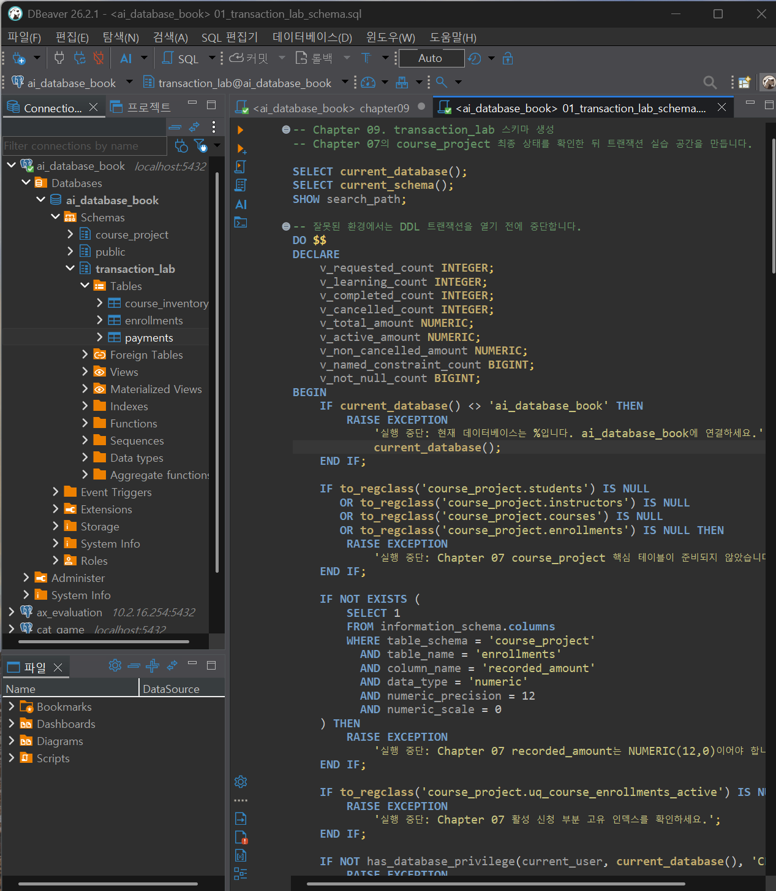
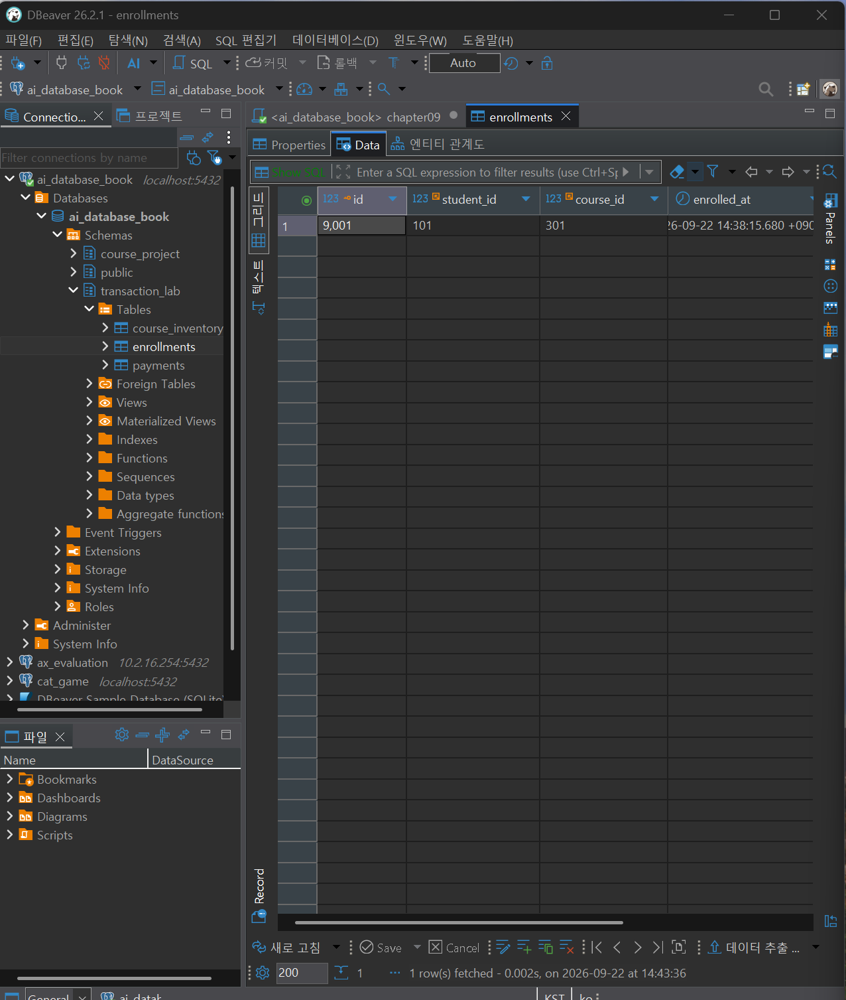
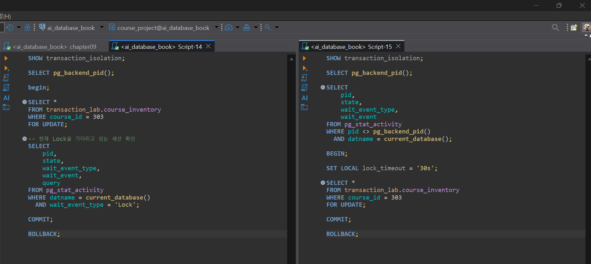

# Chapter 09 확장 실습 답안 템플릿

> **과제:** 트랜잭션으로 데이터 정합성 지키기  
> **사용 방법:** 이 파일을 내려받아 본인의 GitHub 저장소에 `chapter09_answer.md`라는 이름으로 저장한 뒤 실습하면서 바로 작성합니다.  
> **제출 방법:** LMS에는 파일을 직접 업로드하지 않고, **본인 GitHub 저장소의 `chapter09_answer.md` 파일 URL**을 제출합니다.

---

## 제출 전 주의

이 파일과 캡처 화면에는 실제 비밀번호, 전체 DB 접속 URL, API Key, 개인정보를 기록하지 않습니다.

```text
GitHub 계정 또는 별칭: sangjae-lee97  
과제 작성일: 2026.09.22
사용한 AI 도구: 헷
```

---

# 1. 시작 환경과 Chapter 07·08 기준 상태 확인

다음을 실행하거나 Chapter 09의 `01_transaction_lab_schema.sql` 사전 검사를 확인합니다.

```sql
SELECT current_database();
SELECT current_user;
SELECT current_schema();
SHOW search_path;
SHOW transaction_read_only;
```

| 확인 항목 | 실제 결과 | 의미 |
| --- | --- | --- |
| `current_database()` | ai_database_book | 현재 ai_database_book 데이터베이스에 연결되어 있음 |
| `current_user` | postgres | 현재 postgres 사용자 계정으로 접속 중임 |
| `current_schema()` | course_project | 기본으로 사용되는 현재 스키마가 course_project임 |
| `search_path` | course_project, "$user", public | 테이블 이름만 입력하면 course_project → 사용자 스키마 → public 순서로 찾음 |
| `transaction_read_only` | off | 읽기 전용이 아니므로 INSERT, UPDATE, DELETE 등 데이터 변경이 가능함 |

Chapter 07·08 기준값:

```text
students = 3
instructors = 2
courses = 3
enrollments = 5
전체 recorded_amount = 590000
활성 = 3 / 340000
취소 제외 = 4 / 440000
```

### 기준 상태가 다르면 Chapter 09를 계속 진행하면 안 되는 이유

```text
같은 결과를 얻을 수 없어 재현성이 떨어지기 때문
```

---

# 2. `transaction_lab` 스키마 생성

실행 파일:

```text
code/chapter09/01_transaction_lab_schema.sql
```

## 2-1. 생성 전 예상

```text
생성될 스키마: transaction_lab
생성될 테이블 3개:course_inventory, enrollments, payments

course_inventory 한 행의 의미: 특정 강의의 좌석 상태 한 건
enrollments 한 행의 의미: transaction_lab에서 생성한 수강신청 사건 한 건
payments 한 행의 의미: 특정 lab enrollment에 연결된 결제 기록 한 건
```

## 2-2. 생성 결과

```text
통과 메시지: 
Chapter 09 transaction lab schema validation passed
```

기대 메시지:

```text
Chapter 09 transaction lab schema validation passed
```

### Chapter 07·08의 `course_project`와 별도 `transaction_lab`을 사용하는 이유

```text
기존 프로젝트 테이블을 삭제하거나 다시 만들면 앞 장의 데이터가 손상


```

### 증거 화면

권장 경로:

```text
assignments/chapter09/images/step02_schema.png
```

`여기에 transaction_lab 구조가 보이는 핵심 화면을 삽입하세요.`

---

# 3. 초기 좌석과 기준 데이터 입력

실행 파일:

```text
code/chapter09/02_transaction_lab_seed.sql
```

## 3-1. 실행 전 예상

```text
course 301 remaining_seats 예상:3
course 302 remaining_seats 예상:0
course 303 remaining_seats 예상:0
lab enrollments 예상 행 수:0
payments 예상 행 수:0
```

## 3-2. 실제 결과

```text
course 301 remaining_seats:3
course 302 remaining_seats:0
course 303 remaining_seats:0
lab enrollments 행 수:0
payments 행 수:0
통과 메시지:Chapter 09 transaction lab seed validation passed
```

기대 초기 상태:

```text
course 301 / 302 / 303 remaining_seats = 3 / 0 / 0
lab enrollments = 0
payments = 0
```

### 예상과 실제가 다른 경우 원인

```text

```

---

# 4. 첫 번째 정상 COMMIT 추적

실행 파일:

```text
code/chapter09/03_commit_transaction.sql
```

이 실습은 학생 101이 강의 301을 신청하는 하나의 업무 단위를 추적합니다.

## 4-1. 업무 단위 정의

```text
이 트랜잭션에서 함께 성공해야 하는 변경 1:  course 301 좌석을 1개 확보한다
변경 2:학생 101의 lab enrollment를 만든다
변경 3:해당 enrollment의 payment를 만든다.

하나라도 실패하면 전체를 취소해야 하는 이유:이 세 변경은 하나의 업무이므로 함께 성공해야 함


```

### 4-2. 상태 변화 기록

| 시점       | course 301 남은 좌석 | lab enrollment 9001 | payment 9901 | 설명                               |
| -------- | ---------------: | ------------------- | ------------ | -------------------------------- |
| BEGIN 전  |                2 | 없음                  | 없음           | 트랜잭션 실행 전 초기 상태                  |
| 트랜잭션 내부  |                1 | 생성됨                 | 생성됨          | 좌석 감소와 신청·결제가 수행되었지만 아직 COMMIT 전 |
| COMMIT 후 |                1 | 존재                  | 존재           | 검증을 통과하여 변경 내용이 최종 저장됨           |

### 4-3. COMMIT 조건

```text
좌석 UPDATE 기대 영향 행 수: 1
실제 영향 행 수: 1
신청 생성 기대 행 수: 1
결제 생성 기대 행 수: 1
recorded_amount와 payment.amount 일치 여부: 일치 (100000원)
최종 COMMIT 판단: 신청·결제·좌석 상태가 모두 기대값과 일치하므로 COMMIT
```

기대 메시지:

```text
Chapter 09 first commit validation passed
```

### SQL 오류가 없었다는 사실만으로 COMMIT하면 안 되는 이유

```text
SQL이 오류 없이 실행되더라도 데이터가 업무 규칙에 맞게 변경되었다는 의미는 아니다.

예를 들어 좌석이 잘못 감소했거나, 신청 금액과 결제 금액이 다르거나,
신청 데이터가 예상과 다르게 저장될 수도 있다.

따라서 COMMIT 전에 좌석 수, 신청 정보, 결제 금액 등
최종 상태가 기대한 결과와 일치하는지 검증해야 한다.
```


### 증거 화면

권장 경로:

```text
assignments/chapter09/images/step04_commit.png
```

`여기에 COMMIT 후 좌석·신청·결제 관계를 확인할 수 있는 화면을 삽입하세요.`

---

# 5. ROLLBACK으로 전체 원상복구 확인

실행 파일:

```text
code/chapter09/04_rollback_transaction.sql
```

## 5-1. ROLLBACK 전 예상

```text
트랜잭션 안에서 임시로 바뀔 값: course_id 302의 좌석
ROLLBACK 후 다시 돌아와야 할 값: course_id 302의 좌석
이미 이전 파일에서 COMMIT된 9001/9901은 유지되어야 하는가: 유지되어야 함
```

## 5-2. 실제 결과

```text
ROLLBACK 후 course 301 상태: 남은 좌석 1
ROLLBACK 후 lab enrollments 행 수: 1
ROLLBACK 후 payments 행 수: 1
9001 존재 여부: 존재 안함
9901 존재 여부: 존재 안함
통과 메시지: Chapter 09 rollback validation passed
```

기대 메시지:

```text
Chapter 09 rollback validation passed
```

## 5-3. ROLLBACK과 IDENTITY

```text
ROLLBACK이 테이블 행 변경을 되돌리는 방식:
COMMIT되지 않은 INSERT, UPDATE, DELETE 작업을 취소하고 트랜잭션 시작 전 상태로 되돌린다.

IDENTITY 자동 번호가 반드시 이전 값으로 되돌아가지는 않는 이유:
자동 번호는 보통 별도의 시퀀스(sequence)로 관리되며, 시퀀스 값 증가는 트랜잭션 ROLLBACK의 영향을 받지 않을 수 있기 때문이다.

번호가 건너뛰었다고 데이터 손상이라고 단정할 수 없는 이유:
자동 번호는 행을 유일하게 구분하기 위한 식별자이므로 번호가 연속적일 필요는 없다. 중간 번호가 비어 있어도 실제 데이터의 관계와 내용이 정상이라면 데이터 손상은 아니다.
```

---

# 6. 두 번째 COMMIT과 좌석 부족 0행 관찰

실행 파일:

```text
code/chapter09/05_commit_and_sold_out.sql
```

## 6-1. 두 번째 정상 COMMIT

```text
생성된 enrollment id:9002
학생 id:103
course id:302
recorded_amount:120000
payment id: 9902
payment amount:120000
```

## 6-2. 좌석 부족 시도

```text
좌석 확보 UPDATE 기대 영향 행 수: 0
실제 영향 행 수: 0
후속 enrollment 생성 행 수:0
후속 payment 생성 행 수:0
```

기준상 좌석 부족 시 생성되지 않아야 하는 ID:

```text
9003
9903
```

### `UPDATE 0`이 SQL 실패가 아니라 업무상 실패일 수 있는 이유

```text
남은 좌석이 없을 수도 있기 때문에
```

### 영향 행 수가 0인데 신청과 결제를 계속 생성하면 어떤 정합성 문제가 생기나요?

```text
그러면 데이터상으로는 학생이 수강 신청과 결제를 완료했는데, 실제로는 좌석이 없는 상태가 됩니다. 이 상태는 좌석 상태와 신청·결제 상태가 서로 모순되므로 정합성이 깨진 것
```

---

# 7. 주 실습 최종 정합성 검증

실행 파일:

```text
code/chapter09/06_transaction_validation.sql
```

## 7-1. lab 최종 상태

| 항목 | 기대값 | 실제값 | 일치? |
| --- | ---: | ---: | --- |
| course_inventory 행 수 | 3 | 3 | o |
| lab enrollments 행 수 | 2 | 2 | o |
| payments 행 수 | 2 | 2 | o |
| course 301 remaining | 1 | 1 | o |
| course 302 remaining | 0 | 0 | o |
| course 303 remaining | 1 | 1 | o |

## 7-2. 주요 행

```text
9001 = student 101 / course 301 / amount 100000 / payment 9901
실제:
9001	101	김민지	301	데이터베이스 입문	수강중	100000	9901	100000	true	1

9002 = student 103 / course 302 / amount 120000 / payment 9902
실제:
9002	103	박서연	302	정규화 실습	수강중	120000	9902	120000	true	0
9003·9903 = 존재하지 않아야 함
실제: 존재 X
```

## 7-3. 보호 대상 확인

```text
course_project.enrollments 행 수: 5
전체 recorded_amount: 590000
활성 건수/금액:3/340000
취소 제외 건수/금액:4/440000
```

기대값:

```text
course_project.enrollments = 5
전체 = 590000
활성 = 3 / 340000
취소 제외 = 4 / 440000
```

최종 기대 메시지: Chapter 09 main transaction validation passed

```text
Chapter 09 main transaction validation passed
```

### transaction_lab 실습 후에도 course_project 기준 상태를 다시 검사하는 이유

```text
transaction_lab에서 트랜잭션 실습을 하더라도 기존 course_project 데이터가 함께 변경되거나 손상되지 않았는지 확인하기 위해서이다.

즉, 실습용 데이터가 정상이라는 것뿐 아니라 기존 프로젝트의 행 수, 상태, 금액, 제약조건도 그대로 유지되는지 검증해야 전체 데이터베이스의 정합성을 확인할 수 있다.
```

---

# 8. ACID를 이번 실습으로 설명

교과서 정의를 그대로 복사하지 말고 이번 좌석·신청·결제 사례로 작성합니다.

```text
Atomicity:
트랜잭션 안의 작업은 전부 성공하거나 전부 취소되어야 합니다. 좌석 감소만 되고 신청·결제가 실패하는 식으로 일부만 남으면 안 됩니다.
Consistency:
트랜잭션 전후로 데이터가 정해진 규칙을 만족하는 올바른 상태여야 합니다. 예를 들어 남은 좌석이 음수가 되거나 신청 금액과 결제 금액이 서로 달라서는 안 됩니다.
Isolation:
여러 트랜잭션이 동시에 실행되어도 서로의 처리 과정 때문에 잘못된 결과가 생기지 않도록 분리되어야 합니다. 예를 들어 마지막 좌석 1개를 두 사람이 동시에 가져가면 안 됩니다.
Durability:
한 번 COMMIT된 결과는 이후에도 계속 유지되어야 합니다. 다른 트랜잭션이 ROLLBACK되더라도 이미 확정된 신청과 결제는 사라지지 않습니다.
```

### Atomicity와 Consistency가 같은 뜻이 아닌 이유

```text
잘못된 SQL 세 개를 트랜잭션으로 묶어 commit하면 세개가 모두 잘못된 상태로 확정될 수 있기 때문에
```

---

# 9. 선택 실습 — 두 세션 Lock 대기 관찰

실행 파일:

```text
code/chapter09/07_concurrency_two_sessions.sql
```

가능하면 DBeaver에서 **서로 다른 두 연결 세션**으로 수행합니다.

## 9-1. 내 환경

```text
실제 두 세션 실습 수행 / 절차 분석만 수행:
transaction_isolation:
lock_timeout:
```

## 9-2. 시간 순서 기록

| 순서 | Session A                                      | Session B                                   | 관찰                                         |
| -: | ---------------------------------------------- | ------------------------------------------- | ------------------------------------------ |
|  1 | `BEGIN;` 후 course 303을 `SELECT ... FOR UPDATE` | 대기                                          | A가 course 303 행의 Lock을 먼저 획득               |
|  2 | 트랜잭션을 종료하지 않고 유지                               | `BEGIN;` 후 `SET LOCAL lock_timeout = '30s';` | B의 Lock 대기 제한 시간을 30초로 설정                   |
|  3 | 계속 Lock 보유                                     | 같은 course 303에 `SELECT ... FOR UPDATE` 실행   | A가 Lock을 가지고 있으므로 B는 해당 행의 Lock이 풀릴 때까지 대기 |
|  4 | `COMMIT` 또는 `ROLLBACK`으로 트랜잭션 종료               | 대기 중이던 쿼리 진행                                | A의 Lock이 해제되면 B가 Lock을 획득하고 조회를 계속 수행      |


```text
먼저 Lock을 획득한 세션: 세션 A
대기한 세션: 세션 B
A가 COMMIT/ROLLBACK한 뒤 B에서 일어난 일: 대기 사라지고 바로 실행 됨
```

### Lock 대기와 Deadlock의 차이

```text
Lock 대기는 한 세션이 다른 세션의 Lock이 해제되기를 기다리는 정상적인 상황이다.

이번 실습에서는 A가 course 303을 잠그고 B가 같은 행을 요청했으므로
B가 A의 COMMIT 또는 ROLLBACK을 기다리는 구조이다.

Deadlock은 두 세션이 서로 상대방이 가진 Lock을 기다리는 상황이다.

예를 들어 A가 행 301을 잠근 뒤 302를 기다리고,
B가 행 302를 잠근 뒤 301을 기다리면
둘 다 상대방을 기다리기 때문에 스스로 진행할 수 없다.

따라서 이번 A → B의 단순 대기는 Deadlock이 아니라 Lock 대기이다.
```

### `SELECT ... FOR UPDATE`가 모든 UPDATE 앞에 항상 필요한 것은 아닌 이유

```text
UPDATE 자체도 변경 대상 행에 필요한 Lock을 획득한다.

따라서 단순히 특정 행을 바로 UPDATE하는 경우에는
SELECT ... FOR UPDATE를 먼저 실행하지 않아도 PostgreSQL이 UPDATE 과정에서 Lock을 건다.

SELECT ... FOR UPDATE는 이번 좌석 실습처럼
먼저 현재 값을 읽고 그 값을 기준으로 이후 작업을 결정해야 하며,
그 사이 다른 트랜잭션이 같은 행을 변경하지 못하게 해야 할 때 유용하다.

즉, 모든 UPDATE 앞에 무조건 사용하는 문법이 아니라
조회한 행을 이후 처리까지 안전하게 보호해야 할 때 사용하는 방법이다.
```

### 증거 화면

실제 수행했다면 권장 경로:

```text
assignments/chapter09/images/step09_lock.png
```

---

# 10. 선택 실습 — 취소와 좌석 복구

실행 파일:

```text
code/chapter09/08_cancel_and_restore.sql
```

```text
9001 취소 성공 행 수: 1행
course 301 좌석 변화: 1-> 2
같은 취소를 다시 시도한 행 수: 0
두 번째 좌석 복구 행 수: 0 
payment 9901 유지 여부: 유지
최종 ROLLBACK 후 원상복구 여부: 1
통과 메시지: Chapter 09 cancel rollback validation passed
```

기대 흐름:

```text
9001 수강중 → 취소 1행
course 301 remaining 1 → 2
같은 취소 재시도 → 0행
추가 좌석 복구 → 0행
마지막 ROLLBACK → 주 실습 기준으로 복구
```

### 같은 취소를 두 번 처리해도 좌석이 두 번 증가하지 않아야 하는 이유

```text
같은 신청을 두 번 취소하더라도 실제로 사용했던 좌석은 1개이므로 좌석도 1번만 복구되어야 한다.

첫 번째 취소에서는 status가 '수강중'에서 '취소'로 변경되고 좌석이 1 증가한다.

두 번째 취소에서는 이미 status가 '취소'이므로
WHERE status = '수강중' 조건을 만족하지 않아 cancelled가 0행이 된다.

cancelled가 0행이면 이를 입력으로 사용하는 좌석 복구 UPDATE도 0행이 되어
좌석이 다시 증가하지 않는다.

이를 막지 않으면 동일한 취소 요청이 반복될 때 실제 capacity보다 remaining_seats가 커지는 정합성 문제가 발생할 수 있다.
```

---

# 11. 선택 실습 — 오류 상태와 SAVEPOINT

실행 파일:

```text
code/chapter09/09_error_and_savepoint.sql
```

## 11-1. 일반 오류 후 트랜잭션 상태

```text
발생시킨 오류: 좌석 차감 후 중복 활성 신청 오류 유발
오류 이후 다음 SQL 실행 결과:
SQL Error [42601]: 오류: 구문 오류, "3." 부근
  위치: 1
Error position: line: 32

전체 ROLLBACK이 필요한 이유:
SAVEPOINT가 없다면 오류가 발생한 트랜잭션을 정상 상태로 되돌릴 지점이 없기 때문에
BEGIN 이후의 작업을 전체 ROLLBACK하여 트랜잭션을 종료해야 한다.
```

## 11-2. SAVEPOINT 사용

```text
SAVEPOINT 이름:
before_duplicate_enrollment
오류 발생 위치: SAVEPOINT 이후 course 301의 좌석을 임시로 1 감소시킨 뒤,
중복 활성 신청 9003을 INSERT하는 과정에서 오류가 발생한다.

ROLLBACK TO SAVEPOINT 후 상태:
SAVEPOINT 이후 실행했던 좌석 차감이 취소되어
course 301의 remaining_seats가 다시 1로 복구된다.

이후 계속 실행할 수 있었는가:
가능하다.
ROLLBACK TO SAVEPOINT를 실행하면 오류 상태에서 벗어나면서
트랜잭션 전체를 끝내지 않고 SAVEPOINT 이전 상태부터 계속 SQL을 실행할 수 있다.
```

### SAVEPOINT가 전체 ROLLBACK과 다른 점

```text
전체 ROLLBACK은 BEGIN 이후 실행한 트랜잭션 전체를 취소하고 트랜잭션 자체를 종료한다.

SAVEPOINT는 트랜잭션 중간에 복구 지점을 만들어 두고,
문제가 발생했을 때 ROLLBACK TO SAVEPOINT로 그 지점 이후의 작업만 취소할 수 있다.

이번 실습에서는 좌석 차감과 중복 신청 시도만 되돌리고,
트랜잭션 전체를 즉시 종료하지 않은 채 이후 작업을 계속할 수 있다는 차이가 있다.
```

---

# 12. 개인 프로젝트 트랜잭션 시나리오 설계

Chapter 07에서 시작한 개인 프로젝트를 사용합니다.

둘 이상의 변경이 함께 성공해야 하는 업무를 **하나** 선택합니다.

예:

```text
예약 생성 + 좌석 차감
주문 생성 + 재고 차감
대여 생성 + 대여 가능 상태 변경
답변 등록 + 질문 상태 변경
```

## 12-1. 업무 정의

```text
시나리오 ID: P09-T01
업무 이름: AI 브리핑 검색 결과 저장
사용자 행동: 사용자가 등록한 검색어로 네이버 검색을 실행하고,
AI 브리핑과 참고 사이트를 확인한 뒤 그 결과를 저장한다.
왜 하나의 트랜잭션이어야 하는가: 
검색 실행 기록(search_runs)과 해당 검색에서 발견한 참고 사이트(sources)는 하나의 검색 결과를 구성한다. search_runs만 저장되고 sources 저장이 실패하면 CITED 상태인데 실제 근거 URL이 없는 잘못된 데이터가 생길 수 있다.반대로 sources만 남고 search_runs가 존재하지 않는 상태도 허용하면 안 된다.따라서 검색 실행 기록과 출처 정보는 함께 성공하거나 함께 취소되어야 한다.
```

## 12-2. 트랜잭션 설계표

| 항목            | 내 설계                                                                                                             |
| ------------- | ---------------------------------------------------------------------------------------------------------------- |
| BEGIN 전 확인 상태 | 대상 `post`와 `keyword`가 존재하는지 확인하고, 네이버 검색 및 AI 브리핑 출처 확인을 완료한다.                                                   |
| 잠금/경쟁 가능 데이터  | 같은 `keyword`에 대해 프로그램이 동시에 여러 번 실행될 가능성이 있다. MVP는 한 PC에서 실행하므로 위험은 낮지만 필요하면 `keywords` 행을 `FOR UPDATE`로 잠글 수 있다. |
| 변경 1          | `search_runs`에 검색 실행 기록을 1건 INSERT                                                                               |
| 기대 영향 행 수     | 1건                                                                                                               |
| 변경 2          | AI 브리핑에서 확인한 참고 사이트를 `sources`에 INSERT                                                                           |
| 기대 영향 행 수     | 0건 이상. `CITED`인 경우 추적 대상 URL과 일치하는 출처가 최소 1건 필요                                                                  |
| 추가 변경         | 필요하면 검색 결과의 최종 상태를 검증한다.                                                                                         |
| COMMIT 전 검증   | `search_runs`가 1건 존재하는지, 모든 `sources.search_run_id`가 해당 실행을 참조하는지, `CITED`이면 추적 게시글 URL과 일치하는 출처가 존재하는지 확인       |
| COMMIT 조건     | 검색 실행 기록이 정상 저장되고 상태와 출처 데이터가 서로 일치할 때                                                                           |
| ROLLBACK 조건   | `search_runs` INSERT 실패, `sources` 저장 실패, FK 오류, 또는 `CITED`인데 일치하는 출처 URL이 없는 경우                                 |


## 12-3. 실패 시나리오

최소 두 개 작성합니다.

```text
실패 1:
search_runs는 생성했지만 sources 저장 중 오류가 발생한다.

어느 단계에서 발생:
변경 2 - sources INSERT

남으면 안 되는 부분 상태:
출처가 없는 CITED search_runs 기록

ROLLBACK 후 기대 상태:
해당 검색 실행의 search_runs와 sources가 모두 저장되지 않는다.


실패 2:
status를 CITED로 판단했지만 실제 sources에 등록한 블로그 게시글 URL과
일치하는 출처가 존재하지 않는다.

어느 단계에서 발생:
COMMIT 전 정합성 검증

남으면 안 되는 부분 상태:
근거 URL 없이 CITED로 기록된 검색 결과

ROLLBACK 후 기대 상태:
해당 검색 실행 전체가 취소되고 기존 데이터는 그대로 유지된다.
```

## 12-4. SQL 초안

```sql
-- 아직 테이블 구현 전이라면 의사 SQL이어도 됩니다.
BEGIN;

-- 1. 추적 대상 검색어가 실제로 존재하는지 확인
SELECT keyword_id, post_id
FROM keywords
WHERE keyword_id = :keyword_id;

-- 필요하면 동시 실행 방지
-- SELECT keyword_id
-- FROM keywords
-- WHERE keyword_id = :keyword_id
-- FOR UPDATE;


-- 2. 검색 실행 기록 생성
INSERT INTO search_runs (
    keyword_id,
    checked_at,
    status,
    error_message
)
VALUES (
    :keyword_id,
    CURRENT_TIMESTAMP,
    :status,
    NULL
)
RETURNING search_run_id;


-- 3. AI 브리핑에서 발견한 참고 사이트 저장
INSERT INTO sources (
    search_run_id,
    source_url,
    source_title
)
VALUES
    (:search_run_id, :source_url_1, :source_title_1),
    (:search_run_id, :source_url_2, :source_title_2);


-- 4. COMMIT 전 검증
SELECT
    sr.search_run_id,
    sr.status,
    COUNT(s.source_id) AS source_count,
    COUNT(
        CASE
            WHEN s.source_url = p.post_url THEN 1
        END
    ) AS matched_source_count
FROM search_runs sr
JOIN keywords k
    ON sr.keyword_id = k.keyword_id
JOIN posts p
    ON k.post_id = p.post_id
LEFT JOIN sources s
    ON sr.search_run_id = s.search_run_id
WHERE sr.search_run_id = :search_run_id
GROUP BY
    sr.search_run_id,
    sr.status;


-- CITED인데 matched_source_count = 0이면
-- COMMIT하지 않고 ROLLBACK

COMMIT;

-- 검증 실패 시
-- ROLLBACK;
```

---

# 13. AI를 트랜잭션 리뷰어로 활용

AI에게 완성 SQL부터 요구하지 않습니다.

## 13-1. 사용한 프롬프트

```text

```

권장 질문 요소:

```text
1. 하나의 업무 단위가 어디까지인지
2. BEGIN 전 확인할 상태
3. 경쟁 가능 데이터와 잠금 필요성
4. 각 변경의 기대 영향 행 수
5. 여러 테이블 최종 정합성 검증
6. COMMIT 조건
7. ROLLBACK 조건
8. 동시 실행 위험
을 먼저 검토한 뒤 PostgreSQL 초안을 제안하도록 요청
```

## 13-2. AI 제안 검토

| AI 제안                                      | 수용 / 수정 / 보류 / 거절 | 실제 또는 논리 검증                                       | 판단 이유                                              |
| ------------------------------------------ | ----------------- | ------------------------------------------------- | -------------------------------------------------- |
| `search_runs`와 `sources` 저장을 하나의 트랜잭션으로 처리 | 수용                | 둘 중 하나만 저장될 경우 불완전한 검색 결과가 남는지 확인                 | 두 테이블이 하나의 검색 결과를 구성하므로 함께 성공하거나 실패해야 함            |
| 같은 `keyword`를 처리할 때 `FOR UPDATE` 사용        | 보류                | MVP가 개인 PC 한 대에서 단일 실행되는지 확인                      | 현재는 동시 실행 가능성이 낮지만 향후 자동 실행·다중 프로세스가 추가되면 필요할 수 있음 |
| `CITED`이면 일치하는 출처 URL이 존재하는지 COMMIT 전에 검사  | 수용                | `posts.post_url`과 `sources.source_url` JOIN 결과 확인 | 상태값만 믿으면 잘못된 CITED 데이터가 저장될 수 있음                   |


### AI SQL에서 확인한 가장 중요한 위험

```text
가장 중요한 위험은 search_runs.status가 CITED인데
실제 sources에는 추적 대상 게시글 URL과 일치하는 데이터가 없는 상태이다.

SQL 자체가 오류 없이 실행되더라도
이 상태는 프로젝트의 인용 판정 규칙을 위반한다.

따라서 COMMIT 전에 search_runs, keywords, posts, sources를 연결하여
CITED 상태와 실제 출처 URL이 일치하는지 반드시 검증해야 한다.
```

### “오류가 없으면 COMMIT”만으로 부족한 이유

```text
SQL에 문법 오류나 FK 오류가 없다는 것은
데이터베이스가 명령을 정상적으로 실행했다는 의미일 뿐,
저장된 데이터가 업무 규칙까지 만족한다는 의미는 아니다.

예를 들어 search_runs에 CITED가 정상적으로 저장되고
sources에도 다른 사이트 URL이 정상적으로 저장될 수 있다.

두 INSERT 모두 SQL 오류는 없지만,
AI 브리핑 참고 사이트에서 실제 내 블로그 URL이 확인되어야만
CITED로 판단한다는 프로젝트 규칙에는 맞지 않는다.

따라서 COMMIT 전에 단순 실행 성공 여부뿐 아니라
상태값과 실제 출처 데이터의 정합성까지 확인해야 한다.
```

---

# 14. 최종 성찰

아래 문장은 본인의 말로 작성합니다.

```text
1. 트랜잭션은 여러 SQL을 단순히 묶는 것이 아니라
   데이터 정합성을 위한 장치이다.

2. ROLLBACK이 필요한 대표 상황은
   중간까지는 저장됐지만 최종적으로 하나의 업무가 완성되지 않은 경우이다.

3. 조건부 UPDATE의 영향 행 수가 중요한 이유는 예상한 대상만 정확히 변경되었는지 확인하고, 0건 또는 여러 건이 잘못 변경되는 상황을 발견하기 위해서이다.

4. 제약조건이 있어도 트랜잭션이 필요한 이유는 제약조건은 개별 데이터 오류를 막을 수 있지만, 여러 SQL 변경이 하나의 업무로 함께 성공하거나 실패하도록 보장하지는 못하기 때문이다.

5. Lock이 필요한 이유는 Lock이 필요한 이유는 동시에 같은 데이터를 변경하려는 작업이 충돌하여 잘못된 결과가 발생하는 것을 막기 위해서이다.

6. AI가 만든 트랜잭션 SQL을 검토할 때 가장 먼저 확인할 것은 하나의 업무 단위가 어디까지인지와 어떤 변경들이 반드시 함께 성공해야 하는지이다.
```

---

# 15. 제출 체크리스트

- [x] `chapter09_answer.md`를 본인 저장소에 만들었다.
- [x] Chapter 07·08 기준 상태를 확인했다.
- [x] `transaction_lab` 스키마와 초기 데이터를 만들었다.
- [x] 정상 COMMIT의 전·중·후 상태를 기록했다.
- [x] ROLLBACK 후 부분 변경이 남지 않는지 확인했다.
- [x] ROLLBACK과 IDENTITY 번호의 차이를 설명했다.
- [x] 좌석 부족 시 영향 행 수 0을 관찰했다.
- [x] 영향 행 수 0일 때 후속 행이 생성되지 않음을 확인했다.
- [x] `06_transaction_validation.sql` 최종 검증을 통과했다.
- [x] `course_project`가 변경되지 않았음을 확인했다.
- [x] ACID를 이번 실습 사례로 설명했다.
- [x] Lock 실습 또는 두 세션 절차 분석을 수행했다.
- [x] 개인 프로젝트 트랜잭션 시나리오를 작성했다.
- [x] AI 제안의 COMMIT/ROLLBACK/영향 행 수 검증을 확인했다.
- [x] 핵심 캡처는 3~4장 정도로 정리했다.
- [x] 캡처에 비밀번호·개인정보가 없다.
- [x] GitHub 웹에서 Markdown과 이미지가 정상적으로 보인다.
- [x] 최종 파일을 commit/push했다.

---

# 16. LMS 제출 URL

아래 형식의 **본인 GitHub 파일 URL**을 LMS에 제출합니다.

```text
https://github.com/<본인-GitHub-ID>/<본인-저장소>/blob/main/assignments/chapter09/chapter09_answer.md
```

내 제출 URL:

```text
https://github.com/sangjae-lee97/kant-axagent-study/blob/main/ai-database-study/assignments/chapter09/chapter09_answer.md
```

> 교수자 템플릿 URL, 저장소 메인 URL, Raw URL이 아니라 **작성 완료된 본인의 `chapter09_answer.md` 파일 화면 URL**을 제출합니다.