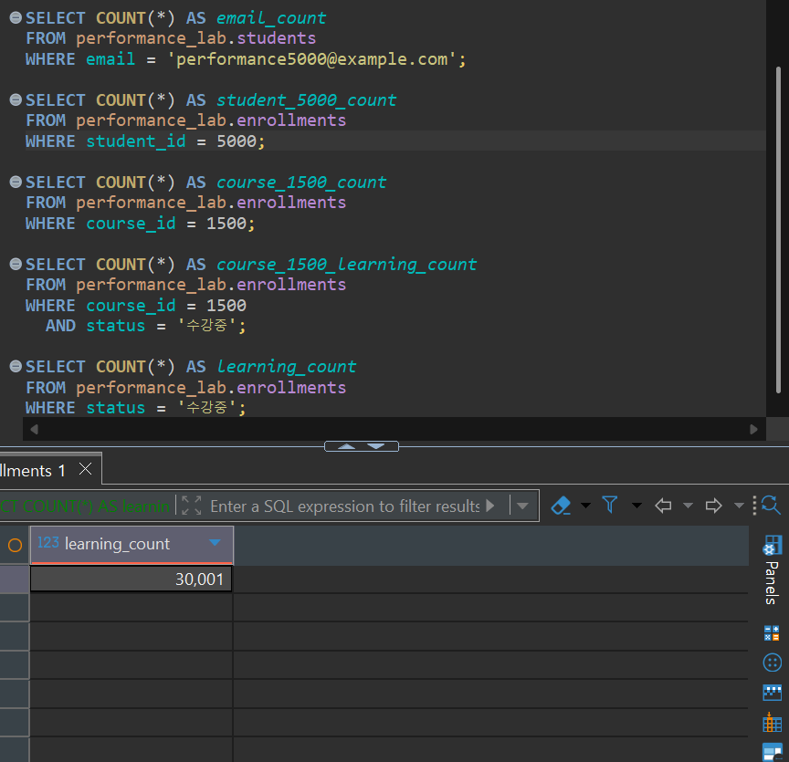
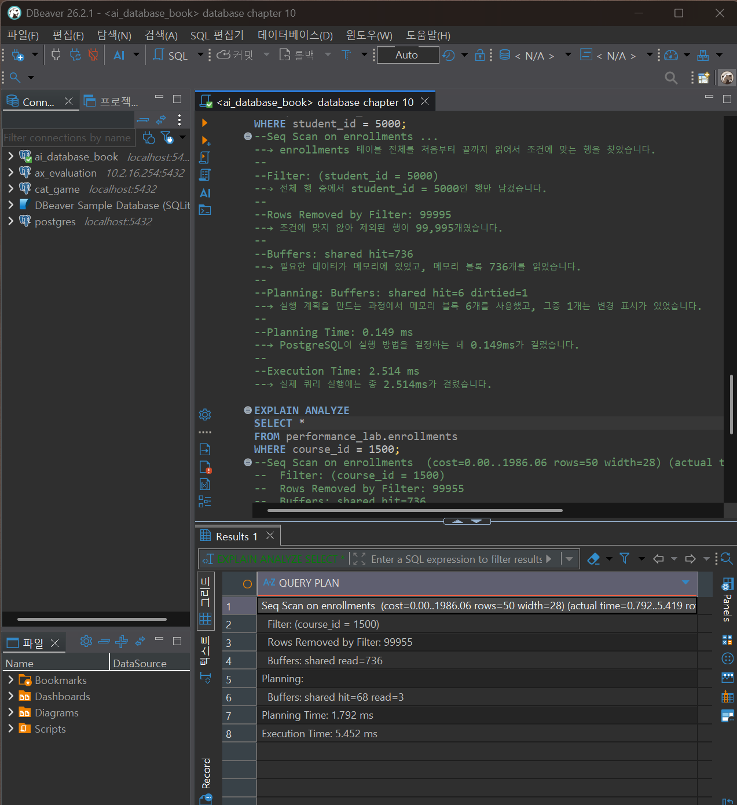
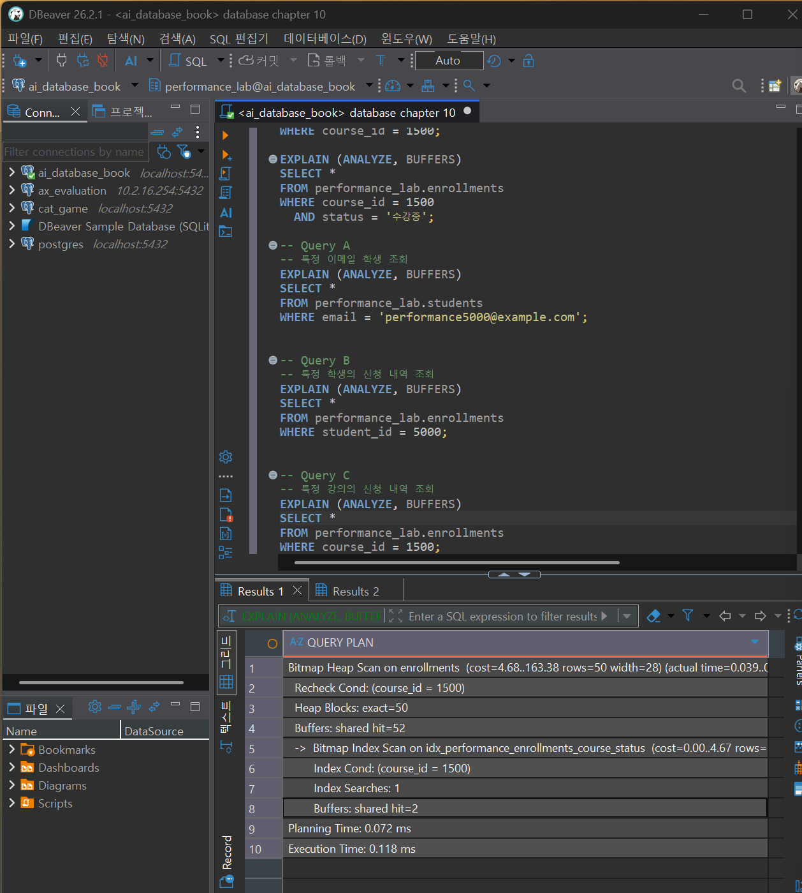

# Chapter 10 확장 실습 답안 템플릿

> **과제:** 실행 계획으로 인덱스 효과 검증하기  
> **사용 방법:** 이 파일을 내려받아 본인의 GitHub 저장소에 `chapter10_answer.md`라는 이름으로 저장한 뒤 실습하면서 바로 작성합니다.  
> **제출 방법:** LMS에는 파일을 직접 업로드하지 않고, **본인 GitHub 저장소의 `chapter10_answer.md` 파일 URL**을 제출합니다.

---

## 제출 전 주의

이 파일과 캡처 화면에는 실제 비밀번호, 전체 DB 접속 URL, API Key, 개인정보를 기록하지 않습니다.

```text
GitHub 계정 또는 별칭: sangjae-lee
과제 작성일: 2026.09.30
사용한 AI 도구: chatgpt
```

---

# 1. PostgreSQL 버전과 시작 환경 확인

다음을 실행합니다.

```sql
SELECT version();
SELECT current_database();
SELECT current_user;
SELECT current_schema();
SHOW search_path;
```

| 확인 항목 | 실제 결과 | 의미 |
| --- | --- | --- |
| PostgreSQL 버전 | PostgreSQL 18.4 | 실습 기준보다 높은 버전이라 실행 계획이 다를 수 있음 |
| `current_database()` | ai_database_book | 현재 실습 DB |
| `current_user` | postgres | 현재 접속 사용자 |
| `current_schema()` | public | 기본 스키마가 `public` |
| `search_path` | public, "$user" | `performance_lab`은 자동 탐색되지 않음 |

### PostgreSQL 버전을 기록해야 하는 이유

```text
PostgreSQL 버전에 따라 지원 기능과 실행 계획이 달라질 수 있기 때문에, 같은 SQL이라도 결과가 다르게 보일 수 있습니다. 따라서 실행 계획을 비교할 때는 먼저 사용 중인 버전을 기록해야 합니다
```

> 이 장의 자동 검증 기준은 PostgreSQL 16입니다. PostgreSQL 18 이상에서는 B-tree Skip Scan 등으로 동일 SQL의 실행 계획이 달라질 수 있습니다.

---

# 2. Chapter 07·08 기준 상태 확인

Chapter 10은 기존 `course_project`를 변경하지 않습니다.

확인 기준:

```text
students = 3
instructors = 2
courses = 3
enrollments = 5

전체 recorded_amount = 590000
활성 = 3건 / 340000
취소 제외 = 4건 / 440000
```

```text
1001 = 완료 / 100000
1004 = 취소 / 150000
1005 = 신청 / 120000
```

### 실제 확인 결과

```text
students: 3
instructors: 2
courses: 3 
enrollments: 5 
전체 recorded_amount: 590000
활성 신청 건수/금액: 3/340000
취소 제외 건수/금액: 4/440000
```

### 성능 실험을 기존 `course_project`에 대량 데이터를 넣지 않고 별도 스키마에서 하는 이유

```text
course_project는 기존 실습 기준 데이터(students 3명, courses 3개, enrollments 5개)를 그대로 유지해야 하기 때문입니다. 성능 측정용 대량 데이터는 performance_lab에 분리하여 기존 데이터에 영향을 주지 않고 인덱스와 실행 계획을 실험합니다.
```

---

# 3. `performance_lab` 생성과 대량 데이터 확인

다음 파일을 순서대로 실행합니다.

```text
code/chapter10/01_performance_lab_schema.sql
code/chapter10/02_performance_lab_seed.sql
```

## 3-1. 생성 후 행 수

| 테이블 | 기대 행 수 | 실제 행 수 | 일치? |
| --- | ---: | ---: | --- |
| `performance_lab.students` | 10003 | 10003 | 일치 |
| `performance_lab.instructors` | 2 | 2 | 일치 |
| `performance_lab.courses` | 2003 | 2003 | 일치 |
| `performance_lab.enrollments` | 100005 | 100005 | 일치 |

## 3-2. 데이터 분포 확인

| 조건 | 기대 행 수 | 실제 행 수 | 대략적 비율 |
| --- | ---: | ---: | ---: |
| `performance5000@example.com` | 1 | 1 | 약 0.010% |
| `student_id = 5000` | 10 | 10 | 약 0.010% |
| `course_id = 1500` | 50 | 50 | 약 0.050% |
| `course_id = 1500 AND status='수강중'` | 15 | 15 | 약 0.015% |
| 전체 `status='수강중'` | 30001 | 30001 | 약 30.0% |

### 선택도가 낮은 조건과 많은 행을 반환하는 조건은 인덱스 판단에서 어떻게 다르게 볼 수 있나요?

```text
적은 행만 반환하는 조건은 인덱스로 검색 범위를 크게 줄일 수 있어 유리할 가능성이 높습니다. 반면 많은 행을 반환하는 조건은 인덱스를 따라 여러 번 접근하는 것보다 테이블 전체를 읽는 Seq Scan이 더 효율적일 수 있습니다. 따라서 실제 실행 계획과 반환 행 수를 함께 확인해야 합니다.
```

### 증거 화면

권장 경로:

```text
assignments/chapter10/images/step03_data_scale.png
```

`여기에 데이터 규모 확인 화면을 삽입하세요.`

---

# 4. 인덱스 생성 전 기준 계획 기록

다음 파일을 실행합니다.

```text
code/chapter10/03_baseline_explain.sql
```

> **중요:** `04_create_candidate_indexes.sql`을 먼저 실행하지 않습니다. 기준 계획을 잃으면 같은 조건의 전후 비교가 어려워집니다.

최소 3개 SQL의 실행 계획을 기록합니다.

```markdown
## Query A

```text
업무 질문: 특정 이메일을 가진 학생 1명을 찾기
WHERE / JOIN / ORDER BY / LIMIT: WHERE email = 'performance5000@example.com'
예상 반환 행 수: 1
실제 반환 행 수: 1
```

```sql
EXPLAIN ANALYZE
SELECT *
FROM performance_lab.students
WHERE email = 'performance5000@example.com';
```

| 관찰 항목 | 기록 |
| --- | --- |
| 주요 Scan/계획 노드 | Index Scan |
| estimated rows | 1 |
| actual rows | 1 |
| Filter | 없음 |
| Index Cond | `email = 'performance5000@example.com'` |
| Buffers hit/read | shared hit=3 |
| Planning Time | 0.095 ms |
| Execution Time | 0.056 ms |

## Query B

```text
업무 질문: 특정 학생(student_id = 5000)의 수강 신청 내역 찾기
WHERE / JOIN / ORDER BY / LIMIT: WHERE student_id = 5000
예상 반환 행 수: 10
실제 반환 행 수: 10
```

```sql
EXPLAIN ANALYZE
SELECT *
FROM performance_lab.enrollments
WHERE student_id = 5000;
```

| 관찰 항목 | 기록 |
| --- | --- |
| 주요 Scan/계획 노드 | Seq Scan |
| estimated rows | 10 |
| actual rows | 10 |
| Filter | `student_id = 5000` |
| Index Cond | 없음 |
| Buffers hit/read | shared hit=736 |
| Execution Time | 2.514 ms |

## Query C

```text
업무 질문: 특정 강의(course_id = 1500)의 수강 신청 내역 찾기
WHERE / JOIN / ORDER BY / LIMIT: WHERE course_id = 1500
예상 반환 행 수: 50
실제 반환 행 수: 50
```

```sql
EXPLAIN ANALYZE
SELECT *
FROM performance_lab.enrollments
WHERE course_id = 1500;
```

| 관찰 항목 | 기록 |
| --- | --- |
| 주요 Scan/계획 노드 | Seq Scan |
| estimated rows | 50 |
| actual rows | 50 |
| Filter | `course_id = 1500` |
| Index Cond | 없음 |
| Buffers hit/read | shared hit=736 |
| Execution Time | 2.288 ms |

### `cost`와 실제 실행 시간이 같은 개념이 아닌 이유

```text
cost는 PostgreSQL이 여러 실행 계획을 비교하기 위해 계산하는 예상 작업 비용입니다.
반면 실제 실행 시간은 SQL을 실제로 실행했을 때 걸린 시간입니다.
따라서 cost 값을 ms 단위의 시간으로 해석하면 안 됩니다.
```

### `EXPLAIN ANALYZE`는 실제 SQL을 실행한다는 점을 왜 기억해야 하나요?

```text
EXPLAIN ANALYZE는 실행 계획만 보여주는 것이 아니라 SQL을 실제로 실행합니다.
SELECT에서는 조회만 수행되지만 INSERT, UPDATE, DELETE 같은 변경 SQL에 사용하면
실제 데이터가 변경될 수 있으므로 주의해야 합니다.
```

### 증거 화면

권장 경로:

```text
assignments/chapter10/images/step04_before_plan.png
```

`여기에 대표 기준 실행 계획을 삽입하세요.`

---

# 5. 후보 인덱스를 만들기 전에 이유 작성

| 후보 인덱스 | 대응 조회 패턴 | 예상 이점 | 컬럼 순서 이유 | 예상 비용/단점 |
| --- | --- | --- | --- | --- |
| `idx_performance_courses_title` | `WHERE title = ?`, `ORDER BY title`, `ORDER BY title LIMIT 20` | 제목 검색과 정렬을 빠르게 처리할 수 있음 | 검색과 정렬에 사용하는 `title`을 인덱스 컬럼으로 사용 | INSERT/UPDATE 시 인덱스 갱신 비용과 저장 공간 증가 |
| `idx_performance_enrollments_student_id` | `WHERE student_id = ?`, 학생별 신청 조회/JOIN | 특정 학생의 신청 내역만 빠르게 찾을 수 있음 | 조회 조건으로 직접 사용하는 `student_id`를 인덱스로 사용 | 데이터 변경 시 인덱스 유지 비용과 저장 공간 증가 |
| `idx_performance_enrollments_course_status` | `WHERE course_id = ?`, `WHERE course_id = ? AND status = ?` | 특정 강의 또는 특정 강의의 상태별 신청을 빠르게 찾을 수 있음 | `course_id`를 먼저 두면 `course_id` 단독 조회와 `course_id + status` 조회를 모두 지원할 수 있음 | `status`만 조회할 때는 효과가 제한적일 수 있고, 쓰기/저장 비용이 증가 |

### “중요한 컬럼이므로 인덱스를 만든다”는 설명이 부족한 이유

```text
인덱스는 컬럼이 중요하다는 이유만으로 만드는 것이 아니라,
실제로 자주 사용하는 WHERE, JOIN, ORDER BY 등의 조회 패턴과
반환되는 행 수를 기준으로 필요성을 판단해야 합니다.
```

### `(course_id, status)`와 `(status, course_id)`가 항상 같은 효과가 아닌 이유

```text
복합 인덱스는 컬럼의 순서에 따라 사용할 수 있는 조회가 달라집니다.

(course_id, status)는 course_id 단독 조건과
course_id + status 조건에 활용하기 좋습니다.

반면 (status, course_id)는 status가 앞에 있기 때문에
course_id만 조건으로 사용하는 조회에서는 같은 효과를 기대하기 어렵습니다.
```

자료에서도 `(course_id, status)`는 `course_id = ?`와 `course_id = ? AND status = ?`에 잘 맞을 수 있고, 후행 컬럼인 `status`만 사용하는 경우에는 같은 방식으로 활용되지 않을 수 있다고 설명하고 있어. :chatgpt-content-reference{index="0"}

---

# 6. 후보 인덱스 생성

다음을 실행합니다.

```text
code/chapter10/04_create_candidate_indexes.sql
```

생성 후 확인:

```text
후보 인덱스 수: 3
전체 인덱스 수: 9
```

본문 기준:

```text
자동 인덱스 = 6
후보 인덱스 = 3
전체 인덱스 = 9
```

### PRIMARY KEY나 UNIQUE가 이미 인덱스를 만들 수 있는데 같은 목적의 인덱스를 또 만들면 어떤 문제가 생기나요?

```text
PRIMARY KEY나 UNIQUE는 이미 해당 컬럼에 인덱스를 만들어 주기 때문에, 같은 컬럼에 비슷한 인덱스를 또 만들면 중복 인덱스가 될 수 있습니다.
그러면 조회 성능 이점은 거의 없는데도 INSERT, UPDATE, DELETE 때 인덱스를 하나 더 갱신해야 하고, 저장 공간도 추가로 사용합니다. 따라서 기존 인덱스가 같은 역할을 하고 있는지 먼저 확인해야 합니다.
```

---

# 7. 같은 SQL로 인덱스 후 재측정

다음 파일을 실행합니다.

```text
code/chapter10/05_after_index_explain.sql
```

Chapter 4에서 기록한 **동일 SQL**을 비교합니다.

좋아. 이제 A/B/C 전부 채울 수 있어. MD 파일에 그대로 복붙할 수 있게 한 셀로 정리하면 아래야.

```markdown
# 7. 같은 SQL로 인덱스 후 재측정

## Query A 전후 비교

| 항목 | Before | After | 해석 |
| --- | --- | --- | --- |
| 주요 계획 노드 | Index Scan | Index Scan | 이미 UNIQUE 인덱스를 사용하고 있었기 때문에 계획 노드는 바뀌지 않음 |
| actual rows | 1 | 1 | 결과 행 수는 동일함 |
| Buffers hit/read | shared hit=3 | shared hit=3 | 읽은 버퍼 수는 동일함 |
| Execution Time | 0.056 ms | 0.038 ms | 실행 시간은 조금 줄었지만 한 번의 측정만으로 성능 향상을 단정하기는 어려움 |
| Index Cond | `email = 'performance5000@example.com'` | `email = 'performance5000@example.com'` | 동일한 이메일 인덱스 조건을 사용함 |

```text
결과 행이 동일했는가: 예
읽은 버퍼가 줄었는가: 아니오
계획이 바뀌었는가: 아니오
실행 시간 한 번만으로 결론낼 수 있는가: 아니오
```

## Query B 전후 비교

| 항목 | Before | After | 해석 |
| --- | --- | --- | --- |
| 주요 계획 노드 | Seq Scan | Index Scan | 전체 테이블 조회에서 student_id 인덱스를 사용하는 방식으로 변경됨 |
| actual rows | 10 | 10 | 결과 행 수는 동일함 |
| Buffers hit/read | shared hit=736 | shared hit=3 | 읽은 버퍼가 크게 줄어듦 |
| Execution Time | 2.514 ms | 0.030 ms | 실행 시간이 크게 감소함 |
| Index Cond | 없음 | `student_id = 5000` | 인덱스 조건을 직접 사용하게 됨 |

```text
결과 행이 동일했는가: 예
읽은 버퍼가 줄었는가: 예, 736에서 3으로 감소
계획이 바뀌었는가: 예, Seq Scan에서 Index Scan으로 변경
실행 시간 한 번만으로 결론낼 수 있는가: 아니오
```

## Query C 전후 비교

| 항목 | Before | After | 해석 |
| --- | --- | --- | --- |
| 주요 계획 노드 | Seq Scan | Bitmap Heap Scan + Bitmap Index Scan | 전체 테이블 조회에서 course_id 인덱스를 이용하는 방식으로 변경됨 |
| actual rows | 50 | 50 | 결과 행 수는 동일함 |
| Buffers hit/read | shared hit=736 | shared hit=52, index hit=2 | 읽은 버퍼가 크게 줄어듦 |
| Execution Time | 2.288 ms | 0.118 ms | 실행 시간이 크게 감소함 |
| Index Cond | 없음 | `course_id = 1500` | 복합 인덱스의 선두 컬럼인 course_id를 인덱스 조건으로 사용함 |

```text
결과 행이 동일했는가: 예
읽은 버퍼가 줄었는가: 예
계획이 바뀌었는가: 예, Seq Scan에서 Bitmap Index Scan + Bitmap Heap Scan으로 변경
실행 시간 한 번만으로 결론낼 수 있는가: 아니오
```

### `Index Scan`으로 바뀌었다는 사실만으로 성공이라고 할 수 없는 이유

```text
Index Scan이 사용되었다고 해서 무조건 더 좋은 것은 아닙니다.
결과 행 수가 동일한지, 읽은 버퍼가 줄었는지, 실제 실행 시간이 개선되었는지,
그리고 그 결과가 반복 측정에서도 비슷하게 나타나는지를 함께 확인해야 합니다.
```

### 증거 화면

권장 경로:

```text
assignments/chapter10/images/step07_after_plan.png
```

`여기에 동일 SQL의 사후 실행 계획을 삽입하세요.`

---

```markdown
# 8. `status` 단독 조회와 Seq Scan 해석

전체 `status = '수강중'`은 약 30%의 행을 반환합니다.

```text
예상 행 수 = 30001
실제 행 수 = 30001
주요 계획 노드 = 실행 결과 확인 필요
```

### 인덱스가 존재해도 PostgreSQL이 Seq Scan을 선택할 수 있는 이유

```text
조회 결과가 전체 데이터의 약 30%처럼 많은 행을 반환하면,
인덱스를 따라 여러 위치를 찾는 것보다 테이블 전체를 한 번 읽는
Seq Scan이 더 효율적이라고 PostgreSQL이 판단할 수 있습니다.
```

### “Seq Scan = 나쁜 계획”이라고 단정하면 안 되는 이유

```text
Seq Scan은 항상 비효율적인 방식이 아닙니다.
많은 행을 조회할 때는 전체 테이블을 순서대로 읽는 것이
인덱스를 사용하는 것보다 오히려 효율적일 수 있습니다.
```

### PostgreSQL 16과 18 이상에서 복합 B-tree 후행 컬럼 조건의 계획이 다를 수 있는 이유

```text
PostgreSQL 16에서는 (course_id, status) 인덱스에서
앞의 course_id 없이 status만 조건으로 사용할 때 인덱스를 활용하기 어렵습니다.

PostgreSQL 18 이상에서는 B-tree Skip Scan이 추가되어
후행 컬럼인 status만 조건으로 사용해도 인덱스를 활용하는 계획이
나타날 수 있으므로 실행 계획이 달라질 수 있습니다.
```

---

# 9. `ORDER BY`와 `LIMIT`에서 인덱스 관찰

`ORDER BY title`과 `ORDER BY title LIMIT 20` 계획을 비교합니다.

```text
ORDER BY title 계획:
- Index Scan 사용
- actual rows = 2003
- Buffers = shared hit=49
- Execution Time = 0.301 ms
- 별도의 Sort 노드는 없음

ORDER BY title LIMIT 20 계획:
- Limit + Index Scan 사용
- actual rows = 20
- Buffers = shared hit=3
- Execution Time = 0.018 ms
- 별도의 Sort 노드는 없음
```

### LIMIT이 있을 때 PostgreSQL이 전체 정렬보다 인덱스 순서를 활용하는 것이 유리할 수 있는 이유

```text
title 인덱스가 이미 정렬된 순서를 가지고 있으므로 전체 데이터를 다시 정렬할 필요가 없습니다.
특히 LIMIT 20이 있으면 인덱스의 앞부분에서 20행만 읽고 바로 멈출 수 있어 처리량을 줄일 수 있습니다.
```

### 실제 계획에서 Sort 노드 또는 Index Scan을 어떻게 확인했나요?

```text
실행 계획에 `Index Scan using idx_performance_courses_title`이 표시되어
title 인덱스를 사용한 것을 확인했습니다.

또한 실행 계획에 별도의 `Sort` 노드가 나타나지 않았으므로
인덱스의 정렬 순서를 그대로 사용한 것으로 확인했습니다.
```

---

# 10. 인덱스별 판단

| 인덱스 | 크기/사용 관찰 | 유지 / 보류 / 제거 | 판단 근거 |
| --- | --- | --- | --- |
| `idx_performance_courses_title` | `idx_scan=7`, `idx_tup_read=4049`, `idx_tup_fetch=4048`, `120 kB` | 유지 | 실제로 여러 번 사용되었고, `ORDER BY title` 및 `LIMIT 20` 조회에서 Index Scan으로 활용됨. 크기도 비교적 작음 |
| `idx_performance_enrollments_student_id` | `idx_scan=7`, `idx_tup_read=70`, `idx_tup_fetch=60`, `936 kB` | 유지 | `student_id = 5000` 조회에서 Seq Scan이 Index Scan으로 바뀌었고, Buffers와 실행 시간이 크게 감소함 |
| `idx_performance_enrollments_course_status` | `idx_scan=12`, `idx_tup_read=30250`, `idx_tup_fetch=0`, `960 kB` | 유지 | 가장 많이 사용된 후보 인덱스이며, `course_id` 및 `course_id + status` 조건에서 Bitmap Index Scan 등에 활용됨 |

### `idx_scan = 0`이라는 이유 하나만으로 인덱스를 삭제하면 안 되는 이유

```text
idx_scan = 0은 관찰 기간 동안 해당 인덱스가 사용되지 않았다는 뜻일 뿐입니다.
통계가 최근 초기화되었거나 해당 조회가 아직 실행되지 않았을 수도 있습니다.
따라서 실제 조회 패턴과 인덱스 역할을 함께 확인한 뒤 삭제 여부를 판단해야 합니다.
```
---

```markdown
# 11. 자동 완료 게이트

다음을 실행합니다.

```text
code/chapter10/07_result_validation.sql
```

```text
최종 검증 결과:
Chapter 10 performance result validation passed
```

검증할 핵심 내용:

```text
performance_lab 기준 행 수 유지
조회 결과 행 수 유지
후보 인덱스 3개 존재
course_project 기준 상태 유지
```

### 실행 계획 비교와 별도로 결과 행 동일성을 검증해야 하는 이유

```text
실행 시간이 빨라졌더라도 조회 결과가 달라졌다면 올바른 성능 개선이라고 할 수 없습니다.
따라서 인덱스 적용 전후에 같은 SQL이 같은 결과 행을 반환하는지 함께 확인해야 합니다.
```

---

# 12. 인덱스 만능론 반박

다음 주장 중 **두 개**를 골라 본문과 실제 실행 계획을 근거로 반박합니다.

```text
A. 인덱스는 많을수록 좋다.
B. 인덱스를 만들었는데 Seq Scan이면 실패다.
C. 모든 FK에는 무조건 같은 방식의 인덱스를 만든다.
D. 실행 시간이 한 번이라도 빨라졌으면 효과가 입증됐다.
E. 선택도가 낮으면 무조건 Index Scan이 나온다.
```

## 주장 1

```text
선택한 주장: A

나의 반박: 인덱스는 조회 성능을 높일 수 있지만, INSERT·UPDATE·DELETE 때마다 인덱스도 함께 갱신해야 하고 저장 공간도 추가로 사용합니다. 따라서 실제 조회에 도움이 되는 인덱스만 유지하는 것이 효율적입니다.

실행 계획에서 확인한 근거: student_id와 course_id 관련 인덱스를 추가한 뒤 Seq Scan이 Index Scan 또는 Bitmap Index Scan으로 바뀌고 Buffers와 Execution Time이 줄어든 것을 확인했습니다. 반면 모든 인덱스가 항상 필요한 것은 아니므로 실제 실행 계획에서 사용 여부와 효과를 확인해야 합니다.
```

## 주장 2

```text
선택한 주장: C

나의 반박: 모든 FK 자식 컬럼에 무조건 같은 형태의 인덱스를 만들 필요는 없습니다. FK는 인덱스가 없어도 무결성을 유지할 수 있고, 실제 조회 패턴과 데이터 규모에 따라 필요한 인덱스가 달라집니다.

실행 계획에서 확인한 근거: enrollments.student_id는 인덱스 생성 전 Seq Scan이었지만 인덱스 생성 후 Index Scan으로 바뀌어 효과가 컸습니다. 반면 FK라는 이유만으로가 아니라 실제 조회에서 자주 사용되고 검색 범위를 줄이는지 실행 계획으로 확인한 뒤 인덱스를 판단해야 합니다.
```

---

# 13. 개인 프로젝트 조회 패턴과 인덱스 후보

개인 프로젝트는 `naver-ai-briefing-tracker`를 기준으로 작성합니다.

프로젝트 목적은 네이버 검색어별 AI 브리핑에서 내 블로그 글이 출처로 인용됐는지 추적하고 기록하는 것입니다. 주요 구조는 다음과 같습니다.

```text
posts
→ keywords
→ search_runs
→ sources
```

주요 관계는 다음과 같습니다.

```text
posts(post_id, post_url, normalized_url)

keywords(post_id, keyword_id, keyword_text)

search_runs(keyword_id, search_run_id, status, checked_at)

sources(search_run_id, source_id, normalized_source_url)
```

상태값은 다음과 같습니다.

```text
CITED
NOT_CITED
NO_BRIEFING
CHECK_FAILED
```

## 반복 조회 질문

| ID | 반복 조회 질문 | WHERE | JOIN | ORDER BY/LIMIT | 예상 반환 비율 | 후보 인덱스 |
| --- | --- | --- | --- | --- | --- | --- |
| P10-Q01 | 특정 검색어의 최근 검색 결과를 최신순으로 조회 | `keyword_id = ?` | 없음 | `ORDER BY checked_at DESC LIMIT 20` | 낮음 | `(keyword_id, checked_at DESC)` |
| P10-Q02 | 특정 검색어에서 실제 인용된 검색 결과만 조회 | `keyword_id = ? AND status = 'CITED'` | 필요 시 `search_runs → sources` | `ORDER BY checked_at DESC` | 낮음~중간 | `(keyword_id, status, checked_at DESC)` |

## 후보 1

```text
후보 인덱스:
idx_search_runs_keyword_checked_at

컬럼 순서:
(keyword_id, checked_at DESC)

이 조회에 도움이 될 것으로 예상한 이유:
특정 keyword_id의 검색 기록만 찾은 뒤 checked_at 최신순으로 조회하는 패턴에 맞습니다.
인덱스가 keyword_id별로 묶이고 그 안에서 checked_at 순서를 활용할 수 있으므로
최근 검색 결과를 빠르게 찾는 데 도움이 될 것으로 예상합니다.

쓰기/저장 비용:
search_runs에 새로운 검색 기록이 INSERT될 때마다 인덱스도 함께 갱신되어야 하며
추가 저장 공간이 필요합니다.

현재 바로 적용 / 후보로 보류:
후보로 보류
```

## 후보 2

```text
후보 인덱스:
idx_search_runs_keyword_status_checked_at

컬럼 순서:
(keyword_id, status, checked_at DESC)

이 조회에 도움이 될 것으로 예상한 이유:
특정 검색어에서 CITED 상태만 찾는 조회는
keyword_id와 status를 함께 WHERE 조건으로 사용합니다.
그 뒤 checked_at 최신순으로 확인하는 경우 정렬까지 함께 지원할 가능성이 있습니다.

쓰기/저장 비용:
search_runs INSERT와 status 변경 시 인덱스 갱신 비용이 발생하고
후보 1과 일부 컬럼이 중복되므로 저장 공간과 유지 비용이 증가합니다.

현재 바로 적용 / 후보로 보류:
후보로 보류
```

### 개인 프로젝트 데이터가 너무 적어 성능 검증이 어렵다면

```text
필요한 데이터 규모:
search_runs가 최소 수천~수만 건 이상 쌓여야 인덱스 전후 차이를 관찰하기 쉬움

필요한 데이터 분포:
하나의 keyword에 여러 search_run이 반복적으로 존재하고
CITED / NOT_CITED / NO_BRIEFING / CHECK_FAILED 상태가 일정 비율로 분포된 데이터

비교할 SQL:
1. WHERE keyword_id = ? ORDER BY checked_at DESC LIMIT 20
2. WHERE keyword_id = ? AND status = 'CITED' ORDER BY checked_at DESC

비교할 지표:
주요 Scan 노드
actual rows
Buffers hit/read
Execution Time
Index Cond
Sort 노드 여부

현재 판단 상태:
후보
```

> 작은 데이터에서 Index Scan이 나오지 않는다고 억지로 설정을 바꾸어 특정 계획을 강제하지 않습니다.

---

# 14. AI를 실행 계획 리뷰어로 활용

## 14-1. AI에게 전달한 정보

```text
업무 질문:
특정 검색어의 최근 검색 결과와 실제 CITED 결과를 빠르게 조회하고 싶음

PostgreSQL 버전:
PostgreSQL 18.4

테이블 행 수:
현재 naver-ai-briefing-tracker의 실제 PostgreSQL 데이터 규모는 충분히 확보되지 않음

데이터 분포:
search_runs.status는 CITED / NOT_CITED / NO_BRIEFING / CHECK_FAILED로 구분
실제 비율은 데이터가 충분히 쌓인 뒤 확인 필요

기존 인덱스:
현재 프로젝트에서 기존 인덱스 정의가 확정된 기록은 없음

SQL:

SELECT *
FROM search_runs
WHERE keyword_id = ?
ORDER BY checked_at DESC
LIMIT 20;

SELECT *
FROM search_runs
WHERE keyword_id = ?
  AND status = 'CITED'
ORDER BY checked_at DESC;

EXPLAIN (ANALYZE, BUFFERS) 핵심 결과:
현재 데이터 규모가 충분하지 않아 실제 성능 차이는 아직 검증하지 않음
```

## 14-2. AI 제안 검토

| AI 제안 | 수용 / 수정 / 보류 / 거절 | 실제 계획/데이터 근거 | 최종 판단 |
| --- | --- | --- | --- |
| `(keyword_id, checked_at DESC)` 인덱스 | 보류 | 특정 검색어의 최근 검색 결과 조회 패턴과 잘 맞지만 현재 데이터가 작아 실제 성능 검증이 어려움 | 데이터가 충분히 쌓인 뒤 EXPLAIN ANALYZE로 검증 |
| `(keyword_id, status, checked_at DESC)` 인덱스 | 보류 | 특정 검색어의 CITED 결과 조회에는 맞지만 후보 1과 중복되는 컬럼이 있어 쓰기·저장 비용도 비교해야 함 | 실제 조회 빈도와 실행 계획을 확인한 뒤 결정 |

### AI가 제안한 인덱스 중 만들지 않기로 한 것이 있다면 이유

```text
현재는 두 후보 모두 바로 만들지 않고 보류했습니다.

조회 패턴에는 맞을 가능성이 있지만 개인 프로젝트의 데이터 규모가 아직 작아
Seq Scan과 Index Scan의 실제 성능 차이를 충분히 검증하기 어렵기 때문입니다.

또한 두 인덱스는 keyword_id와 checked_at을 일부 중복해서 사용하므로
실제 조회 빈도와 쓰기 비용을 확인하지 않고 둘 다 만드는 것은 비효율적일 수 있습니다.
```

### AI가 PostgreSQL 버전이나 데이터 분포를 무시하고 단정한 내용이 있었나요?

```text
아니오.

PostgreSQL 18.4를 사용하고 있다는 점과
현재 개인 프로젝트의 데이터 규모 및 상태 분포가 충분히 검증되지 않았다는 점을 고려했습니다.

따라서 특정 인덱스가 반드시 사용된다고 단정하지 않고
실제 데이터가 쌓인 뒤 실행 계획으로 확인해야 한다고 판단했습니다.
```

### AI가 만든 인덱스 제안을 실제 계획 없이 채택하면 위험한 이유

```text
조회 패턴만 보고 만든 인덱스가 실제로는 선택도가 낮거나
현재 데이터 규모에서 Seq Scan보다 이점이 없을 수 있습니다.

또한 사용되지 않는 인덱스도 INSERT, UPDATE, DELETE 때마다 갱신해야 하고
추가 저장 공간을 사용합니다.

따라서 AI 제안은 후보로만 보고
실제 EXPLAIN (ANALYZE, BUFFERS) 결과와 데이터 분포를 확인한 뒤
적용 여부를 결정해야 합니다.
```

여기서 중요한 점 하나는, `naver-ai-briefing-tracker`의 **실제 PostgreSQL 데이터가 아직 충분히 구축되지 않았던 상태**라서 `idx_scan`, `Buffers`, 실제 실행 시간 같은 값을 임의로 넣지 않고 전부 **후보/보류**로 처리했다는 거야. 또한 이전 EDA에서는 인용률 계산 시 `CITED / (CITED + NOT_CITED)`를 사용하고, `sources`까지 바로 JOIN하면 1:N 때문에 중복 집계가 생길 수 있다는 점을 확인했었어.

---

# 15. 최종 성찰

아래 문장은 본인의 말로 작성합니다.

```text
1. 인덱스가 필요한지 판단할 때 가장 먼저 확인할 것은
   자주 그 인덱스를 사용하는가 이다.

2. 같은 SQL의 인덱스 전후를 비교할 때 통제해야 할 조건은
   같은 PostgreSQL 이다.

3. Seq Scan이 항상 나쁜 것이 아닌 이유는
   많은 행을 조회해야 할 때는 인덱스를 따라 여러 번 접근하는 것보다 테이블 전체를 한 번 순차적으로 읽는 것이 더 효율적일 수 있기 때문 이다.

4. 실행 시간 한 번보다 계획과 Buffers를 함께 보는 이유는
   실행 시간은 캐시나 환경에 따라 달라질 수 있지만, 계획과 Buffers를 함께 보면 실제로 어떤 방식으로 읽었고 얼마나 많은 데이터를 처리했는지 확인할 수 있기 때문 이다.

5. 내 개인 프로젝트에서 아직 인덱스를 보류한 후보가 있다면 그 이유는
   현재 데이터 규모가 작아 실제 성능 차이를 충분히 검증하기 어렵기 때문 이다.
```

---

# 16. 제출 체크리스트

- [x] `chapter10_answer.md`를 본인 저장소에 만들었다.
- [x] PostgreSQL 버전을 기록했다.
- [x] Chapter 07·08 기준 상태를 확인했다.
- [x] `performance_lab`의 10003 / 2 / 2003 / 100005 기준을 확인했다.
- [x] `03_baseline_explain.sql`을 후보 인덱스 생성 전에 실행했다.
- [x] 기준 실행 계획을 최소 3개 기록했다.
- [x] 후보 인덱스 3개의 근거를 먼저 작성했다.
- [x] 동일 SQL의 인덱스 전후 계획을 비교했다.
- [x] 실행 시간뿐 아니라 Scan, actual rows, Buffers, Index Cond를 확인했다.
- [x] `status` 단독 조건의 계획을 해석했다.
- [x] `ORDER BY`와 `LIMIT` 계획을 확인했다.
- [x] 인덱스 만능론 주장 2개를 반박했다.
- [x] `07_result_validation.sql`로 최종 상태를 확인했다.
- [x] 개인 프로젝트의 반복 조회 2개와 인덱스 후보를 작성했다.
- [x] AI 제안을 실제 실행 계획과 비교했다.
- [x] 핵심 캡처 3~4장만 넣었다.
- [x] 캡처에 비밀번호·개인정보가 없다.
- [x] GitHub 웹에서 Markdown과 이미지가 정상적으로 보인다.
- [x] 최종 답안을 commit/push했다.

---

# 17. LMS 제출 URL

아래 형식의 **본인 GitHub 파일 URL**을 LMS에 제출합니다.

```text
https://github.com/<본인-GitHub-ID>/<본인-저장소>/blob/main/assignments/chapter10/chapter10_answer.md
```

내 제출 URL:

```text
https://github.com/sangjae-lee97/kant-axagent-study/blob/main/ai-database-study/assignments/chapter10/chapter10_answer.md
```

> 저장소 메인 URL, 교수자 템플릿 URL, Raw URL이 아니라 **작성 완료된 본인 `chapter10_answer.md` 파일 화면 URL**을 제출합니다.