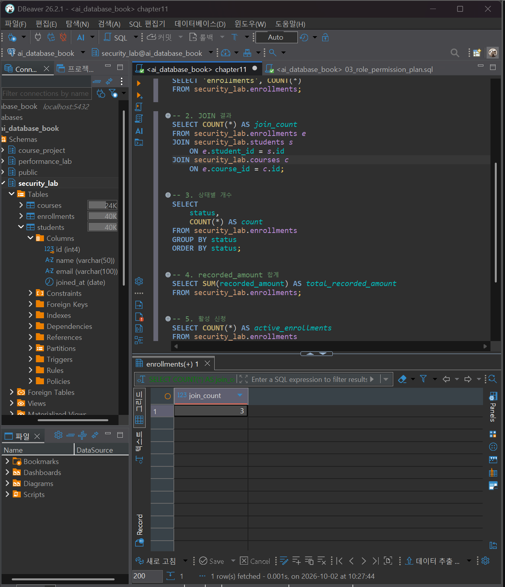

# Chapter 11 확장 실습 답안 템플릿

> **과제:** 데이터베이스를 안전하게 지키고 복구하는 방법  
> **사용 방법:** 이 파일을 내려받아 본인의 GitHub 저장소에 `chapter11_answer.md`라는 이름으로 저장한 뒤 실습하면서 바로 작성합니다.  
> **제출 방법:** LMS에는 파일을 직접 업로드하지 않고, **본인 GitHub 저장소의 `chapter11_answer.md` 파일 URL**을 제출합니다.

---

## 제출 전 주의

이 파일과 캡처 화면에는 실제 비밀번호, 전체 DB 접속 URL, API Key, password file 내용, 실제 개인정보, 민감한 백업 파일 공유 링크를 기록하지 않습니다.

```text
GitHub 계정 또는 별칭:
과제 작성일:
PostgreSQL 버전:
사용한 AI 도구:
실습 환경: 개인 로컬 / 공유 환경 / 기타
```

> **중요**  
> PostgreSQL Role은 데이터베이스 하나가 아니라 **클러스터 전역 객체**입니다.  
> 공유 PostgreSQL 환경에서는 Role 생성·삭제나 광범위한 `GRANT/REVOKE`를 임의 실행하지 않습니다. 실제 Role 변경 실습은 관리자 권한이 있는 개인 로컬 또는 격리된 테스트 환경에서만 수행합니다.

---

# 1. 시작 환경과 Chapter 07·08 기준 상태 확인

다음을 실행합니다.

```sql
SELECT version();
SELECT current_database();
SELECT current_user;
SELECT current_schema();
SHOW search_path;
SHOW transaction_read_only;
```

| 확인 항목 | 실제 결과 | 의미 |
| --- | --- | --- |
| PostgreSQL 버전 | PostgreSQL 18.4 on x86_64-windows, compiled by msvc-19.44.35227, 64-bit | 현재 PostgreSQL **18.4 버전의 64비트 Windows 환경**에서 데이터베이스가 실행되고 있음을 의미 |
| `current_database()` | ai_database_book | 현재 접속해서 작업 중인 데이터베이스 이름이 **`ai_database_book`**임을 의미 |
| `current_user` | postgres | 현재 데이터베이스에 접속한 사용자가 **`postgres`** 계정임을 의미 |
| `current_schema()` | security_lab | 현재 기본적으로 사용되고 있는 스키마가 **`security_lab`**임을 의미 |
| `search_path` | public, "$user" | 테이블 이름에 스키마를 생략했을 때 **`public` 스키마를 우선 탐색하고, 이후 사용자 이름과 같은 스키마도 탐색**한다는 의미 |
| `transaction_read_only` | off | 현재 트랜잭션이 **읽기 전용이 아니므로 INSERT, UPDATE, DELETE, DDL 등의 변경 작업이 가능**하다는 의미 |

Chapter 11 시작 기준:

```text
course_project.students = 3
course_project.instructors = 2
course_project.courses = 3
course_project.enrollments = 5
전체 recorded_amount = 590000
활성 = 3건 / 340000
취소 제외 = 4건 / 440000
```

### 기존 프로젝트 데이터를 변경하지 않고 별도 `security_lab`에서 실습하는 이유

```text
기존 프로젝트 데이터를 보호하고, 권한·백업·복원 실습 중 발생할 수 있는 실수의 영향을 분리하기 위해서이다.
```

---

# 2. 보호 대상과 위협 식별

내 개인 프로젝트 또는 온라인 강의 프로젝트를 기준으로 작성합니다.

| 자산 | 구체적인 예 | 주요 위험 | 보호 방법 후보 |
| --- | --- | --- | --- |
| 개인정보 |  |  |  |
| 업무 데이터 |  |  |  |
| DB 구조 |  |  |  |
| 접속 비밀 |  |  |  |
| 로그 |  |  |  |
| 백업 파일 |  |  |  |
| 복구 절차 |  |  |  |

### 외부 공격 외에 운영 실수도 위험으로 봐야 하는 이유

```text

```

---

# 3. 최소 권한 작업 행렬

다음 역할을 가정합니다.

```text
report reader
application user
backup user
owner/admin
```

`허용 / 차단 / 조건부` 중 하나를 작성합니다.

| 작업 | report reader | application user | backup user | owner/admin |
| --- | --- | --- | --- | --- |
| DB CONNECT |  |  |  |  |
| schema USAGE |  |  |  |  |
| SELECT |  |  |  |  |
| INSERT |  |  |  |  |
| UPDATE |  |  |  |  |
| DELETE |  |  |  |  |
| sequence USAGE |  |  |  |  |
| sequence SELECT |  |  |  |  |
| ALTER |  |  |  |  |
| DROP |  |  |  |  |
| schema CREATE |  |  |  |  |
| 권한 재부여 |  |  |  |  |

### 애플리케이션 로그인 계정을 객체 owner로 사용하면 위험이 커질 수 있는 이유

```text

```

### `SUPERUSER`, `CREATEDB`, `CREATEROLE`을 일반 앱 역할에 주지 않는 이유

```text

```

---

# 4. `security_lab` 생성과 기준 데이터 확인

다음 파일을 순서대로 실행합니다.

```text
code/chapter11/01_security_lab_schema.sql
code/chapter11/02_security_lab_seed.sql
```

## 4-1. 기준 데이터

| 항목 | 기대값 | 실제값 | 일치? |
| --- | ---: | ---: | --- |
| students | 3 | 3 | O |
| courses | 3 | 3 | O |
| enrollments | 3 | 3 | O |
| JOIN 결과 | 3 | 3 | O |
| 신청 | 1 | 1 | O |
| 수강중 | 1 | 1 | O |
| 완료 | 1 | 1 | O |
| 취소 | 0 | 0 | O |
| `recorded_amount` 합계 | 310000 | 310000 | O |
| 활성 신청 | 2 | 2 | O |
| 활성 중복 | 0 | 0 | O |

### `security_lab`을 별도로 사용하는 이유

기존 프로젝트 데이터를 보호하면서 권한·백업·복원 실습을 안전하게 수행하기 위해서이다.


### 증거 화면

권장 경로:

```text
assignments/chapter11/images/step04_security_lab.png
```

`여기에 기준 데이터 확인 화면을 삽입하세요.`

---

# 5. Role과 권한 계획 검토

다음 파일을 읽습니다.

```text
code/chapter11/03_role_permission_plan.sql
```

개인 로컬 또는 격리된 관리자 환경에서만 필요한 문장을 **선택 실행**합니다.

교재 역할 예:

```text
lab_role_security_owner   NOLOGIN
lab_role_report_reader    NOLOGIN
lab_role_enrollment_app   NOLOGIN
lab_role_backup_reader    NOLOGIN
lab_readonly_user         LOGIN
lab_enrollment_user       LOGIN
lab_backup_user           LOGIN
```

## 5-1. 각 역할의 목적

| 역할 | LOGIN/NOLOGIN | 목적 | 과도하게 주면 안 되는 권한 |
| --- | --- | --- | --- |
| `lab_role_security_owner` | NOLOGIN | `security_lab` 객체 소유·관리 | 불필요한 LOGIN, SUPERUSER |
| `lab_role_report_reader` | NOLOGIN | 보고용 데이터 조회 | INSERT, UPDATE, DELETE |
| `lab_role_enrollment_app` | NOLOGIN | 수강신청 조회·등록·상태 변경 | DELETE, TRUNCATE, 불필요한 UPDATE |
| `lab_role_backup_reader` | NOLOGIN | 백업을 위한 데이터 조회 | INSERT, UPDATE, DELETE |
| `lab_readonly_user` | LOGIN | 조회 작업을 수행하는 실제 사용자 | 직접적인 과도한 테이블 권한 |
| `lab_enrollment_user` | LOGIN | 수강신청 앱용 실제 사용자 | 역할 범위를 벗어난 수정·관리 권한 |
| `lab_backup_user` | LOGIN | 백업 작업을 수행하는 실제 사용자 | 데이터 변경·관리 권한 |

### 로그인 역할과 권한 역할을 분리하는 이유

```text
실제 로그인 계정과 권한 묶음을 분리하여 권한을 역할 단위로 쉽게 관리하고 최소 권한 원칙을 적용하기 위해서이다.
```

### PostgreSQL 16 membership의 `INHERIT`, `SET`, `ADMIN` 의미

```text
INHERIT: 로그인 사용자가 해당 Role의 권한을 자동으로 상속
SET: SET ROLE로 해당 Role로 전환 가능
ADMIN: 다른 사용자에게 그 Role을 다시 부여할 권한
```

---

# 6. 현재 권한과 실제 유효 권한 확인

다음을 실행합니다.

```text
code/chapter11/04_permission_checks.sql
```

## 6-1. 확인 결과

```text
security_lab owner:
PUBLIC에 부여된 권한:
report role의 SELECT 권한:
app role의 INSERT 권한:
app role의 UPDATE 범위:
backup role의 SELECT 권한:
backup role의 sequence SELECT 권한:
schema CREATE 허용 여부:
RLS 사용 여부:
```

### 직접 GRANT만 보고 최종 접근 가능 여부를 판단하면 안 되는 이유

```text

```

### `PUBLIC`, 역할 멤버십, 객체 owner가 유효 권한에 영향을 주는 방식

```text

```

---

# 7. 허용/차단 행동 검증

> 공유 환경에서는 실제 Role 변경을 하지 말고 계획 SQL과 권한 확인 결과를 바탕으로 **예상 결과 분석**으로 대체할 수 있습니다.

개인 로컬 또는 격리 환경이라면 다음 파일에서 필요한 구간만 실행합니다.

```text
code/chapter11/05_permission_behavior_tests.sql
```

최소 다음 네 사례를 기록합니다.

| 테스트 | 역할 | 실행 작업 | 예상 | 실제 | 왜 이 결과가 맞는가 |
| --- | --- | --- | --- | --- | --- |
| 허용 1 |  | SELECT |  |  |  |
| 허용 2 |  |  |  |  |  |
| 차단 1 |  |  |  |  |  |
| 차단 2 |  |  |  |  |  |

### 권한 표만 보는 것보다 실제 허용/차단 동작 검증이 중요한 이유

```text

```

### 증거 화면

권장 경로:

```text
assignments/chapter11/images/step07_permission_test.png
```

`여기에 대표 허용/차단 결과를 삽입하세요.`

---

# 8. 비밀정보와 저장소 점검

다음을 확인합니다.

- [ ] 실제 DB 비밀번호가 GitHub에 없다.
- [ ] 전체 접속 URL에 비밀번호가 포함되어 있지 않다.
- [ ] API Key가 없다.
- [ ] password file 내용이 없다.
- [ ] `.env` 실제 값이 커밋되지 않았다.
- [ ] 백업 파일 자체를 일반 Public GitHub 저장소에 올리지 않았다.
- [ ] 실제 개인정보가 캡처 화면에 없다.

### `.env.example`에는 무엇을 남기고 무엇을 남기지 않아야 하나요?

```text

```

### `PGPASSWORD`를 저장소나 장기 실행 환경에 두는 대신 보호된 password file을 검토하는 이유

```text

```

---

# 9. 백업 전 준비 확인

`BACKUP_RESTORE_RUNBOOK.md`를 참고해 기록합니다.

## 9-1. 버전

```text
원본 PostgreSQL 서버 버전:
pg_dump 버전:
pg_restore 버전:
psql 버전:
```

## 9-2. 백업 범위

```text
백업 대상 DB:
백업 대상 스키마:
백업 형식:
백업 역할:
RLS 사용 여부:
외부 스키마 의존성 여부:
```

### `--schema=security_lab`만 지정했다고 외부 의존성이 모두 자동 포함된다고 단정하면 안 되는 이유

```text

```

---

# 10. custom archive 백업 생성

실제 계정명·비밀번호·민감 경로는 제출물에서 가립니다.

사용 형태:

```bash
pg_dump \
  -U <backup_user> \
  -d ai_database_book \
  -Fc \
  --schema=security_lab \
  -f <backup-dir>/security_lab.backup
```

Windows에서는 PowerShell/터미널 문법에 맞게 한 줄로 실행해도 됩니다.

## 10-1. 백업 결과

```text
종료 코드 또는 성공 여부:
생성 시각:
파일 크기:
경고/오류 요약:
백업 파일 저장 위치는 저장소 밖인가:
```

## 10-2. archive 목록 확인

```bash
pg_restore --list <backup-dir>/security_lab.backup
```

확인한 항목:

```text
security_lab 스키마:
students/courses/enrollments:
IDENTITY 시퀀스 3개:
PK/FK/UNIQUE/CHECK:
부분 고유 인덱스:
예상하지 않은 외부 객체:
```

## 10-3. SHA-256

Windows PowerShell 예:

```powershell
Get-FileHash <backup-dir>\security_lab.backup -Algorithm SHA256
```

```text
해시 알고리즘: SHA-256
해시 값:
측정 시각:
```

### 해시가 일치한다고 복구 가능성이 검증된 것은 아닌 이유

```text

```

### 증거 화면

권장 경로:

```text
assignments/chapter11/images/step10_backup.png
```

`파일 목록/크기/해시 등 비밀정보가 아닌 핵심 증거만 삽입하세요.`

---

# 11. 별도 복원 DB 준비

원본 `ai_database_book`에 덮어쓰지 않습니다.

복원 DB 예:

```text
ai_database_book_restore
```

생성 시 확인:

```text
기존 동일 이름 DB 존재 여부를 확인했는가:
복원 DB owner:
원본 DB와 다른 DB인지:
```

### 원본 DB에 바로 복원하지 않는 이유

```text

```

---

# 12. custom archive 원자적 복원

예시:

```bash
pg_restore \
  -U <restore_user> \
  -d ai_database_book_restore \
  --single-transaction \
  --no-owner \
  --no-privileges \
  <backup-dir>/security_lab.backup
```

## 12-1. 옵션 해석

```text
--single-transaction:

--no-owner:

--no-privileges:
```

## 12-2. 실제 결과

```text
복원 성공 여부:
시작/완료 시각:
경고/오류:
부분 객체가 남았는가:
```

### `--no-owner --no-privileges`를 사용했다고 권한 검증까지 끝난 것은 아닌 이유

```text

```

---

# 13. 복원 DB 구조·데이터·소유권 검증

복원 DB에서 다음 파일을 실행합니다.

```text
code/chapter11/06_restore_validation.sql
```

> 이 파일은 원본 DB가 아니라 **별도 복원 DB**에서 실행합니다.

## 13-1. 핵심 결과

| 검증 항목 | 기대값 | 실제값 | 일치? |
| --- | ---: | ---: | --- |
| students | 3 |  |  |
| courses | 3 |  |  |
| enrollments | 3 |  |  |
| JOIN | 3 |  |  |
| 신청/수강중/완료/취소 | 1/1/1/0 |  |  |
| `recorded_amount` 합계 | 310000 |  |  |
| 고아 student FK | 0 |  |  |
| 고아 course FK | 0 |  |  |
| 활성 중복 | 0 |  |  |
| NOT NULL | 14 |  |  |
| 명시 제약조건 | 13 |  |  |
| IDENTITY 시퀀스 | 3 |  |  |

```text
최종 검증 메시지:
```

### 백업 파일 생성 성공보다 복원 검증 결과가 더 중요한 이유

```text

```

### 증거 화면

권장 경로:

```text
assignments/chapter11/images/step13_restore_validation.png
```

`여기에 복원 검증 통과 결과를 삽입하세요.`

---

# 14. 복원 후 권한 2단계 검증

테스트 복원에서 원본 ACL을 생략했다면, 필요한 Role/GRANT 정책을 테스트 환경에 다시 적용한 뒤 다음을 확인합니다.

```text
04_permission_checks.sql
05_permission_behavior_tests.sql의 필요한 구간
```

```text
구조·데이터 검증 통과 여부:
권한 정책 재적용 여부:
허용 동작 검증 결과:
차단 동작 검증 결과:
```

### 구조·데이터 복원과 권한 정책 복원을 별도 단계로 검증하는 이유

```text

```

---

# 15. RPO / RTO 계획

내 개인 프로젝트를 작은 실제 서비스라고 가정합니다.

```text
허용 가능한 데이터 손실 시간(RPO):

허용 가능한 복구 시간(RTO):

백업 주기 후보:

복원 시험 주기 후보:

백업 보관 기간:
```

### 이 숫자들이 기술자가 임의로 정하는 값이 아니라 업무 요구사항이어야 하는 이유

```text

```

---

# 16. 개인 프로젝트 보안·복구 설계

Chapter 07부터 발전시킨 개인 프로젝트를 사용합니다.

## 16-1. 역할 후보

| 역할 ID | 역할 | 해야 하는 작업 | 허용 권한 | 차단 권한 |
| --- | --- | --- | --- | --- |
| P11-R01 |  |  |  |  |
| P11-R02 |  |  |  |  |
| P11-R03 |  |  |  |  |

## 16-2. 백업·복구 계획

```text
백업 대상:
백업에서 제외할 민감/임시 데이터:
백업 주기:
보관 위치:
RPO:
RTO:
복원 대상 별도 환경:
복원 후 검증 SQL 또는 기준:
```

## 16-3. 위험한 명령 후보

내 프로젝트에서 특히 신중히 다뤄야 할 명령 또는 작업을 3개 작성합니다.

```text
1.
2.
3.
```

---

# 17. AI를 보안·복구 리뷰어로 활용

SQL/명령을 먼저 실행하지 않고 AI에게 검토를 요청합니다.

예시 요청:

```text
다음 PostgreSQL 보안·백업·복원 계획을 리뷰해 주세요.
명령을 바로 실행하라고 하지 말고 먼저 다음을 확인해 주세요.

1. 어떤 DB/스키마/Role에 영향이 있는가
2. Role이 클러스터 전역에 영향을 주는가
3. 권한이 과도하지 않은가
4. PUBLIC/owner/membership 경로를 놓치지 않았는가
5. 비밀번호·접속 URL·백업 파일이 노출될 위험이 있는가
6. 원본 DB를 덮어쓸 위험이 있는가
7. backup 범위의 외부 의존성이 있는가
8. 복원 후 구조·데이터·소유권·권한 중 무엇을 검증해야 하는가
9. RPO/RTO 요구사항과 맞는가

[내 계획]
```

## 17-1. AI 제안 검토표

| AI 제안 | 수용 / 수정 / 보류 / 거절 | 실제 확인 근거 | 나의 이유 |
| --- | --- | --- | --- |
|  |  |  |  |
|  |  |  |  |
|  |  |  |  |

### AI가 `SUPERUSER`, `GRANT ALL`, `DROP ... CASCADE`, 원본 DB 직접 복원을 제안한다면 무엇을 확인해야 하나요?

```text

```

---

# 18. 최종 성찰

```text
1. 인증과 권한 부여가 다른 이유는
   ____________________________________________________________ 이다.

2. 최소 권한은 '권한을 무조건 적게 주는 것'이 아니라
   ____________________________________________________________ 이다.

3. 백업 파일이 존재해도 복구 준비가 끝난 것이 아닌 이유는
   ____________________________________________________________ 이다.

4. 별도 DB 복원이 중요한 이유는
   ____________________________________________________________ 이다.

5. AI가 보안·복구 명령을 제안해도 사람이 반드시 확인해야 하는 것은
   ____________________________________________________________ 이다.
```

---

# 19. 제출 체크리스트

- [ ] `chapter11_answer.md`를 본인 저장소에 만들었다.
- [ ] PostgreSQL 버전과 현재 DB를 확인했다.
- [ ] 보호 자산과 위협을 작성했다.
- [ ] 최소 권한 작업 행렬을 작성했다.
- [ ] `security_lab` 3/3/3, 총 310000 기준을 확인했다.
- [ ] Role/권한 계획을 검토했다.
- [ ] 공유 환경에서 위험한 Role 변경을 임의 실행하지 않았다.
- [ ] 현재 ACL/PUBLIC/membership/유효 권한을 확인했다.
- [ ] 허용·차단 행동을 실제 검증하거나 예상 분석했다.
- [ ] 비밀번호·API Key·password file·실제 개인정보를 노출하지 않았다.
- [ ] custom archive 백업을 만들었다.
- [ ] archive 목록과 SHA-256을 확인했다.
- [ ] 원본이 아닌 별도 DB에 복원했다.
- [ ] `06_restore_validation.sql`로 복구 상태를 검증했다.
- [ ] 구조·데이터와 권한을 2단계로 검토했다.
- [ ] RPO/RTO를 작성했다.
- [ ] 개인 프로젝트 보안·복구 계획을 작성했다.
- [ ] AI 제안을 수용/수정/보류/거절로 판단했다.
- [ ] 핵심 증거 화면은 3~4장 정도만 사용했다.
- [ ] GitHub 웹에서 Markdown과 이미지가 정상 표시되는지 확인했다.

---

# LMS 제출 URL

제출할 것은 교수자 템플릿 URL이나 저장소 홈 주소가 아닙니다.

```text
https://github.com/<본인-GitHub-ID>/<본인-저장소>/blob/main/assignments/chapter11/chapter11_answer.md
```

LMS에서 이 URL을 클릭했을 때 **작성 완료한 Chapter 11 답안 Markdown이 바로 열려야 합니다.**