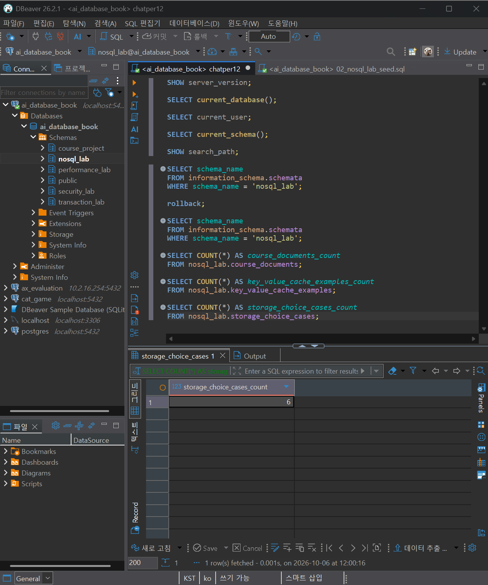
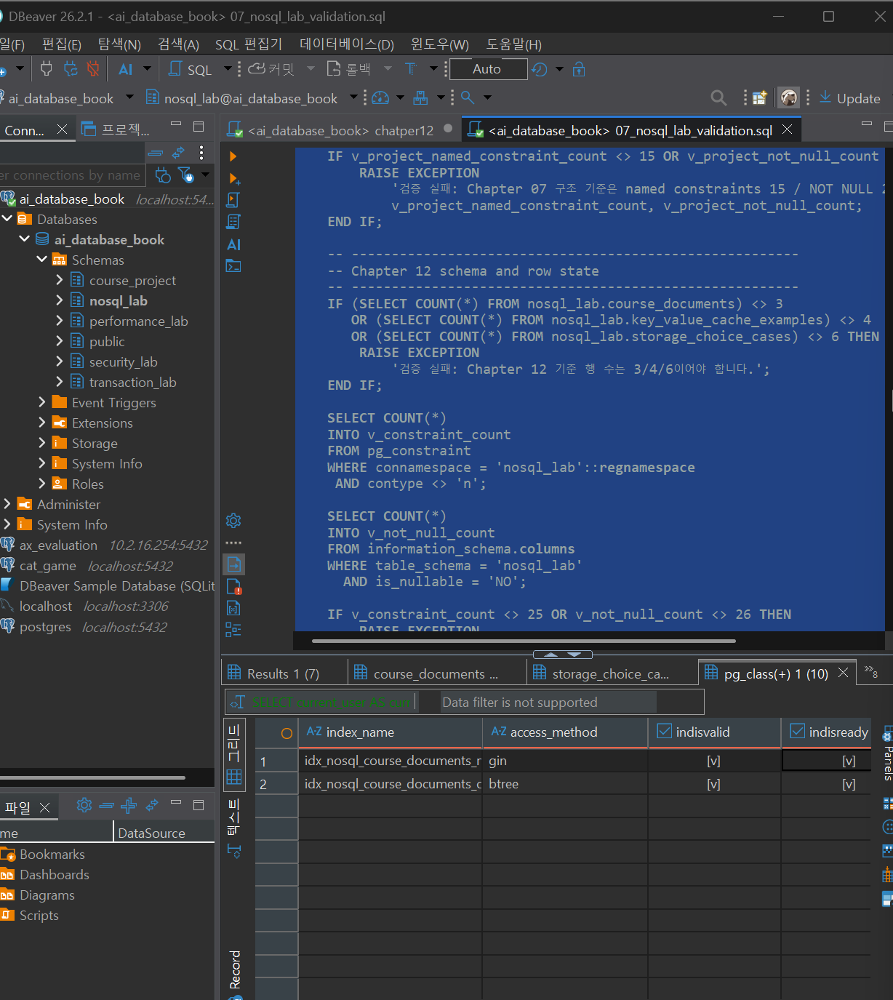

# Chapter 12 확장 실습 답안 템플릿

> **과제:** 조회 패턴으로 RDBMS와 NoSQL 선택하기  
> **사용 방법:** 이 파일을 내려받아 본인의 GitHub 저장소에 `chapter12_answer.md`라는 이름으로 저장한 뒤 실습하면서 바로 작성합니다.  
> **제출 방법:** LMS에는 파일을 직접 업로드하지 않고, **본인 GitHub 저장소의 `chapter12_answer.md` 파일 URL**을 제출합니다.

---

## 제출 전 주의

이 파일과 캡처 화면에는 실제 비밀번호, 전체 DB 접속 URL, API Key, 개인정보를 기록하지 않습니다.

```text
GitHub 계정 또는 별칭: sangjae-lee97
과제 작성일: 2026.10.06
PostgreSQL 버전: 18.4
사용한 AI 도구: gpt
```

> 이번 장에서는 MongoDB, Redis, Cassandra, Graph DB 같은 별도 서버를 반드시 설치하지 않습니다.  
> 제공된 PostgreSQL `nosql_lab`을 이용해 **원본·파생·캐시·문서·저장소 선택 기준**을 실습합니다.

---

# 1. 시작 환경과 Chapter 07 기준 상태 확인

다음을 실행합니다.

```sql
SELECT current_database();
SELECT current_user;
SELECT current_schema();
SHOW search_path;
```

| 확인 항목 | 실제 결과 | 의미 |
| --- | --- | --- |
| `current_database()` | `ai_database_book` | 현재 접속한 데이터베이스는 `ai_database_book`이다. |
| `current_user` | `postgres` | 현재 PostgreSQL에 `postgres` 사용자로 접속 중이다. |
| `current_schema()` | `nosql_lab` | 현재 기본 스키마는 `nosql_lab`이다. |
| `search_path` | `public, "$user"` | 객체 이름에 스키마를 생략하면 먼저 `public`에서 찾고, 이후 사용자명과 같은 스키마를 찾는다. |

Chapter 07·08 기준 상태도 확인합니다.

```text
students = 3
instructors = 2
courses = 3
enrollments = 5

전체 recorded_amount = 590000
활성 = 3건 / 340000
취소 제외 = 4건 / 440000
```

### 기준 상태를 유지한 채 별도 `nosql_lab`에서 실습하는 이유

```text
기존 프로젝트 데이터를 보호하고, 실습 결과가 원본에 영향을 주지 않도록 별도 `nosql_lab`에서 진행한다.
```

---

# 2. 온라인 강의 데이터의 시스템 역할 분류

다음 데이터를 분류합니다.

| 데이터 | 시스템 역할 | Source of Truth 여부 | 잃어버리면 재구축 가능? | 이유 |
| --- | --- | --- | --- | --- |
| 수강신청 | `Source of Truth` | 예 | 아니오 | 실제 수강신청 사실을 나타내는 원본 데이터이므로 반드시 보존해야 한다. |
| 신청 당시 금액 | `Source of Truth` | 예 | 아니오 | 신청 시점의 실제 금액 기록으로, 현재 강의 가격만으로 정확히 복원할 수 없다. |
| 로그인 세션 | `Ephemeral State` | 아니오 | 예 | 일시적인 로그인 상태이며 세션 만료 또는 재로그인으로 다시 생성할 수 있다. |
| 인기 강의 TOP 3 | `Derived Cache` | 아니오 | 예 | 원본 수강신청 데이터를 집계하여 다시 계산할 수 있는 파생 데이터이다. |
| 강의 태그/옵션 | `Flexible Metadata` | 아니오 | **경우에 따라 다름** | 강의마다 구조가 달라질 수 있는 부가 속성이다. 단, 이것이 유일한 저장본이라면 재구축할 수 없다. |
| 학습 행동 이벤트 | `Event Log` | 예 | 아니오 | 사용자의 실제 학습 행동을 시간순으로 기록한 원본 이벤트로, 기록하지 않았다면 나중에 동일하게 복원하기 어렵다. |
| 추천 관계 | `Relationship Index` | 아니오 | 예 | 학생·강의·관심사 등의 원본 데이터를 기반으로 다시 계산하거나 구축할 수 있는 관계 데이터이다. |

사용 가능한 역할 예:

```text
Source of Truth
Derived Cache
Ephemeral State
Flexible Metadata
Event Log
Relationship Index
```

### Source of Truth와 파생 저장소를 구분해야 하는 이유

```text
원본과 재생성 가능한 파생 데이터를 구분해야 장애 시 어떤 데이터를 신뢰하고 복구해야 하는지 명확해진다.
```

---

# 3. 저장소보다 먼저 조회·쓰기 패턴 정의

최소 6개의 읽기/쓰기 문장을 작성합니다.

| ID | 읽기/쓰기 문장 | 키/조건 | 정렬/범위 | 예상 빈도 | 일관성 요구 | 함께 원자적으로 맞아야 하는 데이터 |
| --- | --- | --- | --- | --- | --- | --- |
| Q01 | 학생 101의 최근 30일 학습 이벤트를 시간순으로 읽는다. | `student_id = 101` | 최근 30일, 시간순 | 높음 | 약한 일관성 허용 | 없음 |
| Q02 | 인기 강의 TOP 3를 조회한다. | `course:popular:v1:top3` | 상위 3개 | 매우 높음 | 짧은 지연 허용 | 없음 |
| Q03 | 강의 301의 태그와 온라인 제공 옵션을 읽는다. | `course_id = 301` | 단건 조회 | 중간 | 최신 값 필요 | 강의 기본 정보와 메타데이터 |
| Q04 | 학생과 강의의 수강신청을 생성한다. | `student_id`, `course_id` | 단건 쓰기 | 중간 | 강한 일관성 필요 | 수강신청과 신청 당시 금액 |
| Q05 | 특정 학생의 현재 수강 중인 강의를 조회한다. | `student_id`, `status = '수강중'` | 현재 상태 | 높음 | 최신 값 필요 | 수강 상태와 강의 정보 |
| Q06 | 학생의 관심 주제와 가까운 강의를 관계 기반으로 탐색한다. | 학생·주제 관계 | 2~3단계 관계 탐색 | 중간 | 약간의 지연 허용 | 없음 |

### 기술 이름보다 조회 패턴을 먼저 작성해야 하는 이유

```text
실제 읽기·쓰기 방식과 일관성 요구를 먼저 알아야 어떤 저장 방식이 적합한지 판단할 수 있기 때문이다.
```

---

# 4. `nosql_lab` 생성과 기준 데이터 확인

다음 파일을 순서대로 실행합니다.

```text
code/chapter12/01_nosql_lab_schema.sql
code/chapter12/02_nosql_lab_seed.sql
```

## 4-1. 기준 행 수
| 테이블 | 기대 행 수 | 실제 행 수 | 일치? |
| --- | ---: | ---: | --- |
| `nosql_lab.course_documents` | 3 | 3 | 예 |
| `nosql_lab.key_value_cache_examples` | 4 | 4 | 예 |
| `nosql_lab.storage_choice_cases` | 6 | 6 | 예 |

## 4-2. 원본 매핑 확인
| source_course_id | 기대 course_code | 실제 title | 원본과 일치? |
| ---: | --- | --- | --- |
| 301 | `COURSE-301` | 데이터베이스 입문 | 예 |
| 302 | `COURSE-302` | 정규화 실습 | 예 |
| 303 | `COURSE-303` | 파이썬 데이터 분석 | 예 |


### 증거 화면

권장 경로:

```text
assignments/chapter12/images/step04_nosql_lab.png
```

`여기에 nosql_lab 기준 상태 확인 화면을 삽입하세요.`

---

# 5. PostgreSQL JSONB 혼합 문서 실습

다음을 실행합니다.

```text
code/chapter12/03_document_jsonb_queries.sql
```

## 5-1. 일반 컬럼과 JSONB 영역 구분

| 항목 | 일반 컬럼 / JSONB | 그렇게 둔 이유 |
| --- | --- | --- |
| `source_course_id` | 일반 컬럼 | 원본 강의와 연결해 자주 비교·검증하는 핵심 값이기 때문이다. |
| `course_code` | 일반 컬럼 | 강의를 식별하는 안정적인 핵심 속성이기 때문이다. |
| `title` | 일반 컬럼 | 대부분의 문서에서 공통으로 사용되는 기본 정보이기 때문이다. |
| `level` | 일반 컬럼 | 반복해서 검색·검증하는 값이고 허용값 규칙도 안정적이기 때문이다. |
| `document_version` | 일반 컬럼 | 낙관적 잠금과 변경 여부 확인에 사용하는 핵심 제어 값이기 때문이다. |
| `tags` | JSONB | 강의마다 개수와 내용이 달라질 수 있는 가변 속성이기 때문이다. |
| `options` | JSONB | 온라인 제공 여부 등 강의마다 다른 부가 옵션을 유연하게 저장하기 위해서다. |
| `instructor_snapshot` | JSONB | 화면 표시용 복사본으로, 원본이 아닌 부가 구조이기 때문이다. |

### `level`을 JSONB 안에 넣지 않고 일반 컬럼으로 둔 이유

```text
모든 강의에서 공통으로 사용되고 검색·검증이 자주 필요한 안정적인 값이기 때문에 일반 컬럼으로 두었다.
```

### `instructor_snapshot`이 Source of Truth가 아닌 이유

```text
강사 원본 정보를 복사한 표시용 데이터이므로, 값이 달라질 경우 course_project.instructors의 원본 데이터를 신뢰해야 하기 때문이다.
```

## 5-2. JSONB 조회 결과

```text
사용한 JSONB 조건: options.online = true
예상 결과: 온라인 수강이 가능한 COURSE-301, COURSE-302가 조회된다.
실제 결과: COURSE-301, COURSE-302가 조회되어 예상 결과와 일치했다.
```

```sql
SELECT
    course_code,
    title,
    metadata -> 'options' AS options
FROM nosql_lab.course_documents
WHERE metadata #>> '{options,online}' = 'true'
ORDER BY course_code;
```

## 5-3. 낙관적 잠금 관찰

```text
읽은 document_version: 1
UPDATE 조건에 사용한 version: 1
예상 영향 행 수: 1행
실제 영향 행 수: 1행
```

### 영향 행 수가 0이면 무엇을 의심해야 하나요?

```text
다른 작업이 먼저 수정했거나, 내가 읽은 document_version이 이미 오래된 값인지 확인해야 한다.
```

### 실습에서 ROLLBACK 후 기준 상태를 유지하는 이유

```text
실습용 변경이 이후 검증과 다음 단계 결과에 영향을 주지 않도록 원래 상태를 유지하기 위해서다.
```

---

# 6. Key-Value 캐시 개념 실습

다음을 실행합니다.

```text
code/chapter12/04_key_value_cache_queries.sql
```

## 6-1. Seed 기준

```text
전체 캐시 = 4
Seed 시점 유효 = 3
Seed 시점 만료 = 1
```

| 항목 | 기대 | 실제 |
| --- | ---: | ---: |
| 전체 | 4 | 4 |
| Seed 시점 유효 | 3 | 3 |
| Seed 시점 만료 | 1 | 1 |

## 6-2. Seed 기준과 현재 시각 기준 차이

```text
현재 유효 캐시 수: 2
```

### 현재 유효 건수를 고정 정답으로 사용하면 안 되는 이유

```text
현재 시각을 기준으로 하면 시간이 지날수록 만료 상태가 달라져 실행할 때마다 결과가 달라질 수 있기 때문이다.
```

## 6-3. 정확 키 조회

```text
조회한 키: course:popular:v1:top3
결과: 인기 강의 TOP 3 캐시 값이 조회됨
캐시 미스 여부: 아니오
```

### Key-Value 제품의 TTL과 eviction을 같은 개념으로 보면 안 되는 이유

```text
TTL은 시간이 지나면 만료되는 기준이고, eviction은 메모리 압박이나 정책에 따라 제거되는 기준이기 때문이다.
```

### 이 PostgreSQL 테이블이 실제 Redis 같은 Key-Value DB가 아닌 이유

```text
PostgreSQL 테이블로 Key-Value 구조를 흉내 낸 것이며, 메모리 저장, 자동 TTL 삭제, eviction 같은 Redis의 실제 동작을 제공하지 않기 때문이다.
```

---

# 7. 캐시 장애 사고 실험

상황:

```text
PostgreSQL 원본에서는 인기 강의 순위가 변경되었다.
캐시에는 이전 TOP 3가 남아 있다.
```

다음에 답합니다.

```text
신뢰해야 할 원본: PostgreSQL의 원본 수강신청·강의 데이터
사용자에게 오래된 값을 허용할 수 있는 시간: 서비스 요구사항에서 정한 짧은 시간
캐시 갱신 방식: 원본 변경 시 캐시를 삭제하거나 최신 값으로 갱신
캐시 삭제 후 재생성 방법: 캐시 미스가 발생하면 PostgreSQL 원본에서 다시 조회해 생성
캐시 서버 장애 시 fallback: PostgreSQL 원본을 직접 조회
동시 재생성 요청이 몰릴 때의 위험: 동일 캐시를 여러 요청이 동시에 재생성해 DB 부하가 급증할 수 있음
```

### 캐시가 Source of Truth가 되어서는 안 되는 이유

```text
캐시는 일시적이거나 만료·삭제될 수 있는 파생 데이터이므로, 장애나 유실 시에도 원본에서 다시 만들 수 있어야 하기 때문이다.
```

---

# 8. 저장 방식 선택 사례 검토

다음을 실행합니다.

```text
code/chapter12/05_storage_choice_review.sql
```

각 사례에서 최소 다음 정보를 확인합니다.

| 사례 | system_role | primary_query | 후보 저장소 | consistency | sync 전략 | recovery 전략 | decision_status |
| --- | --- | --- | --- | --- | --- | --- | --- |
| 1 | `source_of_truth` | 학생·강의·신청 당시 기록 금액을 제약조건·트랜잭션·JOIN으로 처리 | PostgreSQL RDBMS | 강한 무결성과 다중 변경 원자성 필요 | 원본 DB 내부 트랜잭션 | 백업·복원 원칙으로 복구 | `adopted` |
| 2 | `ephemeral_state` | 정확한 세션 키로 읽고 TTL 또는 명시적 폐기 후 무효화 | Key-Value DB 후보 | 생성 직후 일관성과 만료·폐기 정책 중요 | 세션 생성·폐기 이벤트 + TTL | 원본 인증 상태 확인 후 재발급 | `poc_planned` |
| 3 | `derived_cache` | 고정 키로 상위 강의 ID 목록 읽기 | Key-Value DB 후보 | 일시적 오래된 값 허용 가능 | 배치·변경 이벤트 갱신 + 캐시 미스 재생성 | 원본 집계로 재생성 | `poc_planned` |
| 4 | `flexible_metadata` | 원본 강의 ID 또는 문서 필드로 상세 조회 | PostgreSQL JSONB 또는 Document DB 후보 | 핵심 필드는 원본과 일치, 부가 정보는 지연 허용 | 변경 이벤트·문서 버전·주기적 대조 | 원본 대조 후 문서 재구축 | `candidate` |
| 5 | `event_log` | 학생·날짜 파티션에서 이벤트 시간순 범위 조회 | Column-Family DB 후보 | 중복·지연 도착·재처리 허용 범위 정의 필요 | event_id 멱등성·실패 대기열·분석 파이프라인 | 원본 이벤트 보관본에서 재생성 | `hold` |
| 6 | `relationship_index` | 여러 단계 관계를 따라 추천 후보 탐색 | Graph DB 후보 | 원본보다 지연된 파생 관계 허용 가능 | 변경 이벤트·주기적 재구축·대조 | 원본에서 전체 관계 인덱스 재생성 | `candidate` |

결정 상태:

```text
candidate
poc_planned
hold
adopted
rejected
```

### 후보 저장소와 실제 채택을 구분해야 하는 이유

```text
후보는 가능성을 검토하는 단계이고, 실제 채택은 PoC·운영 부담·복구 방법까지 확인한 뒤 결정해야 하기 때문이다.
```

### 현재 데이터에서 `adopted`가 PostgreSQL 원본 1건뿐인 이유를 자신의 말로 설명

```text
현재는 수강신청과 신청 당시 금액만 강한 일관성과 원본 보존이 반드시 필요해 PostgreSQL이 채택되었고, 나머지는 아직 후보·PoC·보류 단계라 추가 검증이 필요하기 때문이다.
```

---

# 9. 저장 모델 비교표

제품 이름보다 저장 모델을 비교합니다.

| 후보 | 잘 맞는 접근 패턴 | 트랜잭션/일관성 고려 | 재구축 가능성 | 운영·보안·백업 부담 | 현재 판단 |
| --- | --- | --- | --- | --- | --- |
| PostgreSQL RDBMS | JOIN, 제약조건, 트랜잭션이 필요한 원본 데이터 처리 | 강한 일관성과 원자적 변경에 적합 | 원본이므로 단순 재구축 대상이 아님 | 기존 운영 체계를 그대로 활용 가능 | `adopted` |
| PostgreSQL JSONB | 관계형 구조 안에서 가변 메타데이터 조회 | 핵심 컬럼은 강한 일관성, JSONB 부가 정보는 일부 지연 허용 가능 | 원본과 매핑되어 있으면 재구축 가능 | 별도 저장소를 추가하지 않아 부담이 비교적 적음 | `candidate` |
| Key-Value | 정확한 키 조회, 세션, 캐시 | 원본이 아니므로 일부 지연 허용 가능, TTL·무효화 정책 필요 | 원본에서 다시 만들거나 재발급 가능 | 별도 캐시 서버 운영·장애·보안 관리 필요 | `poc_planned` |
| Document | 문서 단위 조회, 구조가 자주 바뀌는 데이터 | 원본과 동기화 및 문서 버전 관리 필요 | 원본 데이터가 있으면 재구축 가능 | 별도 DB의 백업·권한·동기화 관리 필요 | `candidate` |
| Column-Family | 대량 이벤트를 키·시간 범위로 읽고 쓰는 패턴 | 중복, 늦은 도착, 재처리 정책을 별도로 정의해야 함 | 원본 이벤트 보관본이 있으면 재구축 가능 | 파티션·분산 운영·복구 등 부담이 큼 | `hold` |
| Graph | 여러 단계 관계를 따라 탐색하는 조회 | 원본보다 지연된 파생 관계를 허용할 수 있음 | 원본에서 관계 인덱스를 다시 만들 수 있음 | 별도 Graph DB 운영·동기화·백업 부담이 생김 | `candidate` |

### “NoSQL은 항상 더 빠르다”가 잘못된 설명인 이유

```text
성능은 조회 패턴, 데이터 구조, 인덱스, 네트워크와 운영 방식에 따라 달라지므로 NoSQL이라고 항상 더 빠른 것은 아니다.
```

### 저장소가 하나 추가될 때 새로 생기는 운영 책임 최소 5개

```text
1. 원본과 새 저장소 사이의 동기화 관리
2. 장애 시 재시도와 멱등성 처리
3. 모니터링과 장애 대응
4. 접근 권한과 비밀 정보 관리
5. 백업과 복원 관리
```

---

# 10. JSONB 인덱스 후보 관찰

다음을 실행합니다.

```text
code/chapter12/06_jsonb_index_candidates.sql
```

본문 후보:

```text
metadata @> ...
→ GIN 후보

metadata #>> '{options,online}' = 'true'
→ 표현식 B-tree 후보
```

## 10-1. 생성된 인덱스

| 인덱스 | 대상 표현식/컬럼 | 대응 조회 | 실제 정의 확인 |
| --- | --- | --- | --- |
| `idx_nosql_course_documents_metadata_gin` | `metadata` JSONB 전체 | `metadata @> ...` 같은 JSONB 포함 조건 조회 | `USING gin (metadata)` |
| `idx_nosql_course_documents_online` | `metadata #>> '{options,online}'` | `options.online = 'true'` 같은 특정 JSONB 경로 값 조회 | `USING btree (((metadata #>> '{options,online}'::text[])))` |

### 데이터가 3행뿐이라 인덱스가 있어도 Seq Scan이 합리적일 수 있는 이유

```text
데이터가 적으면 전체 테이블을 읽는 비용이 매우 작아, 인덱스를 탐색하는 것보다 Seq Scan이 더 효율적일 수 있기 때문이다.
```

### `jsonb_ops`와 `jsonb_path_ops`를 무조건 같은 것으로 보면 안 되는 이유

```text
jsonb_ops는 다양한 JSONB 연산자를 지원하고, jsonb_path_ops는 지원 연산자가 더 제한적이지만 특정 포함·경로 조건에서 효율적일 수 있기 때문이다.
```

---

# 11. 최종 자동 검증

다음을 실행합니다.

```text
code/chapter12/07_nosql_lab_validation.sql
```

기대 메시지:

```text
Chapter 12 nosql_lab validation passed
```

```text
실제 검증 메시지: Chapter 12 nosql_lab validation passed
```

검증되는 주요 내용:

```text
Chapter 07 기준 상태 유지
nosql_lab = 3 / 4 / 6
강의 301~303 원본 매핑
instructor_snapshot 원본 대조
JSONB 구조와 document_version 기준 유지
Seed 캐시 = 4 / 3 / 1
저장소 선택 근거 공백 0
adopted 사례 1
JSONB 인덱스 정의
```

### 자동 검증이 통과해도 저장소 선택이 자동으로 정답이 되는 것은 아닌 이유

```text
자동 검증은 데이터 구조와 기준값이 맞는지만 확인하며, 실제 저장소 선택은 조회 패턴, 성능, 일관성, 장애 대응, 운영 비용 등을 함께 판단해야 하기 때문이다.
```

### 증거 화면

권장 경로:

```text
assignments/chapter12/images/step11_validation.png
```

`여기에 최종 검증 통과 화면을 삽입하세요.`

---

# 12. 개인 프로젝트의 데이터 역할 분류

Chapter 07부터 발전시킨 개인 프로젝트를 사용합니다.

최소 6개 데이터 항목을 분류합니다.

| 데이터 | 시스템 역할 | Source of Truth? | 대표 조회/쓰기 | 트랜잭션 필요? | 재구축 가능? | 저장소 후보 |
| --- | --- | --- | --- | --- | --- | --- |
| 등록한 블로그 글 URL | Source of Truth | 예 | 글 URL 등록·조회 | 아니오 | 아니오 | PostgreSQL |
| 검색 키워드 | Source of Truth | 예 | 글별 키워드 등록·조회 | 아니오 | 아니오 | PostgreSQL |
| 검색 실행 이력 `search_runs` | Event Log / Source of Truth | 예 | 키워드별 검색 결과와 확인 시각 저장, 최근 실행 조회 | 예 | 아니오 | PostgreSQL |
| AI 브리핑 출처 URL `sources` | Source of Truth | 예 | 검색 실행별 출처 URL 저장·조회 | 예 | 아니오 | PostgreSQL |
| 검색 결과 상태 `CITED` 등 | Source of Truth | 예 | 실행 결과 상태 저장, 상태별 이력 조회 | 예 | 아니오 | PostgreSQL |
| 키워드별 최신 검색 결과 | Derived Data | 아니오 | 가장 최근 `search_run` 1건 조회 | 아니오 | 예 | 현재 PostgreSQL, 향후 Key-Value 후보 |

---

# 13. 개인 프로젝트 저장 전략 결정

## 13-1. Source of Truth

```text
내 프로젝트의 Source of Truth: PostgreSQL에 저장된 posts, keywords, search_runs, sources 데이터
그 이유: 등록한 글과 키워드, 실제 검색 실행 시각과 결과 상태, 확인된 출처 URL은
추적 이력을 구성하는 핵심 데이터이며 손실되면 동일한 과거 상태를 정확히 재구성하기 어렵기 때문이다.
```

## 13-2. PostgreSQL만 유지할지, 다른 저장 모델을 검토할지

```text
현재 결정:
PostgreSQL만 사용
```

### 결정 근거

```text
주요 조회 패턴:
키워드별 최근 검색 실행 조회,
특정 상태(CITED 등)의 검색 이력 조회,
posts → keywords → search_runs → sources JOIN 조회

일관성 요구:
하나의 검색 실행과 그 결과 상태·출처 정보가 서로 일치해야 한다.

파생 데이터 여부:
키워드별 최신 결과 같은 값은 search_runs에서 다시 계산할 수 있는 파생 데이터다.

재구축 가능 여부:
최신 상태나 요약 결과는 원본 search_runs에서 재구축할 수 있지만,
과거 검색 실행 이력과 당시 출처 정보는 손실 시 정확한 재구축이 어렵다.

운영 부담:
현재 데이터 규모가 작아 별도 NoSQL 저장소를 추가하면 얻는 이점보다
동기화·모니터링·장애 대응 부담이 더 커질 가능성이 높다.

백업/복구 부담:
PostgreSQL 하나만 관리하면 원본과 파생 저장소를 따로 백업·복구하고
정합성을 맞출 필요가 없어 단순하다.

현재 팀 역량:
현재 학습·개발 단계에서는 PostgreSQL 중심으로 구현하고 검증하는 것이 적합하다.
```

> **“현재는 PostgreSQL만 사용한다”도 충분히 좋은 결론입니다.**  
> 기술을 추가하지 않는 이유를 조회 패턴·일관성·운영 책임으로 설명할 수 있어야 합니다.

---

# 14. 작은 PoC 설계

후보 저장 방식 하나를 골라 실제 도입 전에 확인할 PoC를 설계합니다.

```text
후보 저장 방식:
Key-Value

시스템 역할:
Derived Cache

Source of Truth 여부:
아니오

키/문서/파티션/관계 구조:
키: keyword:{keyword_id}:latest
값: search_run_id, status, checked_at

대표 읽기 2개:
1. 특정 키워드의 가장 최근 검색 결과 조회
2. 특정 키워드의 현재 CITED 여부 조회

대표 쓰기 1개:
새 search_run이 PostgreSQL에 정상 저장된 뒤 최신 결과 캐시를 갱신

원본 동기화 방법:
PostgreSQL 저장 성공 후 캐시를 갱신하고,
캐시 미스 또는 불일치 시 PostgreSQL의 최신 search_run으로 다시 생성

중복/재시도 시 멱등성 처리:
동일 search_run_id를 기준으로 이미 반영된 결과이면 다시 처리하지 않음

장애 시 fallback:
Key-Value 저장소 장애 시 PostgreSQL에서
ORDER BY checked_at DESC LIMIT 1로 직접 조회

재구축 방법:
모든 캐시를 삭제해도 각 keyword_id의 최신 search_run을 조회해 다시 생성

보안 요구:
외부에서 직접 접근하지 못하도록 제한하고,
접속 정보와 비밀정보는 환경변수 등으로 분리

백업/복구 방법:
파생 캐시이므로 별도 영구 백업을 필수로 보지 않고,
PostgreSQL 원본에서 전체 재구축 가능하도록 설계
```

## PoC 성공 기준

최소 5개를 작성합니다.

```text
1. 캐시 미스 시 PostgreSQL의 최신 search_run에서 정상적으로 재생성된다.
2. 새 search_run 저장 후 정해진 시간 안에 최신 캐시 값이 갱신된다.
3. 캐시 장애가 발생해도 PostgreSQL 조회로 핵심 기능이 계속 동작한다.
4. 동일 search_run을 여러 번 처리해도 잘못된 중복 갱신이 발생하지 않는다.
5. 캐시 전체를 삭제해도 PostgreSQL 원본만으로 다시 구축할 수 있다.
```

---

# 15. AI를 저장소 선택 리뷰어로 활용

## 15-1. 내가 AI에게 제공한 정보

```text
Source of Truth:
PostgreSQL의 posts, keywords, search_runs, sources

반복 조회/쓰기 패턴:
키워드별 검색 실행 결과 저장,
키워드별 최근 실행 조회,
CITED 상태 이력 조회,
search_run별 출처 URL 조회

트랜잭션 범위:
하나의 검색 실행과 그 결과 상태·출처 데이터가 서로 일치해야 함

허용 가능한 불일치:
최신 상태를 보여 주는 파생 캐시는 짧은 지연을 허용할 수 있지만,
search_runs와 sources 원본 기록은 정확해야 함

재구축 가능 여부:
최신 결과 캐시는 search_runs에서 재구축 가능하지만
과거 검색 실행 이력과 당시 출처 정보는 원본으로 보존해야 함

운영·보안·백업 조건:
현재 규모가 작아 저장소 추가에 따른
동기화·장애 대응·권한·백업·복구 부담을 최소화하고 싶음
```

## 15-2. AI 제안 검토

| AI 제안 | 수용 / 수정 / 보류 / 거절 | 근거 |
| --- | --- | --- |
| 핵심 데이터를 PostgreSQL에 유지 | 수용 | 관계형 구조와 이력 보존, JOIN, 일관성 요구에 적합 |
| 키워드별 최근 조회용 복합 인덱스 검토 | 보류 | 현재 데이터 규모가 작아 실제 실행 계획에서 필요성이 확인되지 않음 |
| 최신 검색 결과를 Key-Value 캐시로 분리 | 보류 | 재구축 가능한 데이터지만 현재 트래픽에서는 별도 저장소 운영 이점이 작음 |
| 검색 출처를 Document DB에 별도 저장 | 거절 | 현재 `search_runs → sources` 관계로 충분하며 별도 DB의 동기화·운영 부담이 더 큼 |

### AI가 기술 이름만 보고 추천한 부분이 있었나요?

```text
Key-Value나 Document DB가 특정 데이터 구조와 잘 맞을 수 있다는 이유만으로
바로 도입할 필요는 없다고 판단했다.
현재 데이터 규모와 실제 반복 조회 패턴에서는 PostgreSQL만으로도 충분하다.
```

### AI가 놓친 동기화·복구·운영 비용이 있었나요?

```text
별도 저장소를 추가하면 PostgreSQL과의 동기화,
실패 시 재시도와 멱등성 처리,
모니터링, 접근 권한 관리, 장애 fallback,
백업과 복구 절차가 추가로 필요하다.
따라서 단순한 조회 성능만으로 저장소 추가를 결정하면 안 된다.
```

### AI 제안보다 내가 최종적으로 다르게 판단한 부분

```text
Key-Value 캐시와 별도 NoSQL 저장소는 기술적으로 사용할 수 있지만,
현재 프로젝트 규모에서는 실제 도입하지 않고 PostgreSQL만 유지하기로 판단했다.

향후 search_runs가 크게 증가하고 최신 결과 조회가 실제 병목으로 확인될 경우에만
Key-Value 캐시를 PoC한 뒤 도입 여부를 다시 결정한다.
```

---

# 16. 이번 Chapter에서 알게 된 점

다음 문장을 자신의 말로 완성합니다.

```text
1. Source of Truth란 잃어버리면 복구 되기 어려운 정보 이다.

2. 파생 저장소를 추가할 때 반드시 생각해야 할 것은 원본과의 동기화, 장애 시 복구, 재구축 가능성 이다.

3. NoSQL을 선택해야 하는 가장 좋은 이유는 “최신 기술”이 아니라 속도, 간편성 이다.

4. 현재 내 프로젝트에서 가장 적절한 저장 전략은 postgreSQL 이다.
```

---

# 17. 핵심 증거 화면

권장 3~4장만 사용합니다.

```text
assignments/chapter12/images/step04_nosql_lab.png
assignments/chapter12/images/step05_jsonb.png
assignments/chapter12/images/step06_cache.png
assignments/chapter12/images/step11_validation.png
```

화면 캡처만 제출하지 않습니다. 반드시 각 결과의 의미를 Markdown에 설명합니다.

---

# 18. GitHub 제출 확인

```bash
git status
git add assignments/chapter12
git commit -m "docs: complete chapter12 assignment"
git push
```

GitHub 웹에서 다음을 확인합니다.

```text
chapter12_answer.md가 정상 표시된다.
이미지가 정상 표시된다.
실제 비밀번호·접속 URL·API Key가 없다.
SQL과 결과 해석이 함께 있다.
개인 프로젝트 저장 전략이 작성되어 있다.
AI 제안에 대한 내 판단이 작성되어 있다.
```

---

# 19. LMS 제출 URL

LMS에는 다음 형태의 **본인 파일 URL 하나**를 제출합니다.

```text
https://github.com/<본인-GitHub-ID>/<본인-저장소>/blob/main/assignments/chapter12/chapter12_answer.md
```

다음을 제출하면 안 됩니다.

```text
교수자 답안 템플릿 URL
본인 저장소 메인 URL
로컬 PC 파일 경로
Raw 파일 주소만 제출
```

---

# 최종 자기 점검

- [x] PostgreSQL 연결과 Chapter 07 기준 상태를 확인했다.
- [x] 원본·파생·캐시·이벤트·관계 인덱스를 구분했다.
- [x] 조회/쓰기 패턴을 최소 6개 작성했다.
- [x] `nosql_lab` 3/4/6 기준을 확인했다.
- [x] 일반 컬럼과 JSONB의 역할 차이를 설명했다.
- [x] 낙관적 잠금의 영향 행 수를 해석했다.
- [x] Seed 캐시 4/3/1과 현재 시각 기준을 구분했다.
- [x] 캐시 장애 시 Source of Truth와 복구 흐름을 설명했다.
- [x] 후보 저장소와 실제 채택을 구분했다.
- [x] JSONB 인덱스 후보를 조회 패턴과 연결했다.
- [x] `07_nosql_lab_validation.sql`을 통과했다.
- [x] 개인 프로젝트의 Source of Truth를 정했다.
- [x] NoSQL이 필요 없다면 그 이유도 설명했다.
- [x] PoC 성공 기준을 작성했다.
- [x]AI 제안을 수용/수정/보류/거절로 판단했다.
- [x] 핵심 캡처를 3~4장 이내로 정리했다.
- [x] GitHub 웹에서 Markdown과 이미지를 최종 확인했다.
- [x] LMS에는 본인 `chapter12_answer.md` URL을 제출한다.